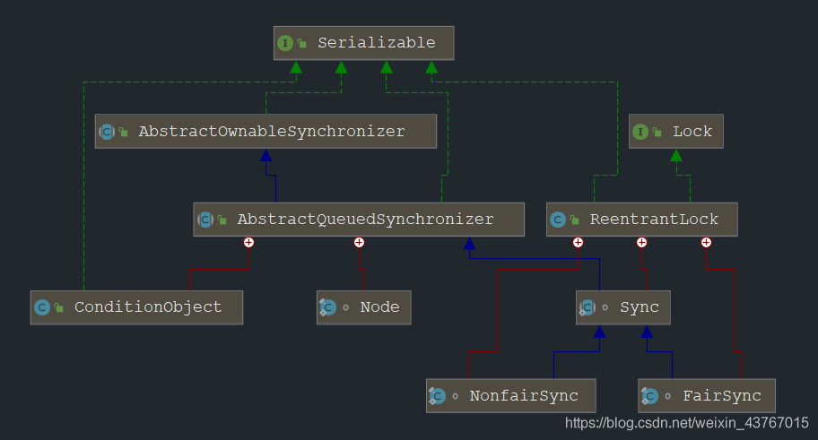

> &emsp;基于 JDK1.8 详细介绍了 Java 的 ReentrantLock 的源码实现，包括加锁、解锁的源码，以及公平性、重入性的实现！


1 ReentrantLock 的概述
===================

> public class ReentrantLock extends Object implements Lock, Serializable

&emsp;ReentrantLock 来自于 JDK1.5，位于 JUC 包的 locks 子包，独占（互斥）式可重入锁。Synchronized 的功能他都有，并且具有更加强大的功能。  

&emsp;实现了 Lock 接口，具有通用的操作锁的方法。由于来自 JUC 包，内部是使用 AQS 队列同步器来辅助实现的，**重写了 AQS 的独占式获取锁的方法，并实现了可重入性**。  

&emsp;**ReentrantLock 还具有公平与非公平两个获取锁模式，这个并非 AQS 提供的，而是 ReentrantLock 基于 AQS 自己实现的。**  

&emsp;除了 Lock 接口的通用方法。此类还定义了 isLocked 和 getLockQueueLength 方法，以及一些相关的 protected 访问方法，这些方法对检测和监视可能很有用。  

&emsp;**要想深入学习 ReentrantLock 的源码实现，应该首先学习并了解 AQS：[JUC—AbstractQueuedSynchronizer（AQS）五万字源码深度解析与应用案例](https://blog.csdn.net/weixin_43767015/article/details/106957989)。下面的源码涉及到 AQS 的均没有讲，在上面的文章中有详细介绍！**

1.1 ReentrantLock 的 API 方法
--------------------------

&emsp;**除了 Lock 接口的通用方法之外，它还具有如下自己特有的方法：**

<table><tbody><tr><td>方法名称</td><td>描述</td></tr><tr><td>int getHoldCount()</td><td>查询当前线程保持此锁定的次数（重入次数），也就是该方法调用前的（lock 方法调用次数 - unlock 方法调用次数）。</td></tr><tr><td>int getWaitQueueLength(Condition condition)</td><td>返回在与此锁相关联的给定条件队列中等待的线程数的估计。</td></tr><tr><td>boolean hasQueuedThread(Thread thread)</td><td>查询给定线程是否正在等待获取此锁。</td></tr><tr><td>boolean hasQueuedThreads()</td><td>查询是否有线程正在等待获取此锁。</td></tr><tr><td>boolean hasWaiters(Condition condition)</td><td>查询任何线程是否等待与此锁相关联的给定条件</td></tr><tr><td>boolean isFair()</td><td>查询此锁是否是公平锁。</td></tr><tr><td>boolean isHeldByCurrentThread()</td><td>查询此锁是否由当前线程持有。</td></tr><tr><td>boolean isLocked()</td><td>查询此锁是否由任何线程持有。</td></tr><tr><td>protected Thread getOwner()</td><td>返回当前拥有此锁的线程，如果不拥有，则返回 null</td></tr><tr><td>protected Collection getQueuedThreads()</td><td>返回包含可能正在等待获取此锁的线程的集合</td></tr><tr><td>int getQueueLength()</td><td>返回等待获取此锁的线程数的估计。</td></tr><tr><td>protected Collection getWaitingThreads(Condition condition)</td><td>返回包含可能在与此锁相关联的给定条件下等待的线程的集合。</td></tr></tbody></table>

1.2 可重入
-------

&emsp;ReentrantLock 是一个可重入的互斥锁。顾名思义，“互斥锁” 表示锁在某一时间点只能被同一线程所拥有。“可重入” 表示锁可被某一线程多次获取。当然 synchronized 也是可重入的互斥锁。  

&emsp;synchronized 关键字隐式的支持重进入，比如一个 synchronized 修饰的递归方法，在方法执行时，执行线程在获取了锁之后仍能连续多次地获得该锁。  

&emsp;ReentrantLock 虽然没能像 synchronized 关键字一样支持隐式的重进入，但是在调用 lock() 方法时，已经获取到锁的线程，能够再次调用 lock() 方法获取锁而不被阻塞。主要的实现是在实现 tryAcquire(int acquires) 方法时考虑占有锁的线程再次获取锁的场景。  

&emsp;在 ReentrantLock 中， AQS 的 state 同步状态值表示线程获取该锁的可重入次数， 在默认情况下，state 的值为 0 表示当前锁没有被任何线程持有。当一个线程第一次获取该锁时会尝试使用 CAS 设置 state 的值为 l ，如果 CAS 成功则当前线程获取了该锁，然后记录该锁的持有者为当前线程。在该线程没有释放锁的情况下第二次获取该锁后，状态值被设置为 2 ， 这就是可重入次数。在该线程释放该锁时，会尝试使用 CAS 让状态值减 1，如果减 l 后状态值为 0，则当前线程释放该锁。

1.3 公平与非公平
----------

&emsp;根据线程获取锁的抢占机制，锁可以分为公平锁和非公平锁。  

&emsp;如果在绝对时间上，先对锁进行获取的请求一定先被满足，也就是等待时间最长的线程最优先获取锁，也可以说锁获取是顺序的。那么这个锁是公平的，反之，是不公平的。  

&emsp;公平锁是严格的以 FIFO 的方式进行锁的竞争，但是非公平锁是无序的锁竞争，刚释放锁的线程很大程度上能比较快的获取到锁，队列中的线程只能等待，所以非公平锁可能会有 “饥饿” 的问题。但是重复的锁获取能减小线程之间的切换，而公平锁则是严格的线程切换，这样对操作系统的影响是比较大的，所以非公平锁的吞吐量是大于公平锁的，这也是为什么 JDK 将非公平锁作为默认的实现。  

&emsp;ReentrantLock 既可以是公平锁又可以是非公平锁。当此类的构造方法 ReentrantLock(boolean fair) 接收 true 作为参数时，ReentrantLock 就是公平锁，线程依次排队获取公平锁，即锁将被等待最长时间的线程占有。  

&emsp;**与默认情况（使用非公平锁）相比，使用公平锁的程序在多线程环境下效率比较低。而且即使是公平锁也不一定能保证线程调度的公平性，后来的线程调用 tryLock 方法同样可以不经过排队而获得该锁。**

2 ReentrantLock 的原理
===================

2.1 基本结构
--------

&emsp;**我们先来看看 ReentrantLock 的类图结构，以帮助我们做全面的分析：**  

  

&emsp;从图中可以看到 ReentrantLock 具有三个内部类，Sync、NonfairSync、FairSync。Sync 直接继承了 AbstractQueuedSynchronizer，应该是提供了通用的方法实现。  

&emsp;而 NonfairSync 和 FairSync 则直接继承了 Sync。从名字能够猜测出，公平锁内部调用的是 FairSync 类，非公平锁内部调用的是 NonfairSync 类，它们具有自己的特殊方法实现，它们都间接的继承了 AbstractQueuedSynchronizer 抽象类。  

&emsp;**所以说，ReentrantLock 锁内部还是依赖 AQS 来实现的，只不过由于需要支持公平模式和非公平模式，而实现了两个内部类。在我们指定使用的模式之后，再选择初始化不同的 AQS 实现来支持即可。**

2.2 构造器
-------

### 2.2.1 ReentrantLock()

> public ReentrantLock()

&emsp;创建一个 ReentrantLock 的实例。这等同于使用 ReentrantLock(false)。即默认无参构造器，是非公平模式。

```java
/** 同步器对象的在ReentrantLock中的引用 */
private final Sync sync;

/**
 * 创建一个不公平的ReentrantLock 的实例，这是默认的模式
 */
public ReentrantLock() {
    //内部初始化了一个NonfairSync对象
    sync = new NonfairSync();
}

```java

### 2.2.2 ReentrantLock(boolean fair)

> public ReentrantLock(boolean fair)

&emsp;创建一个具有给定公平策略的 ReentrantLock。false 表示不公平，true 表示公平。

```java
/**
 * 创建一个具有给定公平策略的 ReentrantLock
 *
 * @param fair false表示不公平，true表示公平。
 */
public ReentrantLock(boolean fair) {
    //很简单，根据参数选择初始化不同的AQS对象
    sync = fair ? new FairSync() : new NonfairSync();
}

```

2.3 非公平模式加锁原理
-------------

### 2.3.1 lock 不可中断获取锁

&emsp;**JUC 中只要是实现 Lock 的锁，那么加锁的方法，一般都统一调用开放给外部的 lock() 方法。**

```java
/**
 * 独占可重入式获取锁
 */
public void lock() {
    //内部调用据图AQS同步器实现的lock方法
    sync.lock();
}

```java

&emsp;在 ReentrantLock 实现中，lock 内部是调用了 AQS 同步器的 lock() 方法，如果我们学习了 AQS，那么我们知道在 AbstractQueuedSynchronizer 中是没有 lock 方法的，而是提供了一些模版方法和可重写发法。因此这个 lock 方法应该是 Sync 这个直接继承 AQS 的实现自己添加的方法。

```java
abstract static class Sync extends AbstractQueuedSynchronizer {
    /**
     * 提供加锁的lock方法
     * 该方法是一个抽象方法，具体的实现由子类去完成
     * 主要用于统一方法的名称
     */
    abstract void lock();
    
    //…………
}

```

&emsp;**因此我们看具体的实现还是要去子类中寻找，这里由于是非公平模式，应该在 NonfairSync 内部类中取寻找。**

```java
/**
 * NonfairSync中的lock方法的实现
 * 用于非公平的获取独占共享锁
 */
final void lock() {
    /*1 手首先假设当前锁没有被重入过，那么尝试获取锁
     * CAS尝试将state的值，从0更新为1
     * */
    if (compareAndSetState(0, 1))
        //如果CAS成功，说明获取到了锁，那么记录获取到的锁的线程
        setExclusiveOwnerThread(Thread.currentThread());
    else
        /*2 如果CAS失败，说明当前锁被重入过，或者锁被其他线程获取了，那么执行AQS的acquire模版方法继续尝试获取*/
        acquire(1);
}

/**
 * AQS中的方法
 * 记录获取到锁的线程
 *
 * @param thread 当前线程
 */
protected final void setExclusiveOwnerThread(Thread thread) {
    //记录该线程
    exclusiveOwnerThread = thread;
}

```

&emsp;**NonfairSync 的 lock 是加锁流程真正意义上的入口，大概分为两步：**

1.  首先尝试获取锁，即 CAS 将 state 的值从 0 更新为 1，这表示假设此时没有现成获取锁，然后该线程尝试获取锁。如果 CAS 成功，那么说明执勤啊该锁没有被任何线程获取，此时获取锁成功，将当前线程标记为持有锁的线程，加锁结束。
2.  若获取锁失败，表示该锁此前已经被某条线程获取到了，或者被别的线程抢先 CAS 成功，那么执行 acquire 方法继续尝试获取锁。

#### 2.3.1.1 acquire 独占式获取锁

&emsp;acquire 方法我们很熟悉了，就是 AQS 提供的模版方法，用于独占式获取锁，这个方法在 AQS 章节中有非常详细的讲解。  
&emsp;在 acquire 方法中会继续尝试获取锁，直到成功才能返回。在这里面主要的就是我们自己重写的 tryAcquire 方法，这是实现重入与可重入，公平与非公平的关键。

```java
/**
 * 独占式的尝试获取锁，获取不成功就进入同步队列等待
 */
public final void acquire(int arg) {
    //内部是由4个方法的调用组成的
    if (!tryAcquire(arg) && acquireQueued(addWaiter(Node.EXCLUSIVE), arg))
        selfInterrupt();
}

```

##### 2.3.1.1.1 tryAcquire 尝试获取锁

&emsp;tryAcquire 是 AQS 中定义的方法，在 AQS 中的实现是抛出异常，需要子类自己重写。

```java
protected boolean tryAcquire(int arg) {
    throw new UnsupportedOperationException();
}

```

&emsp;**ReentrantLock 在公平和非公平模式下对此有不同实现，非公平模式的实现如下：**

```java
/**
 * NonfairSync中的tryAcquire实现
 * 尝试获取独占式锁
 * @param acquires 参数，ReentrantLock中传递的1
 * @return true 获取成功 false 获取失败
 */
protected final boolean tryAcquire(int acquires) {
    //调用nonfairTryAcquire方法，这里方法位于Sync中
    return nonfairTryAcquire(acquires);
}

```

###### 2.3.1.1.1.1 nonfairTryAcquire 可重入非公平的获取独占锁

&emsp;**nonfairTryAcquire 是用于非公平模式下尝试获取锁的方法。**  
&emsp;由于在获取锁时，我们可重写的方法基本上只有 tryAcquire 方法，而这里的 tryAcquire 又调用了 nonfairTryAcquire 方法，**因此 nonfairTryAcquire 里面应该包括了重入锁和非公平模式的实现逻辑，大概步骤如下：**

1.  再次判断 state，如果 state=0，表示当前锁未被任何线程持有，那么尝试 CAS 获取锁，若 CAS 获取成功则设置当前线程，返回 true，方法结束；
2.  否则，表示此前已经有线程获取锁了，那么判断是否就是当前线程获取到了锁，如果是，执行重入逻辑，将 state 加上 1 再写回，表示重入次数 + 1，返回 true，方法结束；
3.  若 CAS 失败（有其他线程已经获取了锁），或者若当前锁已经被其他线程持有，则直接返回 false，方法结束。

```java
/**
 * Sync中的方法
 * 可重入锁非公平的获取独占式
 *
 * @param acquires 参数，ReentrantLock中传递的1
 * @return true 获取成功 false 获取失败
 */
final boolean nonfairTryAcquire(int acquires) {
    //获取当前线程
    final Thread current = Thread.currentThread();
    //获取当前state同步状态值
    int c = getState();
    /*如果为0，表示还没有线程获取该锁*/
    if (c == 0) {
        //尝试获取锁
        if (compareAndSetState(0, acquires)) {
            //获取成功就设置线程变量
            setExclusiveOwnerThread(current);
            //返回true，方法结束
            return true;
        }
    }
    /*如果不为0，那么表示有线程获取到了锁，此时判断是否就是当前线程获取到了锁
     * 如果是，那么表示可重入，执行重入的逻辑*/
    else if (current == getExclusiveOwnerThread()) {
        //新的state应该是此前获取的state+1
        int nextc = c + acquires;
        /*如果小于0，那么表示重入次数过多（超过了Integer.MAX\_VALUE），直接抛出异常
         * 新的state小于0的情况，只有c为Integer.MAX\_VALUE时才会发生，
         * 由于计算机二进制的计算原理，此时加上1反而会变成int类型的最小值，从而小于0
         * */
        if (nextc < 0) // overflow
            throw new Error("Maximum lock count exceeded");
        //到这一步说明重入次数正常，那么设置新状态值，此时重入次数+1
        //这里不需要CAS，因为在else if条件中，当前线程就是已经获取到锁的线程了。
        setState(nextc);
        //返回true，方法结束
        return true;
    }
    /*到这一步，说明尝试获取锁没有成功，或者重入锁的线程不是当前线程，那么返回false
     * 之后会被加入到同步队列，执行后面的逻辑
     * */
    return false;
}

```

&emsp;可以看到，这该实现中，**使用 state 来统计锁被某个线程重入的次数，每重入一次，state 加 1，同时注意到内部还会判断加 1 之后的 state 值是否小于 0，这说明 ReentrantLock 并不是无限重入的，最大重入次数就是 Integer.MAX\_VALUE，这个值再加上 1 就会变成负数，进而抛出异常！**  
&emsp;另外，刚进入 lock 方法时有一次 CAS 去获取锁的尝试，但是在 nonfairTryAcquire 方法中已经囊括所有可能的情况，为什么在 lock 中还要有看起来多此一举的代码呢？虽然该锁是一个重入锁，但是在实际应用中基本上不会有需要重入的业务逻辑，一般都是一次获取，一次释放，一个直观的想法就是它能提升代码性能，不需要更多判断。另外在 tryLock 方法中，就是直接调用的 nonfairTryAcquire 方法，因此 nonfairTryAcquire 方法也必须包含所有的情况。  
&emsp;**nonfairTryAcquire(arg)如果返回 true，则说明当前线程成功获取了锁 (第一次获取或者重入获取)。nonfairTryAcquire(arg) 如果返回 true。**

###### 2.3.1.1.1.2 nonfairTryAcquire 如何实现非公平

&emsp;**非公平的意思是说先尝试获取锁的线程并不一定比后尝试获取锁的线程优先获取锁。**  

&emsp;这里假设线程 A 调用 lock 方法时执行到 nonfairTryAcquire，然后发现当前状态值不为 0，又发现当前线程不是线程持有者，则返回 false ，然后当前线程被放入 AQS 同步队列。  

&emsp;这时候某个线程 C 释放了锁，state 变成 0，此时线程 **B 也调用了 lock 方法执行到 nonfairTryAcquire，发现当前状态值为 0 了，所以通过 CAS 设置获取到了该锁，甚至在外面的 lock 方法中就有可能抢先获取到了锁。**  

&emsp;明明是线程 A 先请求获取该锁，但是却由后请求的 B 线程获取了锁，这就是非公平的体现。这里线程 B 在获取锁前并没有查看当前 AQS 队列里面是否有比自己更早请求该锁的线程，而是使用了抢夺策略，从这里也能想像出公平模式的实现！

### 2.3.2 locklnterruptibly 可中断获取锁

&emsp;**该方法与 lock 方法类似，但是它对中断进行响应，就是当前线程在调用该方法因为没有获取到锁而被挂起时，如果其他线程调用了当前线程的 interrupt 方法，则当前线程会被唤醒并抛出 InterruptedException 异常，然后返回。**  

&emsp;**这里的中断与不可中断模式，是 AQS 已经为我们实现好了的，我们只需要调用相应的模版方法就行了，不需要自己实现。** 关于 AQS 的 acquireInterruptibly 模版方法源码，在 AQS 章节有详细讲解。

```java
/**
 * ReentrantLock中的方法
 * 可中断式获取锁
 *
 * @throws InterruptedException
 */
public void lockInterruptibly() throws InterruptedException {
    //内部直接调用AQS的模版方法acquireInterruptibly
    sync.acquireInterruptibly(1);
}

/**
 * AQS中的方法
 * 可中断式获取锁
 *
 * @param arg 参数，ReentrantLock中传递1
 * @throws InterruptedException
 */
public final void acquireInterruptibly(int arg)
        throws InterruptedException {
    //如果当前线程被中断，直接抛出异常
    if (Thread.interrupted())
        throw new InterruptedException();
    //尝试获取锁
    if (!tryAcquire(arg))
        //如果没获取到，那么调用AQS 可被中断的方法
        doAcquireInterruptibly(arg);
}

```

### 2.3.3 trylock 尝试获取锁

&emsp;**尝试获取锁，如果当前线程获取该锁 (第一次获取或者重入获取) 那么返回 true，否则返回 false 。该方法不会引起当前线程阻塞！**  
&emsp;**内部调用的 nonfairTryAcquire 方法，并且公平模式和非公平模式都只有这一个实现，所以实际上 trylock 永远是非公平的调用。**

```java
/**
 * ReentrantLock的方法
 * 非公平的尝试获取独占锁
 *
 * @return true 成功  false 失败
 */
public boolean tryLock() {
    //内部直接调用Sync的nonfairTryAcquire方法，就算获取不到也不会阻塞，而是返回false
    //并且是非公平模式，不能变更
    return sync.nonfairTryAcquire(1);
}

```

2.4 公平模式加锁原理
------------

&emsp;公平性与否是针对获取锁顺序而言的，如果一个锁是公平的，那么锁的获取顺序就应该符合请求的绝对时间顺序，也就是 FIFO。  
&emsp;上面分析的 nonfairTryAcquire(int acquires) 方法，对于非公平锁，只要 CAS 设置同步状态成功，则表示当前线程获取了锁，而公平锁则不同：  
&emsp;**第一个不同点：从公平锁加锁的入口开始，对比非公平锁少了一次 CAS 获取锁的尝试方法。**

```java
final void lock() {
    acquire(1);
}

```java

&emsp;**接着看公平锁 FairSync 对于获取锁的 tryAcquire 方法的实现：**

```java
/**
 * FairSync中的方法
 * 公平的获取锁
 *
 * @param acquires 参数，ReentrantLock中传递1
 * @return true 成功  false 失败
 */
protected final boolean tryAcquire(int acquires) {
    final Thread current = Thread.currentThread();
    int c = getState();

    if (c == 0) {
        /*其他部分和非公平加锁的实现是一致的，只是多了hasQueuedPredecessors方法的调用
        而hasQueuedPredecessors方法就是公平性的保证*/
        if (!hasQueuedPredecessors() &&
                compareAndSetState(0, acquires)) {
            setExclusiveOwnerThread(current);
            return true;
        }
    } else if (current == getExclusiveOwnerThread()) {
        int nextc = c + acquires;
        if (nextc < 0)
            throw new Error("Maximum lock count exceeded");
        setState(nextc);
        return true;
    }
    return false;
}

```

&emsp;**该方法与非公平的 nonfairTryAcquire(int acquires) 比较，唯一不同的位置为判断条件多了 hasQueuedPredecessors() 方法，是否有任何线程等待获取锁的时间超过当前线程的判断。这是第二个不同点。**

### 2.4.1 hasQueuedPredecessors 判断等待时间

```java
/**
 * 位于AQS中的方法
 * 查询是否有任何线程等待获取锁的时间超过当前线程。
 *
 * @return 如果有前驱 返回true 否则 返回false
 */
public final boolean hasQueuedPredecessors() {
    //同步队列尾节点
    Node t = tail;
    //同步队列头节点
    Node h = head;
    Node s;
    //如果头结点等于尾节点，则返回false，表示没有线程等待
    //否则，如果头结点的后继s不为null并且s的线程和当前线程相等，则返回false，表示表示当前线程就是等待时间最长的线程
    return h != t &&
            ((s = h.next) == null || s.thread != Thread.currentThread());
}

```

&emsp;由于同步队列中头结点是当前获取锁的线程，而新加入的结点是加入到尾部，那么队列中的第二个结点代表的线程就是请求优先级最高的，即等待时间最长的线程。  
&emsp;如果头结点等于尾节点，表示此时同步队列中没有线程等待；否则，如果头结点的后继 s 不为 null 并且 s 的线程和当前线程相等，表示当前线程就是等待时间最长的线程。这两种情况都返回 false，表示没有线程比当前线程更早地请求获取锁，那么当前线程可以去获得锁。  
&emsp;**如果该方法返回 true，则表示有线程比当前线程更早地请求获取锁。那么当前线程将不会执行 CAS 操作去获取锁，而是返回 false，保证了线程获取锁的顺序与加入同步队列的顺序一致，很好的保证了公平性, 但同时也明显增加了获取锁的成本。为了性能，ReentrantLock 的实现就是默认非公平的。**

2.5 解锁原理
--------java

### 2.5.1 unlock 释放锁

&emsp;JUC 中只要是实现 Lock 的锁，那么解锁的方法，一般都统一调用开放给外部的 unlock () 方法。

```java
/**
 * 尝试释放锁
 *
 * @throws IllegalMonitorStateException 如果当前线程不持有此锁，则抛出异常
 */
public void unlock() {
    //内部调用AQS的release模版方法
    sync.release(1);
}

```

#### 2.5.1.1 release 独占式释放锁

&emsp;release 方法我们很熟悉了，就是 AQS 提供的模版方法，用于独占式释放锁，这个方法在 AQS 章节中有非常详细的讲解。  
&emsp;在这里面主要的就是我们自己重写的 tryRelease 方法，其中关键的就是重入锁的释放逻辑。

```java
/**
 * 独占式的释放锁
 *
 * @param arg 参数
 * @return 释放成功返回true, 否则返回false
 */
public final boolean release(int arg) {
    /*tryRelease释放锁，该方法是自己重写实现的方法
    释放成功将返回true，否则返回false或者自己实现的逻辑*/
    if (tryRelease(arg)) {
        //获取头结点
        Node h = head;
        //如果头结点不为null并且状态不等于0
        if (h != null && h.waitStatus != 0)
            /*那么唤醒头结点的一个出于等待锁状态的后继结点
             * 该方法在acquire中已经讲过了
             * */
            unparkSuccessor(h);
        return true;
    }
    return false;
}

```

##### 2.5.1.1.1 tryRelease 尝试释放锁

&emsp;**tryRelease 是 AQS 中定义的方法，在 AQS 中的实现是抛出异常，需要子类自己重写。**

```java
protected boolean tryRelease(int arg) {
    throw new UnsupportedOperationException();
}

```

&emsp;**ReentrantLock 在公平和非公平模式下对此有相同实现，即锁的释放逻辑都是一样的**，该实现在 Sync 中：

```java
/**
 * Sync的tryRelease实现
 * 尝试释放锁
 *
 * @param releases 参数，ReentrantLock中传递1
 * @return true 成功 false 失败
 */
protected final boolean tryRelease(int releases) {
    //获取释放之后的state值c，ReentrantLock中是减去1
    int c = getState() - releases;
    //如果当前线程不是获取锁的线程，那么抛出IllegalMonitorStateException异常
    if (Thread.currentThread() != getExclusiveOwnerThread())
        throw new IllegalMonitorStateException();
    //free用于记录释放成功与否的标志位，默认为false
    boolean free = false;
    //如果c为0，那表示完全释放了锁，此时清除记录线程，free为true
    //否则，说明该锁被重入了，那么lock了几次就需要unlock几次，因为每一次只是state减去1，并且此次并没有完全释放
    if (c == 0) {
        free = true;
        setExclusiveOwnerThread(null);
    }
    //设置新的state
    setState(c);
    //返回free
    return free;
}

```

&emsp;ReentrantLock 中，tryRelease 的实现其实就是将线程持有锁的次数 state 减 1，即将 state 值减 1，若减少后 state 值为 0，那么表示线程将完全释放锁，设置获取锁的线程为 null，更新 state 值，返回 true  

&emsp;如果返回 false，说明此次释放锁并没有完全释放。由于执行该方法的线程必然持有锁，故该方法对 state 的更新不需要任何 CAS 操作。

3 ReentrantLock 总结
==================

&emsp;ReentrantLock 是基于 AQS 实现的独占式可重入锁，同时还有公平模式和非公平模式，即可选择实现未非公平锁和公平锁！  

&emsp;**从源码代码中可以看出来，非公平锁的非公平之处在于：在头结点释放锁唤醒后继线程的时候，如果有新来的线程在尝试获取锁，那么新来的线程在和后继结点中的线程 的竞争中可能成功，有两个地方都有支持这样的可能性：**

1.  在 NonfairSync 实现的的 lock 方法中，CAS 获取到锁（只有在当前锁未被任何线程占有时才能成功）。
2.  在 nonfairTryAcquire 方法中，CAS 获取到锁（只有在当前锁未被任何线程占有时才能成功）。

&emsp;**如果被新来的线程获取到了锁，那么此时获取到锁的线程，不需要加入队列。而队列中被唤醒的后继结点由于获取不到锁只能继续等待获得锁的结点释放了锁之后继续尝试。**  

&emsp;**只要是进入同步队列排了队的结点（线程），就只能按照队列顺序去获取锁，而没有排队的线程，则可能直接插队获取锁。如果在上面的两处获取锁都失败后，线程会被构造结点并加入同步队列等待，再也没有先一步获取锁的可能性。**  

&emsp;可以看出来，非公平模式下，同步队列中等待很久的线程相比还未进入队列等待的线程并没有优先权，甚至竞争也处于劣势：在队列中的线程要等待唤醒，并且还要检查前驱结点是否为头结点。**在锁竞争激烈的情况下, 在队列中等待的线程可能迟迟竞争不到锁，这也就非公平在高并发情况下会出现的饥饿问题。**  

&emsp;**但是非公平模式会有良好的性能，直接获取锁线程不必加入等待队列就可以获得锁，免去了构造结点并加入同步队列的繁琐操作，因为加入到队列尾部时也是需要 CAS 竞争的，可能会造成 CPU 的浪费，并且还可能会因为后续的线程等待、唤醒，造成线程上下文切换，非常耗时。**  

&emsp;**而且即使是公平锁也不一定能保证线程调度的公平性，公平模式下，后来的线程调用 tryLock 方法同样可以不经过排队而获得该锁。因为 tryLock 方法内部是直接调用的 nonfairTryAcquire 方法，这个方法我们说了它不具备公平性！**  

&emsp;**要想更加深入的学习 ReentrantLock 的源码实现，应该首先学习并了解 AQS：[JUC—AbstractQueuedSynchronizer（AQS）五万字源码深度解析与应用案例](https://blog.csdn.net/weixin_43767015/article/details/106957989)。本文的源码涉及到 AQS 的在上面的文章中有详细介绍！**
