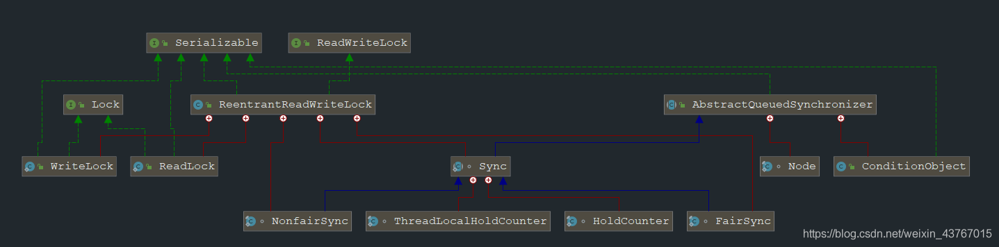

> 详细介绍了 JUC 中的 ReadWriteLock 读写锁的原理，包括读锁、写锁的获取和释放、锁降级的原理，并与传统独占锁的性能做了对比！


1 ReadWriteLock 的概述
===================

> public interface ReadWriteLock

&emsp;ReadWriteLock 来自于 JDK1.5，位于 JUC 包的 locks 子包。是一个接口，中文翻译过来就是 “读写锁”。  

&emsp;**顾名思义，读写锁维护了一对相关的锁，一个用于只读操作，另一个用于写入操作，读锁是共享锁，而写锁是独占锁**。与单纯的互斥锁比如 ReentrantLock 相比，读 - 写锁允许对共享数据进行更高级别的并发访问。在同一时刻可以允许多个读线程访问，但是在写线程访问时，所有的读线程和其他写线程均被阻塞。  

&emsp;假设在程序中定义一个共享的用作缓存数据结构，它大部分时间提供读服务（例如查询和搜索），而写操作占有的时间很少。此时使用读写锁，通过分离读锁和写锁，使得并发性相比一般的排他锁有了很大提升。  
&emsp;一般情况下，读写锁的性能都会比排它锁好，因为大多数场景下共享数据的读是多于写的。在读多于写的情况下，读写锁能够提供比排它锁更好的并发性和吞吐量。  
&emsp;如果共享数据的修改次数远多于读取的次数时，就算存在并发性增强，也是微不足道的。此时读 - 写锁实现（它本身就比互斥锁复杂）的开销将成为主要的执行成本，因此读写锁也不是万能的。  
&emsp;ReadWriteLock 只是一个接口，仅定义了获取读锁和写锁的两个方法，即 readLock() 方法和 writeLock() 方法，这是读写锁的实现规范，Java 并发包提供读写锁的实现是 ReentrantReadWriteLock，我们主要学习的就是它的实现类。

<table><tbody><tr><td>Lock readLock()</td><td>返回用于读取操作的锁。</td></tr><tr><td>Lock writeLock()</td><td>返回用于写入操作的锁。</td></tr></tbody></table>

2 ReentrantReadWriteLock 的概述
============================

> public class ReentrantReadWriteLock extends Object implements ReadWriteLock, Serializable

&emsp;ReentrantReadWriteLock 来自于 JDK1.5，位于 JUC 包的 locks 子包。继承了 ReadWriteLock，是读写锁的主要实现类。  
&emsp;它本身没有实现 Lock 接口，因为 ReentrantReadWriteLock 看起来就像一个容器，内部维护了读锁和写锁两把锁，我们主要是获取这两把锁，然后使用这两把锁来实现同步，因此对于 Lock 的实现交给了内部的读锁与写锁去完成。  
&emsp;除了对公平性和重入性的支持之外，ReentrantReadWriteLock 还支持锁降级：获取写锁 -> 获取读锁 -> 释放写锁，写锁能够降级成为读锁！  
&emsp;**另外，要想深入学习 ReentrantReadWriteLock 的源码实现，应该首先学习并了解 AQS：[JUC—AbstractQueuedSynchronizer（AQS）五万字源码深度解析与应用案例](https://blog.csdn.net/weixin_43767015/article/details/106957989)。下面的源码涉及到 AQS 的均没有讲，在上面的文章中有详细介绍！**

2.1 API 方法
----------

&emsp;**除了具有获取读锁和写锁的方法，同时还具有一些获取锁信息的方法，便于外界监控其内部工作状态，这些方法以及描述如下：**

<table><tbody><tr><td>方法名称</td><td>描述</td></tr><tr><td>ReentrantReadWriteLock.ReadLock readLock()</td><td>返回用于读取操作的锁。</td></tr><tr><td>ReentrantReadWriteLock.WriteLock writeLock()</td><td>返回用于写入操作的锁。</td></tr><tr><td>int getQueueLength()</td><td>返回等待获取读取或写入锁的线程估计数目。</td></tr><tr><td>int getReadHoldCount()</td><td>查询当前线程在此锁上保持的重入读取锁数量。</td></tr><tr><td>int getReadLockCount()</td><td>查询为此锁保持的读取锁数量。</td></tr><tr><td>boolean isWriteLockedByCurrentThread()</td><td>查询当前线程是否保持了写入锁。</td></tr><tr><td>int getWaitQueueLength(Condition condition)</td><td>返回正等待与写入锁相关的给定条件的线程估计数目。</td></tr><tr><td>int getWriteHoldCount()</td><td>查询当前线程在此锁上保持的重入写入锁数量。</td></tr><tr><td>boolean hasQueuedThread(Thread thread)</td><td>查询是否给定线程正在等待获取读取或写入锁。</td></tr><tr><td>boolean hasQueuedThreads()</td><td>查询是否所有的线程正在等待获取读取或写入锁。</td></tr><tr><td>boolean hasWaiters(Condition condition)</td><td>查询是否有些线程正在等待与写入锁有关的给定条件。</td></tr><tr><td>boolean isFair()</td><td>如果此锁将公平性设置为 ture，则返回 true。</td></tr><tr><td>boolean isWriteLocked()</td><td>查询是否某个线程保持了写入锁。</td></tr><tr><td>String toString()</td><td>返回标识此锁及其锁状态的字符串。</td></tr><tr><td>protected Thread getOwner()</td><td>返回当前拥有写入锁的线程，如果没有这样的线程，则返回 null。</td></tr><tr><td>protected Collection getQueuedReaderThreads()</td><td>返回一个 collection，它包含可能正在等待获取读取锁的线程。</td></tr><tr><td>protected Collection getQueuedThreads()</td><td>返回一个 collection，它包含可能正在等待获取读取或写入锁的线程。</td></tr><tr><td>protected Collection getWaitingThreads(Condition condition)</td><td>返回一个 collection，它包含可能正在等待与写入锁相关的给定条件的那些线程。</td></tr><tr><td>protected Collection getQueuedWriterThreads()</td><td>返回一个 collection，它包含可能正在等待获取写入锁的线程。</td></tr></tbody></table>

2.2 读写锁和普通锁性能对比
---------------

&emsp;下面的代码中，使用 ReentrantReadWriteLock 和 ReentrantLock 分别执行 110 个任务，其中 10 个写任务，100 个读任务。  

&emsp;首先，对于读写都使用同一个 ReentrantLock 锁，即独占锁，记录完成时间；然后切换到 ReentrantReadWriteLock，其中读任务使用读锁，写任务使用写锁，记录完成时间，可以发现，在读任务明显多于写任务的时候，读写所的性能将会优于独占锁！

```java
public class ReadWriteLockDemo {
    private static Lock lock = new ReentrantLock();
    private static ReentrantReadWriteLock reentrantReadWriteLock = new ReentrantReadWriteLock();
    private static Lock readLock = reentrantReadWriteLock.readLock();
    private static Lock writeLock = reentrantReadWriteLock.writeLock();
    private static CountDownLatch countDownLatch = new CountDownLatch(110);

    private static void read(Lock lock) throws InterruptedException {
        try {
            lock.lock();
            //模拟读操作
            Thread.sleep(500);
        } finally {
            lock.unlock();
        }
    }

    private static void write(Lock lock) throws InterruptedException {
        try {
            lock.lock();
            //模拟写操作
            Thread.sleep(1000);
        } finally {
            lock.unlock();
        }
    }

    public static void main(String args\[\]) throws InterruptedException {
        //普通独占锁测试性能，读和写都是用一个锁
        Write write = new Write(lock);
        Read read = new Read(lock);
        //读写锁测试性能，读使读锁，写使用写锁
//        Write write = new Write(writeLock);
//        Read read = new Read(readLock);
        //计算分别采用普通重入锁和读写锁的耗时,可以发现
        long l = System.currentTimeMillis();
        //执行任务
        for (int i = 0; i < 100; i++) {
            new Thread(read).start();
        }
        for (int i = 0; i < 10; i++) {
            new Thread(write).start();
        }
        //等待任务执行完毕
        countDownLatch.await();
        //计算任务耗时，读写锁耗时远低于普通重入锁
        System.out.println(System.currentTimeMillis() - l);
    }

    /**
     * 写任务
     */
    static class Write implements Runnable {
        Lock lock;

        Write(Lock lock) {
            this.lock = lock;
        }

        @Override
        public void run() {
            //分别使用两种锁来运行,性能差别很直观的就体现出来
            try {
                write(lock);
                countDownLatch.countDown();
            } catch (InterruptedException e) {
                e.printStackTrace();
            }
        }
    }

    /**
     * 读任务
     */
    static class Read implements Runnable {
        Lock lock;

        Read(Lock lock) {
            this.lock = lock;
        }

        @Override
        public void run() {
            //分别使用两种锁来运行,性能差别很直观的就体现出来
            try {
                read(lock);
                countDownLatch.countDown();
            } catch (InterruptedException e) {
                e.printStackTrace();
            }
        }
    }
}

```

3 ReentrantReadWriteLock 的原理
============================

3.1 基本结构
--------

&emsp;我们先来看看 ReentrantReadWriteLock 的类图结构，以帮助我们做全面的分析：  

  

&emsp;**可以看到 ReentrantReadWriteLock 内部维护了 ReadLock、WriteLock 两个内部类，一个作为读锁，一个作为写锁，由它们实现 Lock 的功能。还维护了的 AQS 的主要实现 Sync，以及下面的公平模式 NonfairSync 和非公平模式 FairSync 的 AQS 实现。**  

&emsp;**ReadLock 和 WriteLock 底层又依赖 AQS 的实现，它们相互配合，最终实现读写锁的功能！**  

&emsp;原来的 AQS 中，具有一个 state 同步状态变量用来表示锁的状态，比如 ReentrantLock 中 state 的 0 就表示没有获取锁，大于 1 就表示获取到锁以及重入次数。在这里，由于具有两把锁，需要使用一个 state 来维护两把锁的状态，此时肯定不能仅仅直接使用 state 的值来表示。  

&emsp;**ReentrantReadWriteLock 的实现方式是 “按位切割”：读写锁将 state 变量根据二进制切分成了两个部分，使用高 16 位表示读锁状态，低 16 位表示写锁状态。**  

&emsp;当更新读的状态时，只需要更新 state 的高 16 位的二进制值，当更新写锁的状态时，只需要更新 state 的第 16 位的二进制值划，这样读写锁的状态更新互不干扰，实现了使用一个 state 变量来表示两把锁的状态。  

&emsp;**例如，某个读写锁的 state 值为 65538，那么他表示锁状态如下：**  


  
&emsp;上面的图中读锁状态为 1，写锁状态为 2，ReentrantReadWriteLock 中的锁都是可重入锁。  

&emsp;**通过位运算读写锁是可以迅速确定读和写各自的状态。假设当前同步状态值为 S，写状态等于 S&0x0000FFFF（将高 16 位全部抹去），读状态等于 S>>>16（无符号右移 16 位）。当写状态增加 1 时，等于 S+1，当读状态增加 1 时，等于 S+(1<<16)，也就是 S+0x00010000。**  

&emsp;下面是 ReentrantReadWriteLock 的主要结构：

```java
public class ReentrantReadWriteLock implements ReadWriteLock,
        java.io.Serializable {

    /**
     * 读锁
     */
    private final ReentrantReadWriteLock.ReadLock readerLock;
    /**
     * 写锁
     */
    private final ReentrantReadWriteLock.WriteLock writerLock;
    /**
     * AQS实现
     */
    final ReentrantReadWriteLock.Sync sync;

    abstract static class Sync extends AbstractQueuedSynchronizer {
        //位移常量
        static final int SHARED\_SHIFT = 16;
        //读锁状态单位值65536
        static final int SHARED\_UNIT = (1 << SHARED\_SHIFT);
        //读锁的最大总个数、写锁的最大重入次数 -> 65535
        static final int MAX\_COUNT = (1 << SHARED\_SHIFT) - 1;
        //写锁的掩码，低位16个l
        static final int EXCLUSIVE\_MASK = (1 << SHARED\_SHIFT) - 1;

        /**
         * 返回读锁的总的数量
         */
        static int sharedCount(int c) {
            //state无符号右移16位，即可获取读锁的数量
            return c >>> SHARED\_SHIFT;
        }

        /**
         * 返回写锁重入次数
         */
        static int exclusiveCount(int c) {
            //state & 低16位的1，即可获取写锁重入次数
            return c & EXCLUSIVE\_MASK;
        }
    }

    /**
     * 公平模式实现
     */
    static final class FairSync extends Sync { }

    /**
     * 非公平模式实现
     */
    static final class NonfairSync extends Sync { }

    /**
     * 读锁实现
     */
    public static class ReadLock implements Lock, java.io.Serializable {
        private final Sync sync;
    }

    /**
     * 写锁实现
     */
    public static class WriteLock implements Lock, java.io.Serializable {
        private final Sync sync;
    }
}

```

3.2 构造器
-------

### 3.2.1 ReentrantReadWriteLock()

> public ReentrantReadWriteLock()

&emsp;使用默认非公平模式创建一个可重入读写锁。

```java
/**
 * 默认构造器
 * 使用默认非公平模式创建一个可重入读写锁。
 */
public ReentrantReadWriteLock() {
    //内部直接调用的另一个构造器，传递false
    this(false);
}

```

### 3.2.2 ReentrantReadWriteLock(fair)

> public ReentrantReadWriteLock(boolean fair)

&emsp;使用给定的公平策略创建一个新的读写锁。true 公平，false 不公平。

```java
/**
 * 使用给定的公平策略创建一个新的读写锁。
 *
 * @param fair true 公平，false 不公平。
 */
public ReentrantReadWriteLock(boolean fair) {
    //根据公平模式创建对应的AQS实例
    sync = fair ? new FairSync() : new NonfairSync();
    //创建读锁实例
    readerLock = new ReadLock(this);
    //创建写锁实例
    writerLock = new WriteLock(this);
}

```

3.3 写锁的获取
---------

&emsp;**写锁是一个支持重进入的独占锁。如果当前线程在获取写锁时，读锁已经被获取（读状态不为 0）或者写锁被别的线程抢先获取或者当前线程不是已经获取写锁的线程，则当前线程进入等待状态。否则当前线程第一次或者再一次获取写锁，写状态值 + 1。**

### 3.3.1 writeLock 获取写锁对象

&emsp;writeLock 方法用于获取进行写操作的锁。

```java
/**
 * @return 获取写锁
 */
public ReentrantReadWriteLock.WriteLock writeLock() {
    //返回在构造器中创建的写锁对象
    return writerLock;
}

```

### 3.3.2 lock 不可中断获取写锁

&emsp;调用 writeLock 的 lock 方法用于获取写锁，如果获取不到，则线程被阻塞（WAITING），不会响应中断。  
&emsp;内部是直接调用的 AQS 的 acquire 模版方法，因此我们更应该关心自己实现的 tryAcquire 方法。acquire 模版方法在 AQS 章节已经详细介绍过了。

```
public void lock() {
    //调用AQS的模版方法
    sync.acquire(1);
}

public final void acquire(int arg) {
    //tryAcquire是自己实现的，其他的方法都是AQS提供的
    if (!tryAcquire(arg) &&
            acquireQueued(addWaiter(Node.EXCLUSIVE), arg))
        selfInterrupt();
}

```

#### 3.3.2.1 tryAcquire 尝试获取独占锁

&emsp;和 ReentrantLock 不同的是，ReentrantReadWriteLock 中的公平锁和非公平锁并没有实现自己的 tryAcquire 方法，无论是何种模式，写锁获取锁的时候都会走同一个 tryAcquire 方法，因此是在方法内部对不同的模式做区分的。大概步骤如下：

1.  获取当前 state 值 c 以及写锁重入数量 w；
2.  如果 c 不等于 0，说明读锁或者写锁至少有一个已经被某线程获取，那么：  
    - 如果没有线程获取写锁或者当前线程不是已经获取写锁的线程，写锁被其他线程获取了，直接返回 false，表示获取写锁失败。  
    - 否则，表示锁重入，判断写锁可重入次数是否超过最大值 65535，如果超过了那么直接抛出异常。  
    - 如果没有超出重入最大值，那么更新 state 的值，返回 true，表示锁重入获取成功。
3.  否则，c 等与 0，表示目前没有线程获取读锁或者写锁，当前线程是第一批获取写锁的线程（可能同时有其他线程尝试获取）
4.  调用 writerShouldBlock 进行公平和非公平模式的判断，如果 writerShouldBlock 返回 true，那么表示不可以尝试获取写锁，则直接返回 false，表示锁获取失败。
5.  如果 writerShouldBlock 返回 false，则执行 CAS 更新 state，如果失败，那么表示锁被其他线程先一步占有了，也返回 false，表示锁获取失败。
6.  如果 CAS 成功，那么设置获取写锁的线程为当前线程，返回 true，表示第一次获取锁成功。

```java
/**
 * Sync的方法
 * 尝试获取写锁，同时实现了重入以及公平和非公平的判断
 *
 * @param acquires 参数，ReentrantReadWriteLock传递的1
 * @return true 成功  false 失败
 */
protected final boolean tryAcquire(int acquires) {
    //获取当前线程
    Thread current = Thread.currentThread();
    //获取当前state值
    int c = getState();
    //获取写锁重入数量 ->   c & EXCLUSIVE\_MASK
    int w = exclusiveCount(c);
    //c 不等于0，说明读锁或者写锁至少有一个已经被某线程获取
    if (c != 0) {
        /*
         * 如果w等于0，说明没有线程获取写锁，那么肯定有线程获取了读锁，当有线程获取读锁时，写锁不能被获取，直接返回。
         * 否则，如果current != getExclusiveOwnerThread()为true，表示当前线程不是已经获取写锁的线程，写锁被其他线程获取了，直接返回。
         * 上面两种情况，都直接返回false，表示获取写锁失败，将会被加入加到的同步队列等待
         * */
        if (w == 0 || current != getExclusiveOwnerThread())
            return false;
        /*
         * 走到这一步说明w不等于0，即有线程获取写锁，并且当前线程就是获取了写锁的线程
         * 此时判断可重入次数是否超过最大值65535，如果超过了那么直接抛出异常
         * */
        if (w + exclusiveCount(acquires) > MAX\_COUNT)
            throw new Error("Maximum lock count exceeded");
        //走到这一步，说明可重入次数并有超过限制，则增加当前线程的重入次数
        //由于写锁是低16位表示的，因此直接采用十进制相加即可
        setState(c + acquires);
        //获取成功，返回true
        return true;
    }
    //走到这一步，说明c为0，表示目前没有线程获取读锁或者写锁，当前线程是第一批获取写锁的线程（可能同时有其他线程尝试获取）
    //writerShouldBlock相当于hasQueuedPredecessors方法，用于实现公平和非公平模式
    //如果writerShouldBlock返回true，表示不可以尝试获取写锁，只有公平模式才可能返回true，那么由于||的短路法则，直接返回false，表示锁获取失败
    //如果writerShouldBlock返回false，表示可以尝试获取写锁，执行CAS更新state，如果失败，那么也返回false，表示锁获取失败
    if (writerShouldBlock() || !compareAndSetState(c, c + acquires)) {
        return false;
    }
    //走到这一步，说明获取锁成功，然后设置获取写锁的线程为当前线程
    setExclusiveOwnerThread(current);
    //返回true，方法结束
    return true;
}

```

##### 3.3.2.1.1 writerShouldBlock 公平与非公平的逻辑

&emsp;**writerShouldBlock 是实现写锁获取的公平或者非公平的关键方法**。writerShouldBlock 实际上是 Sync 中的一个抽象方法，是由它的子类 FairSync 和 NonfairSync 去实现的，因此我们调用 sync 的 writerShouldBlock 方法，实际上是调用具体的实现的方法。  
&emsp;FairSync（公平模式）和 NonfairSync（非公平模式）对它的实现不一样！  
&emsp;NonfairSync 总是返回 false，这样总会让代码执行第二个 CAS 获取锁的逻辑，这样就可能造成非公平的获取锁：

```java
/**
 * NonfairSync中的实现
 * @return 总是返回false
 */
final boolean writerShouldBlock() {
    return false;
}

```

&emsp;FairSync 则是调用 hasQueuedPredecessors 方法，这个方法我们在 ReentrantLock 中也见过，只不过 ReentrantLock 中公平锁是直接调用的该方法，而 ReentrantReadWriteLock 则是多包装了一个 writerShouldBlock 方法。

```java
/**
 * FairSync中的实现
 * @return hasQueuedPredecessors的返回值
 */
final boolean writerShouldBlock() {
    return hasQueuedPredecessors();
}
/**
 * 位于AQS中的方法
 * 查询是否有任何线程等待获取锁的时间超过当前线程。
 *
 * @return 如果有前驱 返回true 否则 返回false
 */
public final boolean hasQueuedPredecessors() {
    //同步队列尾节点
    Node t = tail;
    //同步队列头节点
    Node h = head;
    Node s;
    //如果头结点等于尾节点，则返回false，表示没有线程等待
    //否则，如果头结点的后继s不为null并且s的线程和当前线程相等，则返回false，表示表示当前线程就是等待时间最长的线程
    return h != t &&
            ((s = h.next) == null || s.thread != Thread.currentThread());
}

```

&emsp;由于同步队列中头结点是当前获取锁的线程，而新加入的结点是加入到尾部，那么队列中的第二个结点代表的线程就是请求优先级最高的，即等待时间最长的线程。  
&emsp;如果头结点等于尾节点，表示此时同步队列中没有线程等待；否则，如果头结点的后继 s 不为 null 并且 s 的线程和当前线程相等，表示当前线程就是等待时间最长的线程。这两种情况都返回 false，表示没有线程比当前线程更早地请求获取锁，那么当前线程可以去获得锁。  
&emsp;如果该方法返回 true，则表示有线程比当前线程更早地请求获取锁。**那么当前线程将不会执行 CAS 操作去获取锁，而是返回 false，保证了线程获取锁的顺序与加入同步队列的顺序一致，很好的保证了公平性, 但同时也明显增加了获取锁的成本。为了性能，ReentrantReadWriteLock 的实现就是默认非公平的。**  
&emsp;**公平模式只对初次尝试获取锁的线程有效，如果一个线程已经获取了锁，那么重入的时候，根本就不会走到 hasQueuedPredecessors 方法的逻辑中去。**

### 3.3.3 locklnterruptibly 可中断获取写锁

&emsp;该方法与 lock 方法类似，但是它对中断进行响应，就是当前线程在调用该方法因为没有获取到锁而被挂起时，如果其他线程调用了当前线程的 interrupt 方法，则当前线程会被唤醒并抛出 InterruptedException 异常，然后返回。  
&emsp;**这里的中断与不可中断模式，是 AQS 已经为我们实现好了的，我们只需要调用相应的模版方法就行了，不需要自己实现。** 关于 AQS 的 acquireInterruptibly 模版方法源码，在 AQS 章节有详细讲解。

```java
/**
 * ReentrantLock中的方法
 * 可中断式获取锁
 *
 * @throws InterruptedException
 */
public void lockInterruptibly() throws InterruptedException {
    //内部直接调用AQS的模版方法acquireInterruptibly
    sync.acquireInterruptibly(1);
}

/**
 * AQS中的方法
 * 可中断式获取写锁
 *
 * @param arg 参数，ReentrantLock中传递1
 * @throws InterruptedException
 */
public final void acquireInterruptibly(int arg)
        throws InterruptedException {
    //如果当前线程被中断，直接抛出异常
    if (Thread.interrupted())
        throw new InterruptedException();
    //尝试获取写锁
    if (!tryAcquire(arg))
        //如果没获取到，那么调用AQS 可被中断的方法
        doAcquireInterruptibly(arg);
}

```

### 3.3.4 tryLock 尝试获取写锁

&emsp;尝试获取写锁，如果当前没有其他线程持有写锁或者读锁，或者当前线程就是持有锁的线程，则获取锁成功，然后返回 true。否则，返回 false。  
&emsp;该方法不会阻塞当前线程。并且**和 tryAcquire 方法非常相似，但是这里没有 writerShouldBlock 方法的调用，即不会判断公平模式还是非公平模式，那么默认就是非公平模式了。所以无论指定的是公平模式还是非公平模式，当使用写锁的 tryLock 方法时，都是非公平的。**

```java
/**
 * WriteLock中的方法
 * 尝试获取写锁
 * @return  true 成功  false 失败
 */
public boolean tryLock( ) {
    //调用tryWriteLock方法
    return sync.tryWriteLock();
}

/**
 * Sync中的方法
 * 尝试获取写锁
 * @return true 成功  false 失败
 */
final boolean tryWriteLock() {
    /*可以看到，实际上内部和尝试获取写锁的tryAcquire方法基本上一致的
    * 但是这里没有writerShouldBlock方法的调用，即不会判断公平模式还是非公平模式，那么默认就是非公平模式了
    * */
    Thread current = Thread.currentThread();
    int c = getState();
    if (c != 0) {
        int w = exclusiveCount(c);
        if (w == 0 || current != getExclusiveOwnerThread())
            return false;
        if (w == MAX\_COUNT)
            throw new Error("Maximum lock count exceeded");
    }
    if (!compareAndSetState(c, c + 1))
        return false;
    setExclusiveOwnerThread(current);
    return true;
}

```

### 3.3.5 trylock(timeout, unit) 超时获取写锁

&emsp;与 lock 的不同之处在于，多了超时时间参数，如果尝试获取写锁失败则会把当前线程挂起指定时间，待超时时间到后当前线程被激活，如果还是没有获取到写锁则返回 false。  
&emsp;另外该方法会对中断进行响应，也就是当其他线程调用了该线程的 interrupt() 方法中断了当前等待的线程时，当前线程会抛出 InterruptedException 异常。  
&emsp;**内部同样是调用 AQS 的 tryAcquireNanos 模版方法，这个方法的原理在 AQS 章节已经详细讲解了。**

```java
public boolean tryLock(long timeout, TimeUnit unit)
        throws InterruptedException {
    //调用AQS的模版方法
    return sync.tryAcquireNanos(1, unit.toNanos(timeout));
}

```

3.4 写锁的释放
---------

&emsp;写锁的释放与 ReentrantLock 的锁释放过程基本类似，每次释放均减少写状态 1，当写状态为 0 时表示写锁已被释放。  
&emsp;如果当前线程没有持有该锁而调用了该方法则会抛出 IllegalMonitorStateException 异常。

### 3.4.1 unlock 释放写锁

&emsp;**内部直接调用的 AQS 的 release 模版方法，用于独占式释放锁，这个方法在 AQS 章节中有非常详细的讲解。因此在这里面主要看的就是我们自己重写的 tryRelease 方法。**

```java
public void unlock() {
    sync.release(1);
}
/**
 * 独占式的释放锁
 *
 * @param arg 参数
 * @return 释放成功返回true, 否则返回false
 */
public final boolean release(int arg) {
/*tryRelease释放锁，该方法是自己重写实现的方法
释放成功将返回true，否则返回false或者自己实现的逻辑*/
    if (tryRelease(arg)) {
        //获取头结点
        Node h = head;
        //如果头结点不为null并且状态不等于0
        if (h != null && h.waitStatus != 0)
            /*那么唤醒头结点的一个出于等待锁状态的后继结点
             * 该方法在acquire中已经讲过了
             * */
            unparkSuccessor(h);
        return true;
    }
    return false;
}

```

#### 3.4.1.1 tryRelease 释放写锁

&emsp;内部实现还是非常简单的，和 ReentrantLock 非常的相似，区别就是**一个直接更新 state 的值，另一个是通过更新写锁的状态来更新 state 的值。WriteLock 在公平和非公平模式下对此有相同实现，即锁的释放逻辑都是一样的。**  
&emsp;tryRelease 的实现其实就是将线程持有写锁的数量减 1，即将 state 低 16 位的值减 1，若减少后写锁的数量为 0，那么表示线程将完全释放锁，设置获取锁的线程为 null，更新 state 值，返回 true。  
&emsp;如果返回 false，说明此次释放锁并没有完全释放。由于执行该方法的线程必然持有锁，故该方法对 state 的更新不需要任何 CAS 操作。

```java
/**
 * Sync中的实现
 * 公平模式和非公平模式都是调用的此方法
 *
 * @param releases 参数，ReentrantReadWriteLock传递的1
 * @return true 成功  false 失败
 */
protected final boolean tryRelease(int releases) {
    //检查如果不是当前线程则抛出异常
    if (!isHeldExclusively())
        throw new IllegalMonitorStateException();
    //获取释放一次之后的state值，这里没有考虑高16位，因为获取写锁时读锁状态值肯定是为0。
    int nextc = getState() - releases;
    //获取释放之后的写锁状态，判断是否为0，即写锁是否释放完毕，如果是则为free=true
    boolean free = exclusiveCount(nextc) == 0;
    //如果是释放完，即state为0，此时设置获取锁的线程为null
    if (free)
        setExclusiveOwnerThread(null);
    //简单地更新状态值，因为必须先获取到锁才能释放锁，因此不存在线程安全问题
    setState(nextc);
    return free;
}

/**
 * 判断独占锁线程是不是当前线程
 * @return true 是  false  否
 */
protected final boolean isHeldExclusively() {
    return getExclusiveOwnerThread() == Thread.currentThread();
}

```

3.5 读锁的获取
---------

&emsp;读锁是一个支持重进入的共享锁，它能够被多个线程同时获取，在没有其他线程获取写锁 (写状态为 0) 时，读锁总会被成功地获取。如果当前线程已经获取了读锁，则增加读状态的值，AQS 的状态值 state 的高 16 位的二进制值会增加 1，并且记录当前线程获取读锁的重入次数；  
&emsp;**如果当前线程在获取读锁时，写锁已被同一条线获取，那么将会进行 “锁降级”；如果当前线程在获取读锁时，写锁已被其他线程获取，则进入等待状态。**  
&emsp;**读状态是所有线程获取读锁次数的总和，而每个线程各自获取读锁的次数只能选择保存在 ThreadLocal 中，由线程自身维护，这使获取读锁的实现变得更加复杂。**

### 3.5.1 readlock 获取读锁对象

&emsp;ReadLock 方法用于获取进行读操作的锁。

```java
/**
 * @return 获取读锁
 */
public ReentrantReadWriteLock.ReadLock  readLock()  {
    //返回在构造器中创建的读锁对象
    return readerLock; 
}

```

### 3.5.2 lock 不可中断的获取读锁

&emsp;调用 ReadLock 的 lock 方法用于获取读锁，如果获取不到，则线程被阻塞（WAITING），不会响应中断。  
&emsp;内部是直接调用的 AQS 的 acquireShared 模版方法，因此我们更应该关心自己实现的 tryAcquireShared 方法。acquireShared 模版方法在 AQS 章节已经详细介绍过了。

```java
/**
 * ReadLock的方法
 * 获取读锁，不响应中断
 */
public void lock() {
    //调用AQS的acquireShared模版方法
    sync.acquireShared(1);
}

/**
 * AQS的方法
 *
 * @param arg 参数，ReentrantReadWriteLock中传递1
 */
public final void acquireShared(int arg) {
    if (tryAcquireShared(arg) < 0)
        doAcquireShared(arg);
}

```

#### 3.5.2.1 线程获取读锁记录

&emsp;在 tryAcquireShared 的代码中会遇到几个全新的类型和变量，比如 firstReader、readHolds 等，我们首先来解释它们的含义和作用。  
&emsp;在 ReentrantReadWriteLock 的实现中，读锁也被设计成可重入的锁。我常见的可重入锁都是独占锁，同一时刻何罪之有一条线程能够获取，因此只需要使用 state 变量的值即可保存独占锁的重入次数，并且使用一个 exclusiveOwnerThread 变量来记录获取独占锁的线程，这是没问题的。  
&emsp;但是，如果是共享锁，那么怎么记录每一个线程获取的共享锁的次数呢？如果还像独占锁那样，单独使用多个变量肯来保存那肯定不行，因为线程的数量是不固定的，此时我们就可以考虑一个非常有用的工具，那就是 ThreadLocal。  
&emsp;ThreadLocal，又称线程本地变量，顾名思义，ThreadLocal 中的数据是保存在每一条线程中的，不同的线程之间的数据互不干扰，我们使用 ThreadLocal 来让每一条线程保存该线程自己获取的读锁次数，非常的合适。  
但是，如果读锁竞争不激烈，每次都是一条线程获取、释放读锁，然后又是另一条线程获取、释放读锁，这样让每一条线程都创建自己 ThreadLocalMap 的话那就不值得了，因此还可以使用一个全局变量，用来保存第一次获取读锁的线程以及他获取的读锁次数。  
&emsp;还可以使用一个变量用来保存最后一次获取读锁的线程记录，如果线程经常获取、释放读锁的时候都是获取、释放多次，或者如果线程连续多次获取、释放读锁的概率比较大，那么可以直接使用该变量，也会提升效率。  
&emsp;ReentrantReadWriteLock 也是利用了上面的思路，我们来看看它是怎么做的：

```java
/**
 * 这些变量都保存在Sync类中
 */
abstract static class Sync extends AbstractQueuedSynchronizer {

    /**
     * 用来记录第一个获取到读锁的线程，如果始终只有一个线程获取、释放读锁，这样直接使用该变量想比如使用ThreadLocal效率会更高。
     */
    private transient Thread firstReader = null;
    /**
     * 记录第一个获取到读锁的线程获取读锁的重入次数。
     */
    private transient int firstReaderHoldCount;

    /**
     * 记录最后一个获取读锁的线程获取读锁的重入次数，一个计数器。
     * 当最后一个获取读锁的线程重复获取读锁，或者释放读锁，就会直接使用这个变量，也会提升效率。
     * 如果每次获取、释放读锁的时候都是获取、释放多次，或者如果线程连续多次获取、释放读锁的概率比较大，那么可以直接使用该变量，会提升效率。
     */
    private transient HoldCounter cachedHoldCounter;

    /**
     * 记录线程的id，以及该线程获取读锁个数(重入次数)的计数器
     */
    static final class HoldCounter {
        //获取读锁的数量
        int count = 0;
        //线程的id，这里使用long类型的id而不是引用类型，是为了避免线程被引用而无法回收
        //通过线程id也可以区分线程
        final long tid = getThreadId(Thread.currentThread());
    }

    //readHolds 是一个ThreadLocalHoldCounter对象变量，对于不同的线程来说是共享的，通过readHolds.get可是让不同线程获取自己的获取读锁的重入次数。
    //这个变量的初始化在ReentrantReadWriteLock的构造器被调用时就随着不同模式的AQS实例一起初始化了
    private transient ThreadLocalHoldCounter readHolds;

    /**
     * 包装了线程读锁计数器的ThreadLocal子类，用于不是第一个获取读锁的线程保存自己的读锁获取计数
     */
    static final class ThreadLocalHoldCounter
            extends ThreadLocal<HoldCounter> {
        //初始化方法，如果某个线程的读锁获取计数为null，则会调用该方法初始化一个HoldCounter，count默认为0，tid默认为0
        public HoldCounter initialValue() {
            return new HoldCounter();
        }
    }

    /**
     * Sync的构造器，具体的AQS的实例初始化时，会自动调用父类Sync的构造器，然后初始化readHolds变量
     */
    Sync() {
        readHolds = new ThreadLocalHoldCounter();
        setState(getState()); // ensures visibility of readHolds
    }
}

```

#### 3.5.2.2 tryAcquireShared 尝试获取共享锁

&emsp;在 tryAcquireShared(int unused) 方法中，如果其他线程已经获取了写锁，则当前线程获取读锁失败，进入等待状态。如果当前线程获取了写锁或者写锁未被任何线程获取，则当前线程 CAS 增加读状态，成功获取读锁。  
&emsp;无论是公平还是非公平模式，读锁获取锁的时候都会走同一个 tryAcquireShared 方法，因此是在方法内部对不同的模式做区分的。大概步骤如下：

1.  如果写锁重入状态不为 0，并且持有写锁线程不是当前线程，表明写锁被其他线程占用，则返回 - 1，表示没有获取道读锁。
2.  否则，可能是当前线程获取了写锁，这种情况也可以获取读锁，这就是 “锁降级”。也有可能是，没有线程获取到写锁（写锁重入状态为 0），但是可能有线程持有读锁。继续下一步。
3.  如果公平策略没有要求当前线程阻塞，并且读锁获取总数量没有到达最大值 MAX\_COUNT，则直接尝试 CAS 更新 state，并且如果更新成功，表示获取到写锁，返回 1。
4.  最终如果在前面的判断中都没有返回，那么调用 fullTryAcquireShared 进一步判断。

```java
/**
 * Sync的方法
 * 尝试获取读锁，同时实现了重入以及公平和非公平的判断
 *
 * @param unused acquires 参数，ReentrantReadWriteLock传递的1
 * @return 小于0表示没有获取到读锁，否则表示获取到了读锁
 */
protected final int tryAcquireShared(int unused) {
    //获取当前线程
    Thread current = Thread.currentThread();
    //获取当前状态state
    int c = getState();
    /*如果写锁状态不为0，并且持有写锁线程不是当前线程，表明写锁被其他线程占用。*/
    if (exclusiveCount(c) != 0 &&
            getExclusiveOwnerThread() != current)
        //直接返回-1，表示没有获取到读锁
        return -1;
    //走到这一步，可能是写锁状态为0，即没有线程获取写锁，但是可能有线程持有读锁
    //或者，就是当前线程获取了写锁，这种情况也可以获取读锁。但是需要注意，当一个线程先获取了写锁，然后获取了读锁处理事情完毕后，要记得把读锁和写锁都释放掉，不能只释放写锁。
    /*获取读锁的总数量*/
    int r = sharedCount(c);
    //同写锁的获取，先要调用readerShouldBlock判断公平模式，并得到返回值
    //如果公平策略没有要求当前线程阻塞，并且读锁获取总数量没有到达最大值MAX\_COUNT ->65535，则直接尝试CAS更新state增加SHARED\_UNIT，即高16位的读锁增加一 对应的十进制state应该增加的十进制值
    //如果CAS成功，表示当前线程获取到了读锁
    if (!readerShouldBlock() &&
            r < MAX\_COUNT &&
            compareAndSetState(c, c + SHARED\_UNIT)) {
        /*如果最开始获取的读锁总数量为0，那么表示此前没有线程获取读锁，当前线程在这个时间点是第一个获取到读锁的线程*/
        if (r == 0) {
            //firstReader表示第一个获取到读锁的线程，记录为当前线程
            firstReader = current;
            //firstReaderHoldCount表示第一个获取到读锁的线程获取的的读锁次数，此时变成1
            firstReaderHoldCount = 1;
        }
        /*否则，表示此前已经有线程获取读锁了，如果当前线程就是第一个获取读锁的线程，则该线程获取读锁的次数自增1*/
        else if (firstReader == current) {
            firstReaderHoldCount++;
        }
        /*否则，表示此前已经有线程获取读锁了，并且当前线程不是第一个获取读锁的线程*/
        // 记录最后一个获取读锁的线程或记录其他线程读锁的可重入数
        else {
            //cachedHoldCounter是一个HoldCounter类型的变量，用于记录最后一个获取读锁的线程以及它获取的读锁的次数
            HoldCounter rh = cachedHoldCounter;
            //如果rh为null，或者rh不为null但是当前线程不是此前最后一个获取读锁的线程
            if (rh == null || rh.tid != getThreadId(current))
                //那么为当前线程设置一个新的HoldCounter对象，或者获取当前线程HoldCounter对象，存储当前线程以及获取的读锁次数
                //这个readHolds是一个ThreadLocal对象，只在初始化Sync的时候初始化一次，后续获取读锁的线程都可以使用它，用于存放线程自己获取读锁的次数，相当于一个线程本地变量
                //同时设置当前线程就是最后一个获取读锁的线程
                cachedHoldCounter = rh = readHolds.get();
                /*否则，表示rh不为null并且当前线程是此前最后一个获取读锁的线程*/
            else if (rh.count == 0)
                //更新当前线程在ThreadLocal中的属性值
                readHolds.set(rh);
            //最终当前线程获取的读锁数量都自增1
            rh.count++;
        }
        //返回1，表示
        return 1;
    }
    //不满足上面if的条件:
    //1 readerShouldBlock返回true 公平模式下则说明队列中有线程比当前线程等待时间更久；
    // 非公平模式下说明，线程中等待最久的节点是尝试获取写锁的节点，也那么需要读线程等待，为写锁的获取让行
    //2 读锁获取总数量大于等于最大值MAX\_COUNT，会抛出异常
    //3 CAS失败，在上面尝试获取锁时，采用了CAS，因此多个读线程仍然只有一个会成功，
    // 以上情况表示获取锁失败，失败的线程会进入fullTryAcquireShared方法进行重试，而不是直接返回
    //fullTryAcquireShared的逻辑和上面的逻辑是类似的，会无限循环处理这些情况
    return fullTryAcquireShared(current);
}

```

##### 3.5.2.2.1 readerShouldBlock 公平与非公平的逻辑

&emsp;**读锁的 tryAcquireShared 方法中，通过调用 readerShouldBlock 方法来执行公平与非公平的逻辑。**  
&emsp;**首先看公平模式的实现：**

```java
/**
 * FairSync中的实现
 *
 * @return
 */
final boolean readerShouldBlock() {
    //和写锁一样，都是调用的hasQueuedPredecessors方法
    return hasQueuedPredecessors();
}

```

&emsp;**显然，和写锁的公平模式一样，都是调用的 hasQueuedPredecessors 方法。然后是非公平模式的实现：**

```java
/**
 * NonfairSync中的实现
 *
 * @return
 */
final boolean readerShouldBlock() {
    /* 这里和写锁就不一样了，调用了apparentlyFirstQueuedIsExclusive方法
     * apparentlyFirstQueuedIsExclusive方法用于判断同步队列中head.next的节点是否是独占模式，即是不是写锁线程在等待。
     * 如果是的话返回true，表示队列的第二个节点是写线程在等待，否则返回false
     * 这个方法说明：读锁优先级低于写锁，读锁不应该让写锁始终等待。
     * */
    return apparentlyFirstQueuedIsExclusive();
}

/**
 * AQS中的方法
 *
 * @return head.next是否是写线程在等待独占锁
 */
final boolean apparentlyFirstQueuedIsExclusive() {
    Node h, s;
    //如果head不为null，并且head的后继s不为null，并且s是独占模式（写锁），并且s的线程不为null（没被取消），那么返回true
    return (h = head) != null &&
            (s = h.next) != null &&
            !s.isShared() &&
            s.thread != null;
}

```

&emsp;这里就和写锁的非公平模式不一样了，写锁那边中总是返回 false，这里调用了 apparentlyFirstQueuedIsExclusive 方法。  
&emsp;**apparentlyFirstQueuedIsExclusive 用于判断 head.next 是否存在并且是独占模式，即等待时间最久的线程是否有线程在尝试获取写锁，如果是那么返回 true，表示获取读锁的线程应该等待，即读锁获取的优先级低于写锁。**

##### 3.5.2.2.2 fullTryAcquireShared 失败处理

&emsp;**fullTryAcquireShared 方法用于在 tryAcquireShared 中尝试获取读锁失败的情况进行处理，实际上是一个死循环的处理。大概步骤如下：**

1.  开启一个死循环，在循环中进行如下操作：
2.  如果写锁状态不为 0，并且持有写锁线程不是当前线程，表明写锁被其他线程占用，此时返回 - 1，表示获取读锁失败，需要等待，否则可以进行下一步操作，即获取写锁的线程可以获取读锁，这就是锁降级。
3.  否则，写锁状态为 0，即目前没有线程获取写锁。如果同步队列中有线程（head 的后继）正在尝试获取写锁，并且如果当前线程不是第一个获取读锁的线程，那么返回 - 1，获取读锁的线程进入等待，表示写锁的获取优先级高于读锁。
4.  如果读锁获取总数量等于最大值 MAX\_COUNT ->65535，那么直接抛出异常。
5.  尝试 CAS 设置读锁的 state，如果成功那么表示获取锁成功，失败则继续下一次循环。

```java
/**
 * 无限循环尝试获取读锁，直到获取成功、或者返回等待、或者抛出异常。
 *
 * @param current 当前没有获取到读锁的线程
 * @return 小于0表示没有获取到读锁，否则表示获取到了读锁
 */
final int fullTryAcquireShared(Thread current) {
    HoldCounter rh = null;
    /*开启一个死循环
     * 下面的逻辑和tryAcquireShared的逻辑都差不多
     * */
    for (; ; ) {
        int c = getState();
        /*1 如果写锁状态不为0，表示存在写锁*/
        if (exclusiveCount(c) != 0) {
            /*如果持有写锁线程不是当前线程，表明写锁被其他线程占用，返回-1，表示获取读锁失败
             * 否则，进行下面的步骤继续尝试获取读锁，这就是锁降级*/
            if (getExclusiveOwnerThread() != current)
                //直接返回-1，表示没有获取到读锁
                return -1;
        /*按照常规的读写互斥的思想，如果写锁被获取了，那么读锁是获取不到的。但是如果没有上面的getExclusiveOwnerThread() != current判断，
        那么如果是获取了写锁的线程又尝试获取读锁，则当前获取写锁的线程将会因为获取不到读锁而进入等待队列并进行等待，此时肯定会死锁，再也没有线程能获取写锁和读锁。
        所以，这里的锁降级还能够防止死锁*/
        
        
        /*2 否则，写锁状态不为0，即目前没有线程获取写锁
        那么如果readerShouldBlock返回true，公平模式下说明队列中有线程比当前线程等待时间更久；
        非公平模式下说明，线程中等待最久的节点是尝试获取写锁的节点，也那么需要读线程等待，为写锁的获取让行*/
        } else if (readerShouldBlock()) {
            /*如果当前线程是第一个获取读锁的线程*/
            // Make sure we're not acquiring read lock reentrantly
            if (firstReader == current) {
                //那么什么都不做
                // assert firstReaderHoldCount > 0;
            }
            /*否则，如果当前线程不是第一个获取读锁的线程*/
            else {
                /*如果rh为null*/
                if (rh == null) {
                    //赋值为最后一个获取读锁的线程
                    rh = cachedHoldCounter;
                    //如果rh为null，或者rh不为null但是当前线程不是此前最后一个获取读锁的线程
                    if (rh == null || rh.tid != getThreadId(current)) {
                        //那么为当前线程设置一个新的HoldCounter对象，或者获取当前线程HoldCounter对象，存储当前线程以及获取的读锁次数
                        //这个readHolds是一个ThreadLocal对象，只在初始化Sync的时候初始化一次，后续获取读锁的线程都可以使用它，用于存放线程自己获取读锁的次数，相当于一个线程本地变量
                        //同时设置当前线程就是最后一个获取读锁的线程
                        rh = readHolds.get();
                        //如果当前线程获取的读锁次数为0
                        if (rh.count == 0)
                            //移除这个线程本地变量
                            readHolds.remove();
                    }
                }
                //如果当前线程获取的读锁次数为0，那么返回-1，表示没有获取到读锁
                if (rh.count == 0)
                    return -1;
            }
        }
        /*3 如果读锁获取总数量等于最大值MAX\_COUNT ->65535，那么直接抛出异常*/
        if (sharedCount(c) == MAX\_COUNT)
            throw new Error("Maximum lock count exceeded");
        /*4 到这一步，尝试CAS设置state，如果成功那么表示获取锁成功*/
        if (compareAndSetState(c, c + SHARED\_UNIT)) {
            if (sharedCount(c) == 0) {
                firstReader = current;
                firstReaderHoldCount = 1;
            } else if (firstReader == current) {
                firstReaderHoldCount++;
            } else {
                if (rh == null)
                    rh = cachedHoldCounter;
                if (rh == null || rh.tid != getThreadId(current))
                    rh = readHolds.get();
                else if (rh.count == 0)
                    readHolds.set(rh);
                rh.count++;
                cachedHoldCounter = rh;
            }
            return 1;
        }
    }
}

```

### 3.5.3 locklnterruptibly 可中断获取读锁

&emsp;该方法与 lock 方法类似，但是它对中断进行响应，就是当前线程在调用该方法因为没有获取到锁而被挂起时，如果其他线程调用了当前线程的 interrupt 方法，则当前线程会被唤醒并抛出 InterruptedException 异常，然后返回。  
&emsp;这里的中断与不可中断模式，是 AQS 已经为我们实现好了的，我们只需要调用相应的模版方法就行了，不需要自己实现。关于 AQS 的 acquireSharedInterruptibly 模版方法源码，在 AQS 章节有详细讲解。

```java
/**
 * ReentrantLock中的方法
 * 可中断式获取锁
 *
 * @throws InterruptedException
 */
public void lockInterruptibly() throws InterruptedException {
    //内部直接调用AQS的模版方法acquireSharedInterruptibly
    sync.acquireSharedInterruptibly(1);
}

/**
 * AQS中的方法
 * 可中断式获取读锁
 *
 * @param arg 参数，ReentrantLock中传递1
 * @throws InterruptedException
 */
public final void acquireSharedInterruptibly(int arg)
        throws InterruptedException {
    //如果当前线程被中断，直接抛出异常
    if (Thread.interrupted())
        throw new InterruptedException();
    //尝试获取读锁
    if (tryAcquireShared(arg) < 0)
        //如果没获取到，那么调用AQS 可被中断的方法
        doAcquireSharedInterruptibly(arg);
}

```

### 3.5.4 trylock 尝试获取读锁

&emsp;尝试获取读锁，如果当前没有其他线程持有写锁，则当前线程获取读锁会成功，然后返回 true 。如果当前己经有其他线程持有写锁则该方法直接返回 false ，但当前线程并不会被阻塞。如果当前线程己经持有了该读锁则简单增加 AQS 的状态值高 16 位后直接返回 true。

```java
/**
 * ReadLock中的方法
 * 尝试获取读锁
 *
 * @return true 成功  false 失败
 */
public boolean tryLock() {
    //调用tryReadLock方法
    return sync.tryReadLock();
}

/**
 * Sync中的方法
 * 尝试获取读锁
 *
 * @return true 成功  false 失败
 */
final boolean tryReadLock() {
    /*可以看到，实际上内部和尝试获取读锁的tryAcquireShared方法基本上一致的
     * 但是这里没有readerShouldBlock方法的调用，即不会判断公平模式还是非公平模式，那么默认就是非公平模式了
     * */
    Thread current = Thread.currentThread();
    //这里加了一个循环，即如果是因为CAS获取读锁失败的情况，那么可以再次尝试获取读锁。
    for (; ; ) {
        int c = getState();
        if (exclusiveCount(c) != 0 &&
                getExclusiveOwnerThread() != current)
            return false;
        int r = sharedCount(c);
        if (r == MAX\_COUNT)
            throw new Error("Maximum lock count exceeded");
        if (compareAndSetState(c, c + SHARED\_UNIT)) {
            if (r == 0) {
                firstReader = current;
                firstReaderHoldCount = 1;
            } else if (firstReader == current) {
                firstReaderHoldCount++;
            } else {
                HoldCounter rh = cachedHoldCounter;
                if (rh == null || rh.tid != getThreadId(current))
                    cachedHoldCounter = rh = readHolds.get();
                else if (rh.count == 0)
                    readHolds.set(rh);
                rh.count++;
            }
            return true;
        }
    }
}

```

### 3.5.5 trylock(timeout, unit) 超时获取读锁

&emsp;与 lock 的不同之处在于，多了超时时间参数，如果尝试获取写锁失败则会把当前线程挂起指定时间，待超时时间到后当前线程被激活，如果还是没有获取到写锁则返回 false。  
&emsp;另外该方法会对中断进行响应，也就是当其他线程调用了该线程的 interrupt() 方法中断了当前等待的线程时，当前线程会抛出 InterruptedException 异常。  
&emsp;内部同样是调用 AQS 的 tryAcquireSharedNanos 模版方法，这个方法的原理在 AQS 章节已经详细讲解了。

```java
public boolean tryLock(long timeout, TimeUnit unit)
        throws InterruptedException {
    //调用AQS的模版方法
    return sync.tryAcquireSharedNanos(1, unit.toNanos(timeout));
}

```

3.6 读锁的释放
---------

&emsp;读锁的每次释放（必须是线程安全的，可能有多个读线程同时释放读锁）均减少 state 的读状态，减少的值是（1<<16），同时减少自身保存的读锁获取次数 1。

### 3.6.1 unlock 释放读锁

&emsp;内部直接调用的 AQS 的 releaseShared 模版方法，用于共享式释放锁，这个方法在 AQS 章节中有非常详细的讲解。因此在这里面主要看的就是我们自己重写的 tryReleaseShared 方法。

```java
/**
 * ReadLock中的方法
 * 共享式释放读锁
 */
public void unlock() {
    sync.releaseShared(1);
}

/**
 * 共享模式下释放锁的模版方法，如果成功释放则会调用doReleaseShared
 */
public final boolean releaseShared(int arg) {
    //tryReleaseShared释放指锁
    if (tryReleaseShared(arg)) {
        //释放成功,必定调用doReleaseShared尝试唤醒后继结点
        doReleaseShared();
        return true;
    }
    return false;
}

```

#### 3.6.1.1 tryReleaseShared 释放读锁

&emsp;**tryReleaseShared 的实现其实就是将该线程持有读锁的数量减 1，并将 state 高 16 位的值减 1。大概步骤为：**

1.  首先最开始的 if else 中尝试释放自己保存在线程本地的读锁获取记录，再次还会判断该线程是否还有可释放的读锁次数（>0），如果没有那么抛出异常，这就相当于独占锁了，即需要先获取读锁，才能释放读锁，获取了 n 次，最多也就能释放 n 次。
2.  尝试更新 state，使 state 减少一个读计数单位（SHARED\_UNIT=65536）。由于同时可能有多个读线程更新 state，因此需要使用 CAS，并且在一个死循环之中，直到 CAS 成功为止。
3.  成功之后，如果新的 state 为 0，即此时既没有读锁也没有写锁被获取，那么返回 true，可以尝试唤醒一个同步队列的有效后继。否则返回 false，将不会唤醒后继节点。

```java
/**
 * Sync中的方法
 *
 * @param unused 参数，ReentrantReadWriteLock中传递1
 * @return 如果释放之后没有任何锁拿俄米返回true，否则返回false
 */
protected final boolean tryReleaseShared(int unused) {
    //获取当前线程
    Thread current = Thread.currentThread();
    /*这个if else用于释放该线程自己的读锁记录*/
    /*1 如果当前线程就是第一个获取读锁的线程*/
    if (firstReader == current) {
        // assert firstReaderHoldCount > 0;
        //如果获取读锁的数量为1
        if (firstReaderHoldCount == 1)
            //那么firstReader置空
            firstReader = null;
            //否则，读锁数量自减1
        else
            firstReaderHoldCount--;
    }
    /*2 否则，当前线程不是第一个获取读锁的线程*/
    else {
        //获取 最后一个获取读锁的线程的计数器
        HoldCounter rh = cachedHoldCounter;
        //如果最后一个获取读锁的线程计数器不为null或者最后一个获取读锁的线程不是当前线程
        if (rh == null || rh.tid != getThreadId(current))
            //那么获取当前线程的自己的读锁线程计数器
            rh = readHolds.get();
        //获取当前线程获取的读锁次数
        int count = rh.count;
        //如果读锁次数小于等1
        if (count <= 1) {
            //那么移除该线程的读锁计数器
            readHolds.remove();
            //如果读锁次数小于等于0，那么说明了当前线程多释放了读锁 或者 该线程并没有获取过读锁，此时抛出异常
            if (count <= 0)
                throw unmatchedUnlockException();
        }
        //当前线程获取的读锁次数自减1
        --rh.count;
    }
    /*3  下面的for循环用于CAS更新state 直到成功*/
    for (; ; ) {
        //获取state值
        int c = getState();
        //获取下一个state，减去SHARED\_UNIT（读计数单位）即表示释放一个读锁
        int nextc = c - SHARED\_UNIT;
        //如果CAS成功
        if (compareAndSetState(c, nextc))
            //返回下一个state是否为0，如果是那么返回true，表示读锁写锁都没了，那么可以唤醒随便一个后继节点
            //否则返回false，表示还存在至少一种锁，那么不会唤醒后继
            return nextc == 0;
    }
}

```

3.6 ReentrantReadWriteLock 的锁降级
-------------------------------

&emsp;在读锁的获取源码 tryAcquireShared 中我们就分析过锁降级的源码。  
&emsp;锁降级指的是写锁降级成为读锁：如果当前拥有写锁，再尝试获取到读锁，最后释放最开始拥有的写锁。在最终释放拥有的写锁之后，该线程还拥有读锁，这就是锁降级。  
&emsp;如果当前线程拥有写锁，然后将其释放，最后再获取读锁，这种分段完成的过程则不能称之为锁降级。  
&emsp;锁降级中读锁的获取是否必要呢？答案是必要的。主要是为了保证数据的可见性，如果当前线程不获取读锁而是直接释放写锁，假设此刻另一个线程（记作线程 T）获取了写锁并修改了数据，那么当前线程无法感知线程 T 的数据更新。如果当前线程获取读锁，即遵循锁降级的步骤，则线程 T 将会被阻塞，直到当前线程使用数据并释放读锁之后，线程 T 才能获取写锁进行数据更新。  
&emsp;同时，我们在源码中也说过，支持锁降级还能避免死锁。按照常规的读写互斥的思想，如果写锁被获取了，那么读锁是获取不到的。如果是获取了写锁的线程又尝试获取读锁，则当前获取写锁的线程将会因为获取不到读锁而进入等待队列并进行等待，此时肯定会死锁，再也没有线程能获取写锁和读锁。所以，这里的锁降级（获取了写锁的线程还能获取读锁）还能够防止死锁。  
&emsp;RentrantReadWriteLock 不支持锁升级（把持读锁、获取写锁，最后释放读锁的过程）。目的也是保证数据可见性，如果读锁已被多个线程获取，其中任意线程成功获取了写锁并更新了数据，则其更新对其他获取到读锁的线程是不可见的。  
&emsp;注意，“锁降级”只是一个过程或者一种情况，对于某个经过了 “锁降级” 的线程来说，最终仍然需要释放全部获取的写锁和读锁，才算是将该线程获取的锁释放完毕。

4 ReentrantReadWriteLock 的总结
============================

&emsp;如果存在获取了写锁或者获取了读锁的线程，并且当前线程不是已经获取写锁的线程，那么尝试获取写锁的线程将会等待。如果存在获取了写锁的线程，并且以获取写锁的线程非当前线程，那么尝试获取读锁的线程将会等待。  
&emsp;从 ReentrantReadWriteLock 的读锁获取的源码分析来看，获取写锁的优先级要大于获取读锁。对于读锁的获取：如果是在公平模式下，那么不必说，如果不是重入那么需要排队。在非公平模式下，尝试获取读锁的线程 A 判断如果此时没有线程获取写锁，并且在同步队列中等待时间最久的结点 B（第二个节点）是尝试获取写锁的线程，并且该线程 A 并不是第一次获取读锁的线程，那么该线程 A 将会等待，即读锁获取的优先级低于写锁。  
&emsp;ReentrantReadWriteLock 支持锁降级：当前拥有写锁，再尝试获取到读锁，最后释放最开始拥有的写锁，这样当前线程的锁从写锁变成读锁，可以保证数据的可见性以及防止死锁，但是最终还是需要将获取的全部锁释放完毕才行。
