> &emsp;五万字的 Java 同步器框架 AbstractQueuedSynchronizer（AQS）源码的深度解析与应用。包括锁的获取与释放、同步队列、条件队列的原理，并提供了大量的自定义锁的实现和生产消费模型的案例！


1 从 AQS 学起
==========

> public abstract class AbstractQueuedSynchronizer  
> &emsp;extends AbstractOwnableSynchronizer  
> &emsp;implements Serializable

&emsp;AbstractQueuedSynchronizer，来自于 JDK1.5，位于 JUC 包，由并发编程大师 Doug Lea 编写，字面翻译就是 “抽象队列同步器”，简称为 AQS。AQS 作为一个抽象类，是构建 JUC 包中的锁（比如 ReentrantLock）或者其他同步组件（比如 CountDownLatch）的底层基础框架。  
&emsp;**在每一个同步组件的实现类中，都具有 AQS 的实现类作为内部类，被用来实现该锁的内存语义，并且他们之间是强关联关系，从对象的关系上来说锁或同步器与 AQS 是：“聚合关系”。**  
&emsp;也可以这样理解二者之间的关系：锁（比如 ReentrantLock）是面向使用者（大部分 “用轮子” 程序员）的，它定义了使用者与锁交互的外部接口，比如获得锁、释放锁的接口，这样就隐藏了实现细节，方便学习使用；而 AQS 则是面向的是锁的实现者（少部分 “造轮子” 的程序员，比如 Doug Lea，这个比喻并不恰当，因为 Doug Lea 是整个 JUC 包的编写者，包括 AQS 也是他写的），因为 AQS 简化了锁的实现方式，屏蔽了同步状态管理、线程的排队、线程的等待与唤醒等更加底层的操作，我们如果想要自己写一个“锁”—造轮子，那么就可以直接利用 AQS 框架实现，而不需要去关心上面那些更加底层的东西。这样的话似乎也不算真正的从零开始造轮子，因为我们用的 AQS 这个制造工具也是别人（Doug Lea）制作的::>\_<::。  
&emsp;锁和 AQS 很好地隔离了使用者和实现者所需关注的领域。如果我们只是想单纯的使用某个锁，那个直接看锁的 API 就行了，而如果我们想要看懂某个锁的实现，那么我们就需要看锁的源码，在这之中我们又可能会遇到 AQS 框架的某个方法的调用；如果我们想要走得更远，那么此时又会进入 AQS 的源码，那么我们必须去了解 AQS 这个同步框架的设计与实现！  
&emsp;如果我们想要真正学搞懂 JUC 的 locks 部分，那么，先从 AQS 学起吧！

2 AQS 的设计
=========

&emsp;AbstractQueuedSynchronizer 被设计为一个抽象类，它使用了一个 volatile int 类型的成员变量 state 来表示同步状态，通过内置的 FIFO 双向队列来完成资源获取线程的排队等待工作。通常 AQS 的子类通过继承 AQS 并实现它的抽象方法来管理同步状态。  
&emsp;AQS 的子类常常作为同步组件的静态内部类（也就是聚合关系），AQS 自身没有实现任何同步接口，它仅仅是定义了若干同步状态获取和释放的方法来供同步组件使用，AQS 既可以支持独占式地访问同步状态（比如 ReentrantLock），也可以支持共享式地访问同步状态（比如 CountDownLatch），这样就可以方便实现不同类型的同步组件。  
&emsp;AQS 的方法设计是基于模板方法模式的，也就是说实现者需要继承 AQS 并按照需要重写指定的方法，随后将 AQS 的实现类组合在同步组件的实现中，并最终调用 AQS 提供的模板方法来实现同步，而这些模板方法内部实际上被设计成会调用使用者重写的方法。  
&emsp;因此，AQS 的方法可以分为三大类：固定方法、可重写的方法、模版方法。

2.1 固定方法
--------

&emsp;重写 AQS 指定的方法时，需要使用 AQS 提供的如下 3 个方法来访问或修改同步状态，不同的锁实现都可以直接调用这三个方法：

1.  getState()：获取当前最新同步状态。
2.  setState(int newState)：设置当前最新同步状态。
3.  compareAndSetState(int expect,int update)：使用 CAS 设置当前状态，该方法能够保证状态设置的原子性。

&emsp;**它们的源码很简单：**

```
/**
 * int类型同步状态变量，或者代表共享资源，被volatile修饰，具有volatile的读、写的内存语义
 */
private volatile int state;

/**
 * @return 返回同步状态的当前值。此操作具有volatile读的内存语义，因此每次获取的都是最新值
 */
protected final int getState() {
    return state;
}

/**
 * @param newState 设置同步状态的最新值。此操作具有volatile写的内存语义，因此每次写数据都是写回主存并导致其它缓存实效
 */
protected final void setState(int newState) {
    state = newState;
}

/**
 * 如果当前状态值等于预期值，则以原子方式将同步状态设置为给定的更新值。
 * 此操作具有volatile读取和写入的内存语义。
 *
 * @param expect 预期值
 * @param update 写入值
 * @return 如果更新成功返回true，失败则返回false
 */
protected final boolean compareAndSetState(int expect, int update) {
    //内部调用unsafe的方法，该方法是一个CAS方法
    //这个unsafe类，实际上是比AQS更加底层的底层框架，或者可以认为是AQS框架的基石。
    //CAS操作在Java中的最底层的实现就是Unsafe类提供的，它是作为Java语言与Hospot源码（C++）以及底层操作系统沟通的桥梁
    return unsafe.compareAndSwapInt(this, stateOffset, expect, update);
}
```

&emsp;这三个方法 getState()、setState()、compareAndSetState() 都是 final 方法，是 AQS 提供的通用设置同步状态的方法，能保证线程安全，我们直接调用即可。

2.2 可重写的方法
----------

&emsp;**可重写的方法在 AQS 中一般都没有提供实现，并且如果子类不重写直接调用还会抛出异常，这些方法一般是对同步状态的单次尝试获取、释放（即加锁、解锁），并没有后续失败处理的方法！实现者一般根据需要重写对应的方法！**  
&emsp;AQS 可重写的方法如下所示：

```
/**
 * 独占式获取锁，该方法需要查询当前状态并判断锁是否符合预期，然后再进行CAS设置锁。返回true则成功，否则失败。
 *
 * @param arg 参数，在实现的时候可以传递自己想要的数据
 * @return 返回true则成功，否则失败。
 */
protected boolean tryAcquire(int arg) {
    throw new UnsupportedOperationException();
}

/**
 * 独占式释放锁，等待获取锁的线程将有机会获取锁。返回true则成功，否则失败。
 *
 * @param arg 参数，在实现的时候可以传递自己想要的数据
 * @return 返回true则成功，否则失败。
 */
protected boolean tryRelease(int arg) {
    throw new UnsupportedOperationException();
}

/**
 * 共享式获取锁，返回大于等于0的值表示获取成功，否则失败。
 *
 * @param arg 参数，在实现的时候可以传递自己想要的数据
 * @return 返回大于等于0的值表示获取成功，否则失败。
 * 如果返回值小于0，表示当前线程共享锁失败
 * 如果返回值大于0，表示当前线程共享锁成功，并且接下来其他线程尝试获取共享锁的行为很可能成功
 * 如果返回值等于0，表示当前线程共享锁成功，但是接下来其他线程尝试获取共享锁的行为会失败（实际上也有可能成功，在后面的源码部分会将）
 */
protected int tryAcquireShared(int arg) {
    throw new UnsupportedOperationException();
}

/**
 * 共享式释放锁。返回true成功，否则失败。
 *
 * @param arg 参数，在实现的时候可以传递自己想要的数据
 * @return 返回true成功，否则失败。
 */
protected boolean tryReleaseShared(int arg) {
    throw new UnsupportedOperationException();
}

/**
 * 当前AQS是否在独占模式下被线程占用，一般表示是否被前当线程独占；如果同步是以独占方式进行的，则返回true；其他情况则返回 false
 *
 * @return 如果同步是以独占方式进行的，则返回true；其他情况则返回 false
 */
protected boolean isHeldExclusively() {
    throw new UnsupportedOperationException();
}
```

2.3 模版方法
--------

&emsp;**在实现同步组件的时候，按照需要重写可重写的方法，但是直接调用的还是 AQS 提供的模板方法，模版方法再被 Lock 接口的方法包装。**  
&emsp;这些模板方法同样是 final 的。可以猜测出这些模版方法包含了对上面的可重写方法的后续处理（比如失败处理）！**AQS 的模板方法基本上分为 3 类：**

1.  独占式获取与释放同步状态
2.  共享式获取与释放同步状态
3.  查询同步队列中的等待线程情况

**独占方式：**  
**acquire(int arg)：** 独占式获取同步状态，如果当前线程获取同步状态成功，则由该方法返回，否则，将会进入同步队列等待，该方法将会调用重写的 tryAcquire(int arg) 方法。该方法不会响应中断。  
**acquireInterruptibly(int arg)：** 与 acquire(int arg) 相同，但是该方法响应中断，当前线程未获取到同步状态而进入同步队列中，如果当前被中断，则该方法会抛出 InterruptedException 并返回。  
**tryAcquireNanos(int arg,long nanos)：** 在 acquireInterruptibly 基础上增加了超时限制，如果当前线程在超时时间内没有获取到同步状态，那么将会返回 false，获取到了返回 true。  
**release(int arg) ：** 独占式的释放同步状态，该方法会在释放同步状态之后，将同步队列中第一个结点包含的线程唤醒。

**共享方式：**  
**acquireShared(int arg)：** 共享式获取同步状态，如果当前线程未获取到同步状态，将会进入同步队列等待。与独占式的不同是同一时刻可以有多个线程获取到同步状态。该方法不会响应中断。  
**acquireSharedInterruptibly(int arg) ：** 与 acquireShared(int arg) 相同，但是该方法响应中断，当前线程未获取到同步状态而进入同步队列中，如果当前被中断，则该方法会抛出 InterruptedException 并返回。  
**tryAcquireSharedNanos(int arg,long nanos)：** 在 acquireSharedInterruptibly 基础上增加了超时限制，如果当前线程在超时时间内没有获取到同步状态，那么将会返回 false，获取到了返回 true  
**releaseShared(int arg)：** 共享式释放同步状态

**获取线程等待情况：**  
**getQueuedThreads() ：** 获取等待在同步队列上的线程集合。

2.4 总体结构
--------

&emsp;AQS 中文名为队列同步器，可以猜测，它的内部具有一个队列，实际上也确实如此。  
&emsp;**AQS 内部使用一个一个 FIFO 的双端队列，被称为同步队列，来完成同步状态的管理**，当前线程获取同步状态失败（获取锁失败）的时候，AQS 会将当前线程及其等待状态信息构造成一个结点 Node 并将其加入同步队列中，同时阻塞当前线程，当同步状态由持有线程释放的时候，会将同步队列中的首结点中的线程唤醒使其再次尝试获取同步状态。  
&emsp;**同步队列中的结点 Node 是 AQS 中的一个内部类**，用来保存获取同步状态失败的线程的线程引用、等待状态以及前驱结点和后继结点。AQS 外部持有同步队列的两个引用，一个指向头结点 head，而另一个指向尾结点 tail。  
&emsp;**在 AQS 中还维持了一个 volatile int 类型的字段 state，用来描述同步状态，可以通过 getState、setState、compareAndSetState 函数修改其值。**  
&emsp;对于不同的锁实现，state 可以有不同的含义。对于 ReentrantLock 的实现来说，state 可以用来表示当前线程获取锁的可重入次数；对于读写锁 ReentrantReadWriteLock 来说，state 的高 16 位表示读状态，也就是获取该读锁的次数，低 16 位表示获取到写锁的线程的可重入次数；对于 Semaphore 来说，state 用来表示当前可用信号的个数：对于 CountDownlatch 来说，state 用来表示计数器当前的值。  
&emsp;**AQS 内部还有一个 ConditionObject 内部类，用来结合锁实现更加灵活的线程同步。ConditionObject 可以直接访问 AQS 对象内部的变量，比如 state 状态值和 AQS 同步队列。ConditionObject 又被称为条件变量，每个条件变量实例又对应一个条件队列（单向链表，又称等待队列），其用来存放调用 Condition 的 await 方法后被阻塞的线程，这个等待队列的头、尾元素分别由 firstWaiter 和 lastWaiter 持有。**  
&emsp;上面的介绍能看出来，**AQS 中包含两个队列的实现，一个同步队列，用于存放获取不到锁的线程，另一个是条件队列，用于存放调用了 await 方法的线程，但是两个队列中的线程都是 WAITING 状态，因为 Lock 所底层都是调用的 LockSupport.park 方法。后面的章节会介绍同步队列和条件队列的实现！**

3 Lock 接口
=========

3.1 Lock 接口概述
-------------

> public interface Lock

&emsp;**Lock 接口本来和 AQS 没有太多关系的，但是如果想要是实现一个正规的、通用的同步组件（特别是锁），那就不得不提 Lock 接口。**  
&emsp;**Lock 接口同样自于 JDK1.5，它被描述成 JUC 中的锁的超级接口，所有的 JUC 中的锁都会实现 Lock 接口。**  
&emsp;由于它是作为接口，到这里或许大家都明白了它的设计意图，接口就是一种规范。Lcok 接口定义了一些抽象方法，用于获取锁、释放锁等，而所有的锁都实现 Lock 接口，那么它们虽然可能有不同的内部实现，但是开放给外部调用的方法却是一样的，这就是一种规范，无论你怎么实现，你给外界调用的始终是 “同一个方法”！因此 JUC 中的锁也被常常统称为 lock 锁。  
&emsp;这种优秀的架构设计，不同的锁实现统一了锁获取、释放等常规操作的方法，方便外部人员使用和学习！类似的设计在 JDBC 数据库驱动上面也能看到！

3.2 Lock 接口的 API 方法
-------------------

&emsp;我们来看看实现 Lcok 接口都需要实现哪些方法！

<table><tbody><tr><td>方法名称</td><td>描述</td></tr><tr><td>lock</td><td>获取锁，如果锁无法获取，那么当前的线程被挂起，直到锁被获取到，不可被中断。</td></tr><tr><td>lockInterruptibly</td><td>获取锁，如果获取到了锁，那么立即返回，如果获取不到，那么当前线程被挂起，直到当前线程被唤醒或者其他的线程中断了当前的线程。</td></tr><tr><td>tryLock</td><td>如果调用的时候能够获取锁，那么就获取锁并且返回 true，如果当前的锁无法获取到，那么这个方法会立刻返回 false</td></tr><tr><td>tryLcok(long time,TimeUnit unit)</td><td>在指定时间内尝试获取锁。如果获取了锁，那么返回 true，如果当前的锁无法获取，那么当前的线程被挂起，直到当前线程获取到了锁或者当前线程被其他线程中断或者指定的等待时间到了。时间到了还没有获取到锁则返回 false。</td></tr><tr><td>unlock</td><td>释放当前线程占用的锁</td></tr><tr><td>newCondition</td><td>返回一个与当前的锁关联的条件变量。在使用这个条件变量之前，当前线程必须占用锁。调用 Condition 的 await 方法，会在等待之前原子地释放锁，并在等待被唤醒后原子的获取锁</td></tr></tbody></table>

3.3 锁获取与中断
----------

&emsp;**Thread 类中有一个 interrupt 方法，可中断因为主动调用 Object.wait()、Thread.join() 和 Thread.sleep() 等方法造成的线程等待，以及使用 lockInterruptibly 方法和 tryLock（time，timeUnit）尝试获取锁但是未获取锁而造成的阻塞，并且他们都将抛出 InterruptedException 异常，并且设置该线程的中断状态位为 true。对于因为调用 lock() 方法，或者因为无法获取 Synchronized 锁而被阻塞的线程，interrupt 方法无法中断。**  
&emsp;下面举例详细说明 Lock 接口的这四种方法的使用：假如线程 A 和线程 B 使用同一个锁 LOCK，此时线程 A 首先获取到锁 LOCK.lock()，并且始终持有不释放。如果此时 B 要去获取锁，有四种方式：

1.  **LOCK.lock():** 此方式会使得 B 始终处于等待中，**即使调用 B.interrupt() 也不能中断**，除非线程 A 调用 LOCK.unlock() 释放锁。
2.  **LOCK.lockInterruptibly():** 此方式会使得 B 等待，但**当调用 B.interrupt() 会被中断等待，并抛出 InterruptedException 异常**，否则会与 lock() 一样始终处于等待中，直到线程 A 释放锁。
3.  **LOCK.tryLock():** 调用该方法时 B 不会等待，一次获取不到锁就直接返回 false。
4.  **LOCK.tryLock(10, TimeUnit.SECONDS)：** 该处会在 10 秒时间内处于等待中，但**当调用 B.interrupt() 会中断等待，并抛出 InterruptedException。** 10 秒时间内如果线程 A 释放锁，线程 B 会获取到锁并返回 true，否则 10 秒过后会直接返回 false，去执行下面的逻辑。

3.4 Synchronized 和 Lock 的区别
---------------------------

1.  首先 synchronized 是 java 内置关键字，是 jvm 层面实现的；Lock 是个 java 接口，可以代表 JUC 中的锁，通过 java 代码实现。
2.  synchronized 会自动释放锁 (a 线程执行完同步代码会释放锁 ；b 线程执行过程中发生异常会释放锁)，Lock 需在 finally 中手工释放锁（unlock() 方法释放锁），否则容易造成线程死锁；即 lock 需要显示的获得、释放锁，synchronized 隐式获得、释放锁。
3.  lock 在等待锁过程中可以用 lockInterruptibly（）方法配合 interrupt 方法（）来中断等待，也可以使用 tryLock（）设置等待超时时间，而 synchronized 只能等待锁的释放，不能响应中断。
4.  synchronized 是非公平锁，而 Lock 锁可以实现为公平锁或者非公平锁。
5.  Lock 锁将监视器 monitor 方法，单独的封装到了一个 Condition 对象当中，更加的面向对象了，而且一个 Lock 锁可以拥有多个 condition 对象 (条件队列)，singal 和 signalAll 可以选择唤醒不同的队列中的线程；而同一个 synchronized 块只能有一个监视器对象，一个条件队列。
6.  Lock 可以提高多个线程进行读操作的效率，非常灵活。（可以通过 readwritelock 实现读写分离）。
7.  synchronized 使用 Thread.holdLock(监视器对象) 检测当前线程是否持有锁，Lock 可以通过 lock.trylock 或者 isHeldExclusively 方法判断是否获取到锁。

4 不可重入独占锁简单实现
=============

&emsp;经过上面的学习，我们知道了 AQS 的大概设计思路与方法，以及规范的锁需要实现 Lock 接口，现在我们尝试自己构建一个简单的独占锁。  
&emsp;顾名思义，独占锁就是在同一时刻只能有一个线程获取到锁，而其他获取锁的线程只能  
&emsp;处于同步队列中等待，只有获取锁的线程释放了锁，后继的线程才能够获取锁，下面是一个基于 AQS 的独占锁的实现。  
&emsp;我们需要重写 tryAcquire 和 tryRelease(int releases) 方法。将同步状态 state 值为 1 看锁被获取了，使用 setExclusiveOwnerThread 方法记录获取到锁的线程，state 为 0 看作锁没被获取。另外，下面的简单实现并没有可重入的考虑，因此不具备重入性！  
&emsp;从实现中能够看出来，有了 AQS 工具，我们实现自定义同步组件还是比较简单的！

```
/**
 * @author lx
 */
public class ExclusiveLock implements Lock {
    /**
     * 将AQS的实现组合到锁的实现内部
     * 对于同步状态state，这里的实现将1看成同步，0看成未同步
     */
    private static class Sync extends AbstractQueuedSynchronizer {
        /**
         * 重写isHeldExclusively方法
         *
         * @return 是否处于锁占用状态
         */
        @Override
        protected boolean isHeldExclusively() {
            //state是否等于1
            return getState() == 1;
        }

        /**
         * 重写tryAcquire方法，尝试获取锁
         * 这里的实现为：当state状态为0的时候可以获取锁
         *
         * @param acquires 参数，这里我们没用到
         * @return 获取成功返回true，失败返回false
         */
        @Override
        public boolean tryAcquire(int acquires) {
            if (compareAndSetState(0, 1)) {
                setExclusiveOwnerThread(Thread.currentThread());
                return true;
            }
            return false;
        }

        /**
         * 重写tryRelease方法，释放锁
         * 这里的实现为：当state状态为1的时候，将状态设置为0
         *
         * @param releases 参数，这里我们没用到
         * @return 释放成功返回true，失败返回false
         */
        @Override
        protected boolean tryRelease(int releases) {
            //如果尝试解锁的线程不是加锁的线程，那么抛出异常
            if (Thread.currentThread() != getExclusiveOwnerThread()) {
                throw new IllegalMonitorStateException();
            }
            //设置当前拥有独占访问权限的线程为null
            setExclusiveOwnerThread(null);
            setState(0);
            return true;
        }

        /**
         * 返回一个Condition，每个condition都包含了一个condition队列
         * 用于实现线程在指定条件队列上的主动等待和唤醒
         *
         * @return 每次调用返回一个新的ConditionObject
         */
        Condition newCondition() {
            return new ConditionObject();
        }
    }

    /**
     * 仅需要将操作代理到Sync实例上即可
     */
    private final Sync sync = new Sync();

    /**
     * lock接口的lock方法
     */
    @Override
    public void lock() {
        sync.acquire(1);
    }

    /**
     * lock接口的tryLock方法
     */
    @Override
    public boolean tryLock() {
        return sync.tryAcquire(1);
    }

    @Override
    public boolean tryLock(long timeout, TimeUnit unit) throws InterruptedException {
        return sync.tryAcquireNanos(1, unit.toNanos(timeout));
    }

    @Override
    public void lockInterruptibly() throws InterruptedException {
        sync.acquireInterruptibly(1);
    }

    /**
     * lock接口的unlock方法
     */
    @Override
    public void unlock() {
        sync.release(1);
    }

    /**
     * lock接口的newCondition方法
     */
    @Override
    public Condition newCondition() {
        return sync.newCondition();
    }

    public boolean isLocked() {
        return sync.isHeldExclusively();
    }

    public boolean hasQueuedThreads() {
        return sync.hasQueuedThreads();
    }
}
```

5 同步队列
======

5.1 同步队列的结构
-----------

```
public abstract class AbstractQueuedSynchronizer extends
            AbstractOwnableSynchronizer implements java.io.Serializable {
        /**
         * 当前获取锁的线程，该变量定义在父类中，AQS直接继承。在独占锁的获取时，如果是重入锁，那么需要知道到底是哪个线程获得了锁。没有就是null
         */
        private transient Thread exclusiveOwnerThread;
        /**
         * AQS中保持的对同步队列的引用
         * 队列头结点，实际上是一个哨兵结点，不代表任何线程，head所指向的Node的thread属性永远是null。
         */
        private transient volatile Node head;
        /**
         * 队列尾结点，后续的结点都加入到队列尾部
         */
        private transient volatile Node tail;
        /**
         * 同步状态
         */
        private volatile int state;

        /**
         * Node内部类，同步队列的结点类型
         */
        static final class Node {

            /*AQS支持共享模式和独占模式两种类型，下面表示构造的结点类型标记*/
            /**
             * 共享模式下构造的结点，用来标记该线程是获取共享资源时被阻塞挂起后放入AQS 队列的
             */
            static final Node SHARED = new Node();
            /**
             * 独占模式下构造的结点，用来标记该线程是获取独占资源时被阻塞挂起后放入AQS 队列的
             */
            static final Node EXCLUSIVE = null;


            /*线程结点的等待状态，用来表示该线程所处的等待锁的状态*/

            /**
             * 指示当前结点(线程)需要取消等待
             * 由于在同步队列中等待的线程发生等待超时、中断、异常，即放弃获取锁，需要从同步队列中取消等待，就会变成这个状态
             * 如果结点进入该状态，那么不会再变成其他状态
             */
            static final int CANCELLED = 1;
            /**
             * 指示当前结点（线程）的后续结点（线程）需要取消等待（被唤醒）
             * 如果一个结点状态被设置为SIGNAL，那么后继结点的线程处于挂起或者即将挂起的状态
             * 当前结点的线程如果释放了锁或者放弃获取锁并且结点状态为SIGNAL，那么将会尝试唤醒后继结点的线程以运行
             * 这个状态通常是由后继结点给前驱结点设置的。一个结点的线程将被挂起时，会尝试设置前驱结点的状态为SIGNAL
             */
            static final int SIGNAL = -1;
            /**
             * 线程在等待队列里面等待，waitStatus值表示线程正在等待条件
             * 原本结点在等待队列中，结点线程等待在Condition上，当其他线程对Condition调用了signal()方法之后
             * 该结点会从从等待队列中转移到同步队列中，进行同步状态的获取
             */
            static final int CONDITION = -2;
            /**
             * 释放共享资源时需要通知其他结点，waitStatus值表示下一个共享式同步状态的获取应该无条件传播下去
             */
            static final int PROPAGATE = -3;
            /**
             * 记录当前线程等待状态值，包括以上4中的状态，还有0，表示初始化状态
             */
            volatile int waitStatus;

            /**
             * 前驱结点，当结点加入同步队列将会被设置前驱结点信息
             */
            volatile Node prev;

            /**
             * 后继结点
             */
            volatile Node next;

            /**
             * 当前获取到同步状态的线程
             */
            volatile Thread thread;

            /**
             * 等待队列中的后继结点，如果当前结点是共享模式的，那么这个字段是一个SHARED常量
             * 在独占锁模式下永远为null，仅仅起到一个标记作用，没有实际意义。
             */
            Node nextWaiter;

            /**
             * 如果是共享模式下等待，那么返回true（因为上面的Node nextWaiter字段在共享模式下是一个SHARED常量）
             */
            final boolean isShared() {
                return nextWaiter == SHARED;
            }

            /**
             * 用于建立初始头结点或SHARED标记
             */
            Node() {
            }

            /**
             * 用于添加到等待队列
             *
             * @param thread
             * @param mode
             */
            Node(Thread thread, Node mode) {
                this.nextWaiter = mode;
                this.thread = thread;
            }
            //......
        }
    }
}
```

&emsp;由上面的源码可知，同步队列的基本结构如下图：  

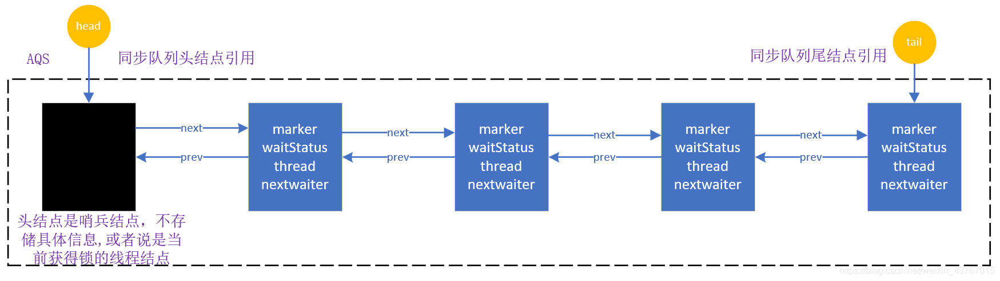

&emsp;在 AQS 内部 Node 的源码中我们能看到，同步队列是 "CLH" （Craig, Landin, andHagersten） 锁队列的变体，它的 head 引用指向的头结点作为哨兵结点，不存储任何与等待线程相关的信息，或者可以看成已经获得锁的结点。第二个结点开始才是真正的等待线程构建的结点，后续的结点会加入到链表尾部。  
&emsp;将新结点添加到链表尾部的方法是 compareAndSetTail(Node expect,Node update) 方法，该方法是一个 CAS 方法，能够保证线程安全。  
&emsp;最终获取锁的线程所在的结点，会被设置成为头结点（setHead 方法），该设置步骤是通过获取锁成功的线程来完成的，由于只有一个线程能够成功获取到锁，因此设置的方法并不需要使用 CAS 来保证。  
&emsp;同步队列遵循先进先出 (FIFO)，头结点的 next 结点是将要获取到锁的结点，线程在释放锁的时候将会唤醒后继结点，然后后继结点会尝试获取锁。

5.2 锁的获取与释放
-----------

&emsp;Lock 中 “锁” 的状态使用 state 变量来表示，一般来说 0 表示锁没被占用，大于 0 表示所已经被占用了。  
&emsp;**AQS 提供的锁的获取和释放分为独占式的和共享式的：**

1.  独占式：顾名思义就是同一时刻只能有一个线程获取到锁，其他获取锁线程只能处于同步队列中等待，只有获取锁的线程释放了锁，后继的线程才能够获取到锁。
2.  共享式：同一时刻能够有多个线程获取到锁。

&emsp;**对于 AQS 来说，线程同步的关键是对同步状态 state 的操作：**

1.  在独占式下获取和释放锁使用的方法为： 
    - void acquire(int arg)
    - void acquireInterruptibly(int arg) 
    - boolean release( int arg）。
2.  在共享式下获取和释放锁的方法为： 
    - void acquireShared(int arg) 
    - void acquireSharedInterruptibly(int arg）
    - boolean realseShared(int arg）。

&emsp;**获取锁的大概通用流程如下：**  

- 线程会首先尝试获取锁，如果失败，则将当前线程以及等待状态等信息包成一个 Node 结点加到同步队列里。
- 接着会不断循环尝试获取锁（获取锁的条件是当前结点为 head 的直接后继才会尝试），如果失败则会尝试阻塞自己（阻塞的条件是当前节结点的前驱结点是 SIGNAL 状态），阻塞后将不会执行后续代码，直至被唤醒；
- 当持有锁的线程释放锁时，会唤醒队列中的后继线程，或者阻塞的线程被中断或者时间到了，那么阻塞的线程也会被唤醒。

&emsp;**如果分独占式和共享式，那么在上面的通用步骤之下有这些区别：**

1.  独占式获取的锁是与具体线程绑定的，就是说如果一个线程获取到了锁，exclusiveOwnerThread 字段就会记录这个线程，其他线程再尝试操作 state 获取锁时会发现当前该锁不是自己持有的，就会在获取失败后被放入 AQS 同步队列。比如独占锁 ReentrantLock 的实现， 当一个线程获取了 ReentrantLock 的锁后，在 AQS 内部会首先使用 CAS 操作把 state 状态值从 0 变为 1 ，然后设置当前锁的持有者为当前线程，当该线程再次获取锁时发现它就是锁的持有者，则会把状态值从 1 变为 2，也就是设置可重入次数，而当另外一个线程获取锁时发现自己并不是该锁的持有者就会被放入 AQS 同步队列后挂起。
2.  共享式获取的锁与具体线程是不相关的，当多个线程去请求锁时通过 CAS 方式竞争获取锁，当一个线程获取到了锁后，另外一个线程再次去获取时如果当前锁还能满足它的需要，则当前线程只需要使用 CAS 方式进行获取即可。比如 Semaphore 信号量， 当一个线程通过 acquire（）方法获取信号量时，会首先看当前信号量个数是否满足需要，不满足则把当前线程放入同步队列，如果满足则通过自旋 CAS 获取信号量，相应的信号量个数减少对应的值。

&emsp;**实际上，具体的步骤更加复杂，下面讲解源码的时候会提到！**

5.3 acquire 独占式获取锁
------------------

&emsp;**通过调用 AQS 的 acquire 模版方法可以独占式的获取锁，该方法不会响应中断，也就是由于线程获取同步状态失败后进入同步队列中，后续对线程进行中断操作时，线程不会从同步队列中移出。基于独占式实现的组件有 ReentrantLock 等。**  

&emsp;**该方法大概步骤如下：**

1.  首先调用 tryAcquire 方法尝试获取锁，如果获取锁成功会返回 true，方法结束；否则获取锁失败返回 false，然后进行下一步的操作。
2.  通过 addWaiter 方法将线程按照独占模式 Node.EXCLUSIVE 构造同步结点，并添加到同步队列的尾部。
3.  然后通过 acquireQueued(Node node,int arg) 方法继续自旋获取锁。
4.  一次自旋中如果获取不到锁，那么判断是否可以挂起并尝试挂起结点中的线程（调用 LockSupport.park(this) 方法挂起自己，注意这里的线程状态是 WAITING）。而挂起线程的唤醒主要依靠前驱结点或线程被中断来实现，注意唤醒之后会继续自旋尝试获得锁。
5.  最终只有获得锁的线程才能从 acquireQueued 方法返回，然后根据返回值判断是否调用 selfInterrupt 设置中断标志位，但此时线程处于运行态，即使设置中断标志位也不会抛出异常（即 acquire（lock）方法不会响应中断）。
6.  线程获得锁，acquire 方法结束，从 lock 方法中返回，继续后续执行同步代码！

```java
/**
 * 独占式的尝试获取锁，一直获取不成功就进入同步队列等待
 */
public final void acquire(int arg) {
    //内部是由4个方法的调用组成的
    if (!tryAcquire(arg) && acquireQueued(addWaiter(Node.EXCLUSIVE), arg))
        selfInterrupt();
}
```

### 5.3.1 tryAcquire 尝试获取独占锁

&emsp;**熟悉的 tryAcquire 方法，这个方法我们在最开头讲 “AQS 的设计” 时就提到过，该方法是 AQS 的子类即我们自己实现的，用于首次尝试获取独占锁，一般来说就是对 state 的改变、或者重入锁的检查、设置当前获得锁的线程等等，不同的锁有自己相应的逻辑判断，这里不多讲，后面讲具体锁的实现的时候（比如 ReentrantLock）会讲到。总之，获取成功该方法就返回 true，失败就返回 false。**  

&emsp;在 AQS 的中 tryAcquire 的实现为抛出异常，因此需要子类重写：

```
protected boolean tryAcquire(int arg) {
    throw new UnsupportedOperationException();
}
```

### 5.3.2 addWaiter 加入到同步队列

&emsp;**addWaiter 方法是 AQS 提供的，也不需要我们重写，或者说是锁的通用方法！**  
&emsp;**addWaiter 方法用于将按照独占模式构造的同步结点 Node.EXCLUSIVE 添加到同步队列的尾部。大概步骤为：**

1.  按照给定模式，构建新结点。
2.  如果同步队列不为 null，则尝试将新结点添加到队列尾部（只尝试一次），如果添加成功则返回新结点，方法结束。
3.  如果队列为 null 或者添加失败，则调用 enq 方法循环尝试添加，直到成功，返回新结点，方法结束。

```java
/**
 * addWaiter(Node node)方法将获取锁失败的线程构造成结点加入到同步队列的尾部
 *
 * @param mode 模式。独占模式传入的是一个Node.EXCLUSIVE，即null；共享模式传入的是一个Node.SHARED，即一个静态结点对象（共享的、同一个）
 * @return 返回构造的结点
 */
private Node addWaiter(Node mode) {
    /*1 首先构造结点*/
    Node node = new Node(Thread.currentThread(), mode);
    /*2 尝试将结点直接放在队尾*/
    //直接获取同步器的tail结点，使用pred来保存
    Node pred = tail;
    /*如果pred不为null，实际上就是队列不为null
     * 那么使用CAS方式将当前结点设为尾结点
     * */
    if (pred != null) {
        # 多线程存在竞争的情况下：当前结点的前驱结点为 tail,只用当 CAS 操作成功后，tail.next 指向 node 结点
        # 如果 pred.next = node 结点，线程 A 执行到 compareAndSetTail(pred, node) 时挂起，线程 B 又改变了
        # pred.next = node 指向，此时线程 A 又拿到 CPU 执行且 CAS 操作成功。
        # 此时 pred.next= nodeB, nodeA.prev = pred tail = nodeA 出现分歧。
        node.prev = pred;
        //通过使用compareAndSetTail的CAS方法来确保结点能够被线程安全的添加，虽然不一定能成功。
        if (compareAndSetTail(pred, node)) {
            //将新构造的结点置为原队尾结点的后继
            pred.next = node;
            //返回新结点
            return node;
        }
    }
    /*
     * 3 走到这里，可能是:
     * (1) 由于可能是并发条件，并且上面的CAS操作并没有循环尝试，因此可能添加失败
     * (2) 队列可能为null
     * 调用enq方法，采用自旋方式保证构造的新结点成功添加到同步队列中
     * */
    enq(node);
    return node;
}

/**
 * addWaiter方法中使用到的Node构造器
 *
 * @param thread 当前线程
 * @param mode   模式
 */
Node(Thread thread, AbstractQueuedSynchronizer.Node mode) {
    //等待队列中的后继结点 就等于该结点的模式
    //由此可知，共享模式该值为Node.SHARED结点常量，独占模式该值为null
    this.nextWaiter = mode;
    //当前线程
    this.thread = thread;
}
```

#### 5.3.2.1 enq 保证结点入队

**enq 方法用在同步队列为 null 或者一次 CAS 添加失败的时候，enq 要保证结点最终必定添加成功。大概步骤为：**

1.  **开启一个死循环**，在死循环中进行如下操作；
2.  如果队列为空，那么初始化队列，添加一个哨兵结点，结束本次循环，继续下一次循环；
3.  如果队列不为空，那么向前面的方法一样，则尝试将新结点添加到队列尾部，如果添加成功则返回新结点的前驱，循环结束；如果不成功，结束本次循环，继续下一次循环。

**enq 方法返回的是新结点的前驱，当然在 addWaiter 方法中没有用到。**  

&emsp;另外，添加头结点使用的 compareAndSetHead 方法和添加尾结点使用的 compareAndSetTail 方法都是 CAS 方法，并且都是调用 Unsafe 类中的本地方法，因为线程挂机、恢复、CAS 操作等最终会通过操作系统中实现，Unsafe 类就提供了 Java 与底层操作系统进行交互的直接接口，这个类的里面的许多操作类似于 C 的指针操作，通过找到对某个属性的偏移量，直接对该属性赋值，因为与 Java 本地方法对接都是 Hospot 源码中的方法，而这些的方法都是采用 C++ 写的，必须使用指针！  
&emsp;**也可以说 Unsafe 是 AQS 的实现并发控制机制基石。因此在学习 AQS 的时候，可以先了解 Unsafe：[Java 中的 Unsafe 类的原理详解与使用案例](https://blog.csdn.net/weixin_43767015/article/details/104643890)。**

```java
/**
 * 循环，直到尾结点添加成功
 */
private Node enq(final Node node) {
    /*死循环操作，直到添加成功*/
    for (; ; ) {
        //获取尾结点t
        Node t = tail;
        /*如果队列为null，则初始化同步队列*/
        if (t == null) {
            /*调用compareAndSetHead方法，初始化同步队列
             * 注意：这里是新建了一个空白结点，这就是传说中的哨兵结点
             * CAS成功之后，head将指向该哨兵结点，返回true
             * */
            if (compareAndSetHead(new Node()))
                //尾结点指向头结点（哨兵结点）
                tail = head;
            /*之后并没有结束，而是继续循环，此时队列已经不为空了，因此会进行下面的逻辑*/
        }
        /*如果队列不为null，则和外面的的方法类似，调用compareAndSetTail方法，新建新结点到同步队列尾部*/
        else {
            /*1 首先修改新结点前驱的指向，这一步不是安全的
            但是没关系，因为这一步如果发生了冲突，那么下面的CAS操作必然之后有一条线程会成功
            其他线程将会重新循环尝试*/
            node.prev = t;
            /*
             * 2 调用compareAndSetTail方法通过CAS方式尝试将结点添加到同步队列尾部
             * 如果添加成功，那么才能继续下一步，结束这个死循环，否则就会不断循环尝试添加
             * */
            if (compareAndSetTail(t, node)) {
                //3 修改原尾结点后继结点的指向
                t.next = node;
                //返回新结点，结束死循环
                return t;
            }
        }
    }
}

/**
 * CAS添加头结点. 仅仅在enq方法中用到
 *
 * @param update 头结点
 * @return true 成功；false 失败
 */
private final boolean compareAndSetHead(Node update) {
    return unsafe.compareAndSwapObject(this, headOffset, null, update);
}


/**
 * CAS添加尾结点. 仅仅在enq方法中用到
 *
 * @param expect 预期原尾结点
 * @param update 新尾结点
 * @return true 成功；false 失败
 */
private final boolean compareAndSetTail(Node expect, Node update) {
    return unsafe.compareAndSwapObject(this, tailOffset, expect, update);
}
```

&emsp;在 addWaiter 和 enq 方法中，成为尾结点需要三步：

1.  设置前驱 prev
2.  设置 tail
3.  设置后继 next

&emsp;**由于第二步设置 tail 是 CAS 操作，那么只能保证 node 的前驱 prev 一定是正确的，但是此后设置后继的操作却不一定能够马上成功就切换到了其他线程，此时 next 可能为 null，但实际他的后继并不一定真的为 null。**  
&emsp;**因此同步队列只能保证前驱 prev 一定是可靠的，但是 next 却不一定可靠，所以后面的源码的遍历操作基本上都是从后向前通过前驱 prev 进行遍历的。**

### 5.3.3 acquireQueued 结点自旋获取锁

&emsp;**能够走到该方法，那么说明通过了 tryAcquire() 和 addWaiter() 方法，表示该线程获取锁已经失败并且被放入同步队列尾部了。**  
&emsp;a**cquireQueued 方法表示结点进入同步队列之后的动作，实际上就进入了一个自旋的过程，自旋过程中，当条件满足，获取到了锁，就可以从这个自旋中退出并返回，否则可能会阻塞该结点的线程，后续即使阻塞被唤醒，还是会自旋尝试获取锁，直到成功或者而抛出异常。**  
&emsp;**最终如果该方法会因为获取到锁而退出，则会返回否被中断标志的标志位 或者 因为异常而退出，则会抛出异常！大概步骤为：**

1.  同样开启一个死循环，在死循环中进行下面的操作；
2.  如果当前结点的前驱是 head 结点，那么尝试获取锁，如果获取锁成功，那么当前结点设置为头结点 head，当前结点线程出队，表示当前线程已经获取到了锁，然后返回是否被中断标志，结束循环，进入 finally；
3.  如果当前结点的前驱不是 head 结点或者尝试获取锁失败，那么判断当前线程是否应该被挂起，如果返回 true，那么调用 parkAndCheckInterrupt 挂起当前结点的线程（LockSupport.park 方法挂起线程，线程出于 WAITING），此时不再执行后续的步骤、代码。
4.  如果当前线程不应该被挂起，即返回 false，那本次循环结束，继续下一次循环。
5.  如果线程被其他线程唤醒，那么判断是否是因为中断而被唤醒并修改标志位，同时继续循环，直到在步骤 2 获得锁，才能跳出循环！（这也是 acquire 方法不会响应中断的原理—park 方法被中断时不会抛出异常，仅仅是从挂起状态返回，然后需要继续尝试获取锁）
6.  最终，线程获得了锁跳出循环，或者发生异常跳出循环，那么会执行 finally 语句块，finally 中判断线程是否是因为发生异常而跳出循环，如果是，那么执行 cancelAcquire 方法取消该结点获取锁的请求；如果不是，即因为获得锁跳出循环，则 finally 中什么也不干！

```java
/**
 * @param node 新结点
 * @param arg  参数
 * @return 如果在等待时中断，则返回true
 */
final boolean acquireQueued(final Node node, int arg) {
    //failed表示获取锁是否失败标志
    boolean failed = true;
    try {
        //interrupted表示是否被中断标志
        boolean interrupted = false;
        /*死循环*/
        for (; ; ) {
            //获取新结点的前驱结点
            final Node p = node.predecessor();
            /*只有前驱结点是头结点的时候才能尝试获取锁
             * 同样调用tryAcquire方法获取锁
             * */
            if (p == head && tryAcquire(arg)) {
                //获取到锁之后，就将自己设置为头结点（哨兵结点），线程出队列
                setHead(node);
                //前驱结点（原哨兵结点）的链接置空，由JVM回收
                p.next = null;
                //获取锁是否失败改成false，表示成功获取到了锁
                failed = false;
                //返回interrupted，即返回线程是否被中断
                return interrupted;
            }
            /*前驱结点不是头结点或者获取同步状态失败*/
            /*shouldParkAfterFailedAcquire检测线程是否应该被挂起，如果返回true
             * 则调用parkAndCheckInterrupt用于将线程挂起
             * 否则重新开始循环
             * */
            if (shouldParkAfterFailedAcquire(p, node) &&
                    parkAndCheckInterrupt())
                /*到这一步，说明是当前结点（线程）因为被中断而唤醒，那就改变自己的中断标志位状态信息为true
                 * 然后又从新开始循环，直到获取到锁，才能返回
                 * */
                interrupted = true;
        }
    }
    /*线程获取到锁或者发生异常之后都会执行的finally语句块*/ finally {
        /*如果failed为true，表示获取锁失败，即对应发生异常的情况，
        这里发生异常的情况只有在tryAcquire方法和predecessor方法中可能会抛出异常，此时还没有获得锁，failed=true
        那么执行cancelAcquire方法，该方法用于取消该线程获取锁的请求，将该结点的线程状态改为CANCELLED，并尝试移除结点（如果是尾结点）
        另外，在超时等待获取锁的的方法中，如果超过时间没有获取到锁，也会调用该方法

        如果failed为false，表示获取到了锁，那么该方法直接结束，继续往下执行；*/
        if (failed)
            //取消获取锁请求，将当前结点从队列中移除，
            cancelAcquire(node);
    }
}


/**
 * 位于Node结点类中的方法
 * 返回上一个结点，或在 null 时引发 NullPointerException。 当前置不能为空时使用。 空检查可以取消，表示此异常无代码层面的意义，但可以帮助 VM？所以这个异常到底有啥用？
 *
 * @return 此结点的前驱
 */
final Node predecessor() throws NullPointerException {
    //获取前驱
    Node p = prev;
    //如果为null，则抛出异常
    if (p == null)
        throw new NullPointerException();
    else
        //返回前驱
        return p;
}


/**
 * head指向node新结点，该方法是在tryAcquire获取锁之后调用，不会产生线程安全问题
 *
 * @param node 新结点
 */
private void setHead(Node node) {
    head = node;
    //新结点的thread和prev属性置空
    //即丢弃原来的头结点，新结点成为哨兵结点，内部线程出队
    //设置里虽然线程引用置空了，但是一般在tryAcquire方法中轨记录获取到锁的线程，因此不担心找不到是哪个线程获取到了锁
    //这里也能看出,哨兵结点或许也可以叫做"获取到锁的结点"
    node.thread = null;
    node.prev = null;
}
```

#### 5.3.3.1 shouldParkAfterFailedAcquire 结点是否应该挂起

&emsp;**shouldParkAfterFailedAcquire 方法在没有获取到锁之后调用，用于判断当前结点是否需要被挂起。大概步骤如下：**

1.  如果前驱结点已经是 SIGNAL(-1) 状态，即表示当前结点可以挂起，返回 true，方法结束；
2.  否则，如果前驱结点状态大于 0，即 Node.CANCELLED，表示前驱结点放弃了锁的等待，那么由该前驱向前查找，直到找到一个状态小于等于 0 的结点，当前结点排在该结点后面，返回 false，方法结束；
3.  否则，前驱结点的状态既不是 SIGNAL(-1)，也不是 CANCELLED(1)，尝试 CAS 设置前驱结点的状态为 SIGNAL(-1)，返回 false，方法结束！

&emsp;**只有前驱结点状态为 SIGNAL 时，当前结点才能安心挂起，否则一直自旋！**  

&emsp;**从这里能看出来，一个结点的 SIGNAL 状态一般都是由它的后继结点设置的，但是这个状态却是表示后继结点的状态，表示的意思就是前驱结点如果释放了锁，那么就有义务唤醒后继结点！**

```java
/**
 * 检测当前结点（线程）是否应该被挂起
 *
 * @param pred 该结点的前驱
 * @param node 该结点
 * @return 如果前驱结点已经是SIGNAL状态，当前结点才能挂起，返回true；否则，可能会查找新的前驱结点或者尝试将前驱结点设置为SIGNAL状态，返回false
 */
private static boolean shouldParkAfterFailedAcquire(Node pred, Node node) {
    //获取 前取的waitStatus\_等待状态
    //回顾创建结点时候,并没有给waitStatus赋值，因此每一个结点最开始的时候waitStatus的值都为0
    int ws = pred.waitStatus;
    /*如果前驱结点已经是SIGNAL状态，即表示当前结点可以挂起*/
    if (ws == Node.SIGNAL)
        return true;
    /*如果前驱结点状态大于0，即 Node.CANCELLED 表示前驱结点放弃了锁的等待*/
    if (ws > 0) {
        /*由该前驱向前查找，直到找到一个状态小于等于0的结点(即没有被取消的结点)，当前结点成为该结点的后驱，这一步很重要，可能会清理一段被取消了的结点，并且如果该前驱释放了锁，还会唤醒它的后继，保持队列活性*/
        do {
            node.prev = pred = pred.prev;
        } while (pred.waitStatus > 0);
        pred.next = node;
    }
    /*否则，前驱结点的状态既不是SIGNAL(-1)，也不是CANCELLED(1)*/
    else {
        /*前驱结点的状态CAS设置为SIGNAL(-1)，可能失败，但没关系，因为失败之后会一直循环*/
        compareAndSetWaitStatus(pred, ws, Node.SIGNAL);
    }
    //返回false，表示当前结点不能挂起
    return false;
}
```

#### 5.3.3.2 parkAndCheckInterrupt 挂起线程 & 判断中断状态

&emsp;**shouldParkAfterFailedAcquire 方法返回 true 之后，将会调用 parkAndCheckInterrupt 方法挂起线程并且后续判断中断状态，分两步：**

1.  使用 LockSupport.park(this) 挂起该线程，不再执行后续的步骤、代码。直到该线程被中断或者被唤醒（unpark）！
2.  如果该线程被中断或者唤醒，那么返回 Thread.interrupted() 方法的返回值，该方法用于判断前线程的中断状态，并且清除该中断状态，即如果该线程因为被中断而唤醒，则中断状态为 true，将中断状态重置为 false，并返回 true，如果该线程不是因为中断被唤醒，则中断状态为 false，并返回 false。

```java
/**
 * 挂起线程，在线程返回后返回中断状态
 *
 * @return 如果因为线程中断而返回，而返回true，否则返回false
 */
private final boolean parkAndCheckInterrupt() {
    /*1)使用LockSupport.park(this)挂起该线程，不再执行后续的步骤、代码。直到该线程被中断或者被唤醒（unpark）*/
    LockSupport.park(this);
    /*2)如果该线程被中断或者唤醒，那么返回Thread.interrupted()方法的返回值，
    该方法用于判断前线程的中断状态，并且清除该中断状态，即，如果该线程因为被中断而唤醒，则中断状态为true，将中断状态重置为false，并返回true，注意park方法被中断时不会抛出异常！
    如果该线程不是因为中断被唤醒，则中断状态为false，并返回false*/
    return Thread.interrupted();
}
```

#### 5.3.3.3 finally 代码块

&emsp;**在 acquireQueued 方法中，具有一个 finally 代码块，那么无论 try 中发生了什么，finally 代码块都会执行的。在 acquire 独占式不可中断获取锁的方法中，执行 finally 的只有两种情况：**

1.  当前结点（线程）最终获取到了锁，此时会进入 finally，而在获取到锁之后会设置 failed = false。
2.  在 try 中发生了异常，此时直接跳到 finally 中。这里发生异常的情况只可能在 tryAcquire 或 predecessor 方法中发生，然后直接进入 finally 代码块中，此时还没有获得锁，failed=true！  
    - tryAcquire 方法是我们自己实现的，抛出什么异常由我们来定，就算抛出异常一般也不会在 acquireQueued 中抛出，可能在最开始调用 tryAcquire 时就抛出了。  
    - predecessor 方法中，会检查如果前驱结点为 null 则抛出 NullPointerException。但是注释中又说这个检查无代码层面的意义，或许是这个异常永远不会抛出？

&emsp;**finally 代码块中的逻辑为：**

1.  如果 failed = true，表示没有获取锁而进行 finally，即发生了异常。那么执行 cancelAcquire 方法取消当前结点线程获取锁的请求，acquireQueued 方法结束，然后抛出异常。
2.  如果 failed = false，表示已经获取到了锁，那么实际上 finally 中什么都不会执行。acquireQueued 方法结束，返回 interrupted—是否被中断标志。

&emsp;**综上所述，在 acquire 独占式不可中断获取锁的方法中，大部分情况在 finally 中都是什么也不干就返回了，或者说抛出异常的情况基本没有，因此 cancelAcquire 方法基本不考虑。**  
&emsp;**但是在可中断获取锁或者超时获取锁的方法中，执行到 cancelAcquire 方法的情况还是比较常见的。因此将 cancelAcquire 方法的源码分析放到可中断获取锁方法的源码分析部分！**

### 5.3.4 selfInterrupt 安全中断

&emsp;**selfInterrupt 是 acquire 中最后可能调用的一个方法，顾名思义，用于安全的中断，什么意思呢，就是根据! tryAcquire 和 acquireQueued 返回值判断是否需要设置中断标志位。**  

&emsp;**只有 tryAcquire 尝试失败，并且 acquireQueued 方法 true 时，才表示该线程是被中断过了的，但是在 parkAndCheckInterrupt 里面判断中断标志位之后又重置的中断标志位（interrupted 方法会重置中断标志位）。**  

&emsp;**虽然看起来没啥用，但是本着负责的态度，还是将中断标志位记录下来。那么此时重新设置该线程的中断标志位为 true。**

```java
/**
 * 中断当前线程，由于此时当前线程出于运行态，因此只会设置中断标志位，并不会抛出异常
 */
static void selfInterrupt() {
    Thread.currentThread().interrupt();
}
```

5.4 release 独占式锁释放
------------------

&emsp;**当前线程获取到锁并执行了相应逻辑之后，就需要释放锁，使得后续结点能够继续获取锁。通过调用 AQS 的 release(int arg) 模版方法可以独占式的释放锁，在该方法大概步骤如下：**

1.  尝试使用 tryRelease(arg) 释放锁，该方法在最开始我们就讲过，是自己实现的方法，通常来说就是将 state 值为 0 或者减少、清除当前获得锁的线程等等，如果符合自己的逻辑，锁释放成功则返回 true，否则返回 false；
2.  如果 tryRelease 释放成功返回 true，判断如果 head 不为 null 且 head 的状态不为 0，那么尝试调用 unparkSuccessor 方法唤醒头结点之后的一个非取消状态 (非 CANCELLED 状态) 的后继结点，让其可以进行锁获取。返回 true，方法结束；
3.  如果 tryRelease 释放失败，那么返回 false，方法结束。

```java
/**
 * 独占式的释放同步状态
 *
 * @param arg 参数
 * @return 释放成功返回true, 否则返回false
 */
public final boolean release(int arg) {
    /*tryRelease释放同步状态，该方法是自己重写实现的方法
    释放成功将返回true，否则返回false或者自己实现的逻辑*/
    if (tryRelease(arg)) {
        //获取头结点
        Node h = head;
        //如果头结点不为null并且状态不等于0
        if (h != null && h.waitStatus != 0)
            /*那么唤醒头结点的一个出于等待锁状态的后继结点
             * 该方法在acquire中已经讲过了
             * */
            unparkSuccessor(h);
        return true;
    }
    return false;
}
```

### 5.4.1 unparkSuccessor 唤醒后继结点

&emsp;**unparkSuccessor 用于唤醒参数结点的某个非取消的后继结点，该方法在很多地方法都被调用，大概步骤：**

1.  如果当前结点的状态小于 0，那么 CAS 设置为 0，表示后继结点可以继续尝试获取锁。
2.  如果当前结点的后继 s 为 null 或者状态为取消 CANCELLED，则将 s 先指向 null；然后从 tail 开始到 node 之间倒序向前查找，找到离 tail 最近的非取消结点赋给 s。需要从后向前遍历，因为同步队列只保证结点前驱关系的正确性。
3.  如果 s 不为 null，那么状态肯定不是取消 CANCELLED，则直接唤醒 s 的线程，调用 LockSupport.unpark 方法唤醒，被唤醒的结点将从被 park 的位置继续执行！

```java
/**
 * 唤醒指定结点的后继结点
 *
 * @param node 指定结点
 */
private void unparkSuccessor(Node node) {

    int ws = node.waitStatus;
    /*
     * 1)  如果当前结点的状态小于0，那么CAS设置为0，表示后继结点线程可以先尝试获锁，而不是直接挂起。
     * */
    if (ws < 0)
        compareAndSetWaitStatus(node, ws, 0);
    //先获取node的直接后继
    Node s = node.next;
    /*
     * 2)  如果s为null或者状态为取消CANCELLED，则从tail开始到node之间倒序向前查找，找到离tail最近的非取消结点赋给s。
     * */
    if (s == null || s.waitStatus > 0) {
        s = null;
        for (Node t = tail; t != null && t != node; t = t.prev)
            if (t.waitStatus <= 0)
                s = t;
    }
    /*
     * 3)如果s不为null，那么状态肯定不是取消CANCELLED，则直接唤醒s的线程，调用LockSupport.unpark方法唤醒，被唤醒的结点将从被park的位置向后执行！
     * */
    if (s != null)
        LockSupport.unpark(s.thread);
}
```

5.5 acquirelnterruptibly 独占式可中断获取锁
----------------------------------

&emsp;**在 JDK1.5 之前，当一个线程获取不到锁而被阻塞在 synchronized 之外时，如果对该线程进行中断操作，此时该线程的中断标志位会被修改，但线程依旧会阻塞在 synchronized 上，等待着获取锁，即无法响应中断。**  

&emsp;**上面分析的独占式获取锁的方法 acquire，同样是不会响应中断的。但是 AQS 提供了另外一个 acquireInterruptibly 模版方法，调用该方法的线程在等待获取锁时，如果当前线程被中断，会立刻返回，并抛出 InterruptedException。**

```java
public final void acquireInterruptibly(int arg)
        throws InterruptedException {
    //如果当前线程被中断，直接抛出异常
    if (Thread.interrupted())
        throw new InterruptedException();
    //尝试获取锁
    if (!tryAcquire(arg))
        //如果没获取到，那么调用AQS 可被中断的方法
        doAcquireInterruptibly(arg);
}
```

### 5.5.1 doAcquireInterruptibly 独占式可中断获取锁

&emsp;**doAcquireInterruptibly 会首先判断线程是否是中断状态，如果是则直接返回并抛出异常其他不步骤和独占式不可中断获取锁基本原理一致，还有一点的区别就是在后续挂起的线程因为线程被中断而返回时的处理方式不一样：独占式不可中断获取锁仅仅是记录该状态，interrupted = true，紧接着又继续循环获取锁；独占式可中断获取锁则直接抛出异常，因此会直接跳出循环去执行 finally 代码块。**

```java
/**
 * 独占可中断式的锁获取
 *
 * @param arg 参数
 */
private void doAcquireInterruptibly(int arg)
        throws InterruptedException {
    //同样调用addWaiter将当前线程构造成结点加入到同步队列尾部
    final Node node = addWaiter(Node.EXCLUSIVE);
    //获取锁失败标志，默认为true
    boolean failed = true;
    try {
        /*和独占式不可中断方法acquireQueued一样，循环获取锁*/
        for (; ; ) {
            final Node p = node.predecessor();
            if (p == head && tryAcquire(arg)) {
                setHead(node);
                p.next = null; // help GC
                failed = false;
                return;
            }
            if (shouldParkAfterFailedAcquire(p, node) &&
                    parkAndCheckInterrupt())
                /*
                 * 这里就是区别所在，独占不可中断式方法acquireQueued中
                 * 如果线程被中断，此处仅仅会记录该状态，interrupted = true，紧接着又继续循环获取锁
                 *
                 * 但是在该独占可中断式的锁获取方法中
                 * 如果线程被中断，此处直接抛出异常，因此会直接跳出循环去执行finally代码块
                 * */
                throw new InterruptedException();
        }
    }
    /*获取到锁或者抛出异常都会执行finally代码块*/ 
    finally {
        /*如果获取锁失败。可能就是线程被中断了，那么执行cancelAcquire方法取消该结点对锁的请求，该线程结束*/
        if (failed)
            cancelAcquire(node);
    }
}
```

### 5.5.2 finally 代码块

&emsp;**在 doAcquireInterruptibly 方法中，具有一个 finally 代码块，那么无论 try 中发生了什么，finally 代码块都会执行的。在 acquireInterruptibly 独占式可中断获取锁的方法中，执行 finally 的只有两种情况：**

1.  当前结点（线程）最终获取到了锁，此时会进入 finally，而在获取到锁之后会设置 failed = false。
2.  在 try 中发生了异常，此时直接跳到 finally 中，这里发生异常的情况可能在 tryAcquire、predecessor 方法中，更加有可能的原因是因为线程被中断而抛出 InterruptedException 异常，然后直接进入 finally 代码块中，此时还没有获得锁，failed=true！  
    - tryAcquire 方法是我们自己实现的，抛出什么异常由我们来定，就算抛出异常一般也不会在 doAcquireInterruptibly 中抛出，可能在最开始调用 tryAcquire 时就抛出了。  
    - predecessor 方法中，会检查如果前驱结点为 null 则抛出 NullPointerException。但是注释中又说这个检查无代码层面的意义，或许是这个异常永远不会抛出？  
    - 根据 doAcquireInterruptibly 逻辑，如果线程在挂起过程中被中断，那么将主动抛出 InterruptedException 异常，这也是被称为 “可中断” 的逻辑

&emsp;**finally 代码块中的逻辑为：**

1.  如果 failed = true，表示没有获取锁而进行 finally，即发生了异常。那么执行 cancelAcquire 方法取消当前结点线程获取锁的请求，doAcquireInterruptibly 方法结束，抛出异常！
2.  如果 failed = false，表示已经获取到了锁，那么实际上 finally 中什么都不会执行，doAcquireInterruptibly 方法结束。

#### 5.5.2.1 cancelAcquire 取消获取锁请求

&emsp;**由于独占式可中断获取锁的方法中，线程被中断而抛出异常的情况比较常见，因此这里分析 finally 中 cancelAcquire 的源码。cancelAcquire 方法用于取消结点获取锁的请求，参数为需要取消的结点 node，大概步骤为：**

1.  node 记录的线程 thread 置为 null
2.  跳过已取消的前置结点。由 node 向前查找，直到找到一个状态小于等于 0 的结点 pred (即找一个没有取消的结点)，更新 node.prev 为找到的 pred。
3.  **node 的等待状态 waitStatus 置为 CANCELLED，即取消请求锁。**
4.  **如果 node 是尾结点**，那么尝试 CAS 更新 tail 指向 pred，成功之后继续 CAS 设置 pred.next 为 null。
5.  否则，说明 node 不是尾结点或者 CAS 失败 (可能存在对尾结点的并发操作)：  
    - **如果 node 不是 head 的后继** 并且 (pred 的状态为 SIGNAL 或者将 pred 的 waitStatus 置为 SIGNAL 成功) 并且 pred 记录的线程不为 null。那么设置 pred.next 指向 node.next。最后 node.next 指向 node 自己。  
    - **否则，说明 node 是 head 的后继** 或者 pred 状态设置失败 或者 pred 记录的线程为 null。那么调用 unparkSuccessor 唤醒 node 的一个没取消的后继结点。最后 node.next 指向 node 自己。

```java
/**
 * 取消指定结点获取锁的请求
 *
 * @param node 指定结点
 */
private void cancelAcquire(Node node) {
    // Ignore if node doesn't exist
    if (node == null)
        return;
    /*1 node记录的线程thread置为null*/
    node.thread = null;

    /*2 类似于shouldParkAfterFailedAcquire方法中查找有效前驱的代码:
    do {
        node.prev = pred = pred.prev;
    } while (pred.waitStatus > 0);
    pred.next = node;

    这里同样由node向前查找，直到找到一个状态小于等于0的结点(即没有被取消的结点)，作为前驱
    但是这里只更新了node.prev,没有更新pred.next*/
    Node pred = node.prev;
    while (pred.waitStatus > 0)
        node.prev = pred = pred.prev;

    //predNext记录pred的后继，后续CAS会用到。
    Node predNext = pred.next;

    /*3 node的等待状态设置为CANCELLED，即取消请求锁*/
    node.waitStatus = Node.CANCELLED;

    /*4 如果当前结点是尾结点，那么尝试CAS更新tail指向pred，成功之后继续CAS设置pred.next为null。*/
    if (node == tail && compareAndSetTail(node, pred)) {
        //新尾结点pred的next结点设置为null，即使失败了也没关系，说明有其它新入队线程或者其它取消线程更新掉了。
        compareAndSetNext(pred, predNext, null);
    }
    /*5 否则，说明node不是尾结点或者CAS失败(可能存在对尾结点的并发操作)，这种情况要做的事情是把pred和node的后继非取消结点拼起来。*/
    else {
        int ws;
    /*5.1 如果node不是head的后继 并且 (pred的状态为SIGNAL或者将pred的waitStatus置为SIGNAL成功) 并且 pred记录的线程不为null。
    那么设置pred.next指向node.next。这里没有设置prev，但是没关系。
    此时pred的后继变成了node的后继—next，后续next结点如果获取到锁，那么在shouldParkAfterFailedAcquire方法中查找有效前驱时，
    也会找到这个没取消的pred，同时将next.prev指向pred，也就设置了prev关系了。
     */
        if (pred != head &&
                ((ws = pred.waitStatus) == Node.SIGNAL ||
                        (ws <= 0 && compareAndSetWaitStatus(pred, ws, Node.SIGNAL))) &&
                pred.thread != null) {
            //获取next结点
            Node next = node.next;
            //如果next结点存在且未被取消
            if (next != null && next.waitStatus <= 0)
                //那么CAS设置perd.next指向node.next
                compareAndSetNext(pred, predNext, next);
        }
        /*5.2 否则，说明node是head的后继 或者pred状态设置失败 或者 pred记录的线程为null。
         *
         * 此时需要调用unparkSuccessor方法尝试唤醒node结点的后继结点，因为node作为head的后继结点是唯一有资格取尝试获取锁的结点。
         * 如果外部线程A释放锁，但是还没有调用unpark唤醒node的时候，此时node被中断或者发生异常，这时node将会调用cancelAcquire取消，结点内部的记录线程变成null，
         * 此时就是算A线程的unpark方法执行，也只是LockSupport.unpark(null)而已，也就不会唤醒任何结点了
         * 那么node后面的结点也不会被唤醒了，队列就失活了；如果在这种情况下，在node将会调用cancelAcquire取消的代码中
         * 调用一次unparkSuccessor，那么将唤醒被取消结点的后继结点，让后继结点可以尝试获取锁，从而保证队列活性！
         *
         * 前面对node进行取消的代码中，并没有将node彻底移除队列，
         * 而被唤醒的结点会尝试获取锁，而在在获取到锁之后，在
         * setHead(node);
         * p.next = null; // help GC
         * 部分，可能将这些被取消的结点清除
         * */
        else {
            unparkSuccessor(node);
        }
        /*最后node.next指向node自身，方便后续GC时直接销毁无效结点
        同时也是为了Condition的isOnSyncQueue方法，判断一个原先属于条件队列的结点是否转移到了同步队列。
        因为同步队列中会用到结点的next域，取消结点的next也有值的话，可以断言next域有值的结点一定在同步队列上。
        这里也能看出来，遍历的时候应该采用倒序遍历，否则采用正序遍历可能出现死循环*/
        node.next = node;
    }
}
```

#### 5.5.2.2 cancelAcquire 案例演示

&emsp;设一个同步队列结构如下，有 ABCDE 五个线程调用 acquireInterruptibly 方法争夺锁，并且 BCDE 线程都是因为获取不到锁而导致的阻塞。  
&emsp;我们来看看几种情况下 cancelAcquire 方法怎么处理的：  
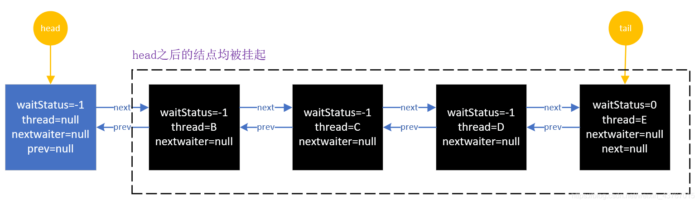  
&emsp;**如果此时线程 D 被中断，那么抛出异常进入 finally 代码块，属于 node 不是尾结点，node 不是 head 的后继的情况，如下图：**  
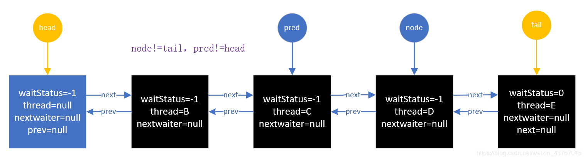
&emsp;**在 cancelAcquire 方法之后的结构如下：**  
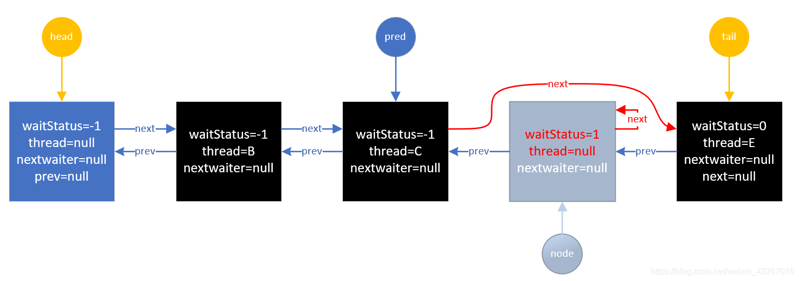  
&emsp;**如果此时线程 E 被中断，那么抛出异常进入 finally 代码块，属于 node 是尾结点的情况，如下图：**  
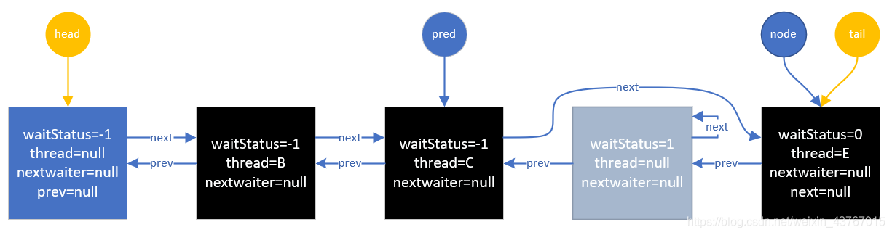  
&emsp;**在 cancelAcquire 方法之后的结构如下：**  
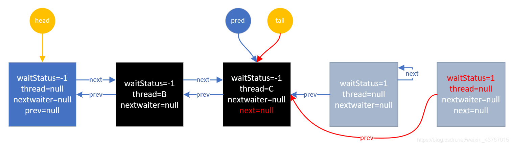  
&emsp;**如果此时进来了两个新线程 F、G，并且又都被挂起了，那么此时同步队列结构如下图：**  
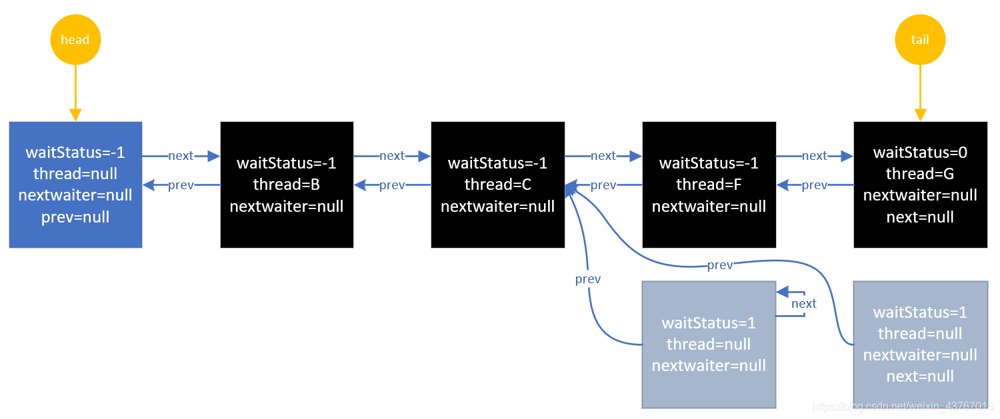

&emsp;**可以看到，实际上该队列出现了分叉，这种情况在同步队列中是很常见的，因为被取消的结点并没有主动去除自己的 prev 引用。那么这部分被取消的结点无法被删除吗，其实是可以的，只不过需要满足一定的条件结构！**  

&emsp;**如果此时线程 B 被中断，那么抛出异常进入 finally 代码块，属于 node 不是尾结点，node 是 head 的后继的情况，如下图：**  

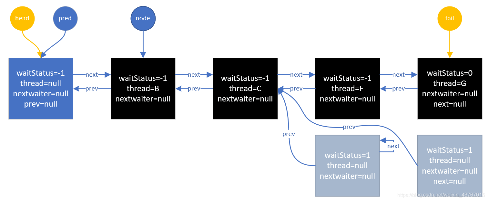  

&emsp;**在 cancelAcquire 方法之后的结构如下：**  

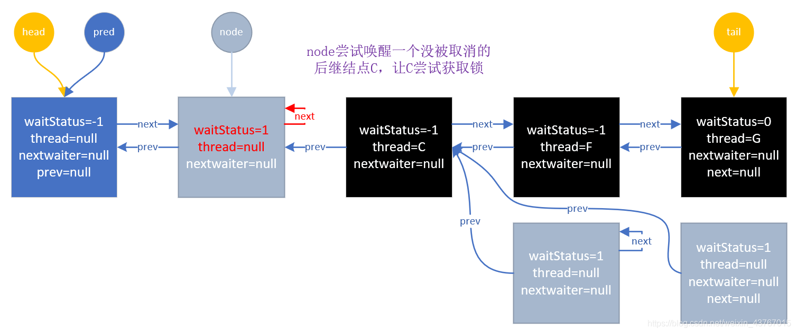  

&emsp;注意在这种情况下，node 还会调用 unparkSuccessor 方法唤醒后继结点 C，让 C 尝试获取锁，如果假设此时线程 A 的锁还没有使用完毕，那么此时 C 肯定不能获取到锁。  
&emsp;但是 C 也不是什么都没做，C 在被唤醒之后获得 CPU 执行权的那段时间里，在 doAcquireInterruptibly 方法的 for 循环中，改变了一些引用关系。  
&emsp;它会判断自己是否可以被挂起，此时它的前驱被取消了 waitStatus=1，明显不能，因此会继续向前寻找有效的前驱，具体的过程在前面的 “acquire- acquireQueued” 部分有详解，最终 C 被挂起之后的结构如下：  

  

&emsp;可以看到 C 最终和 head 结点直接链接了起来，但是此时被取消的 B 由于具有 prev 引用，因此还没有被 GC，不要急，这是因为还没到指定结构，到了就自然会被 GC 了。  
&emsp;如果此时线程 A 的资源使用完毕，那么首先释放锁，然后会尝试唤醒一个没有取消的后继线程，明显选择 C。**如果在 A 释放锁之后，调用 LockSupport.unpark 方法唤醒 C 之前，C 被先一步因中断而唤醒了。此时 C 抛出异常，不会再去获得锁，而是去 finally 执行 cancelAcquire 方法去了，此时还是属于 node 不是尾结点，node 是 head 的后继的情况，如下图：**  

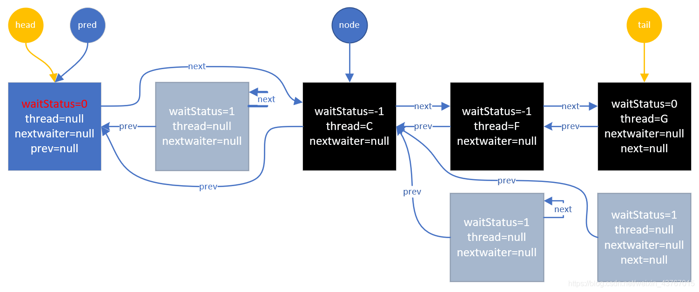
  
&emsp;**那么在 C 执行完 cancelAcquire 方法之后的结构如下：**

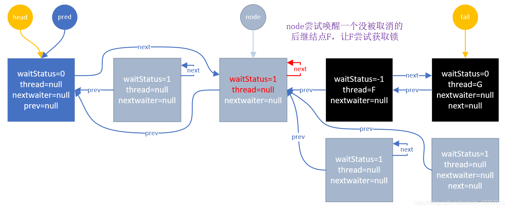
  
&emsp;**如果此时线程 A 又获取到了 CPU 的执行权，执行 LockSupport.unpark，但此时结点 C 因为被中断而取消，其内部记录的线程变量变成了 null，LockSupport.unpark(null)，将会什么也不做。那么这时队列岂不是失活了？其实并没有！**  
&emsp;**此时，cancelAcquire 方法中的 “node 不是尾结点，node 是 head 的后继” 这种情况下的 unparkSuccessor 方法就非常关键了。该方法用于唤醒被取消结点 C 的一个没被取消的后继结点 F，让其尝试获取锁，这样就能保证队列不失活。**  
&emsp;**F 被唤醒之后，会判断是否能够休眠，明显不能，因为前驱 node 的状态为 1，此时经过循环中一系列方法的操作，会变成如下结构：**  

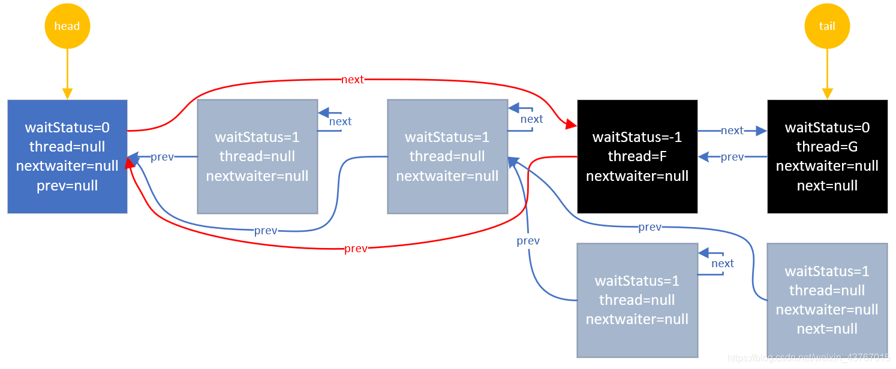  

&emsp;明显结点 F 是 head 的直接后继，可以获取锁。  
&emsp;在获取锁成功之后，F 会将自己设置为新的 head，此时又会改变一些引用关系，即将 F 与前驱结点的 prev 和 next 关系都移除：

```
setHead(node);
p.next = null; // help GC
```

&emsp;引用关系改变之后的结构下：  

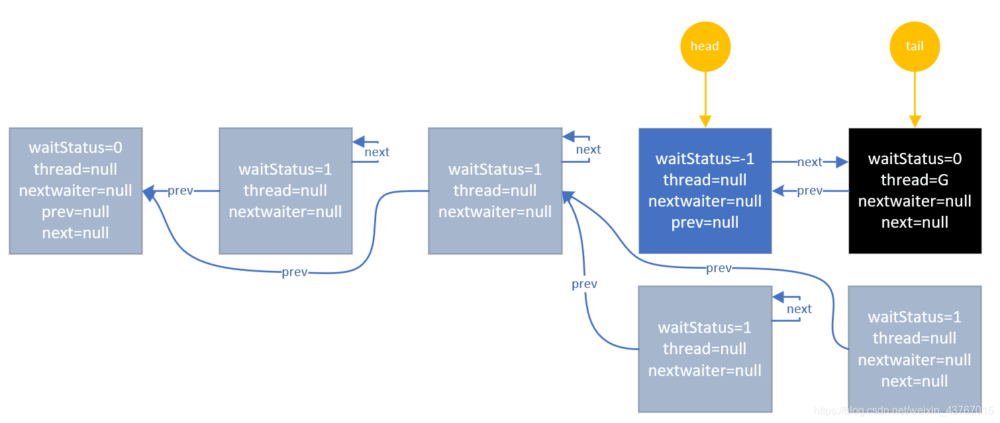
  
&emsp;可以看到，到这一步，才会真正的将哪些无效结点删除，被 GC 回收。**那么，需要真正删除一个结点需要有什么条件？条件就是：如果某个结点获取到了锁，那么该结点的前驱以及和该结点前驱相关的结点都将会被删除！**  
&emsp;**但是，在上面的分析中，我们认为只要有节点引用关联就不会被 GC 回收，然而实际上现代 Java 虚拟机采用可达性分析算法来分析垃圾，因此，在上面的队列中，对于那些 “分叉”，即那些被取消的、只剩下 prev 引用的、最重要的是不能通过 head 和 tail 的引用链到达也没有外部引用可达的节点，将会在可达性分析算法中被标记为垃圾并在一次 GC 中被直接回收！**

&emsp;比如此时 F 线程执行完了，下一个就是 G，那么 G 获得锁之后，F 将会被删除，最终结构如下：  

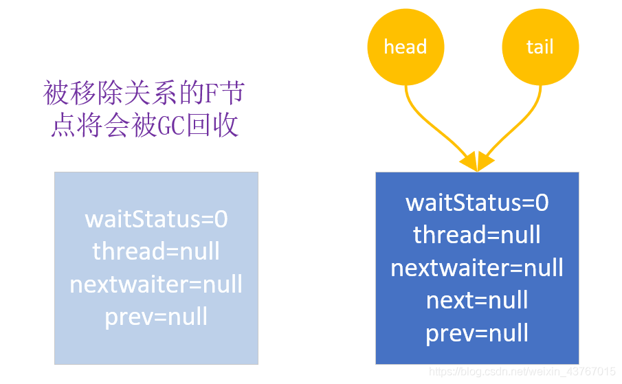

5.6 tryAcquireNanos 独占式超时获取锁
----------------------------

&emsp;**独占式超时获取锁 tryAcquireNanos 模版方法可以被视作响应中断获取锁 acquireInterruptibly 方法的 “增强版”，支持中断，支持超时时间！**

```java
/**
 * 独占式超时获取锁，支持中断
 *
 * @param arg          参数
 * @param nanosTimeout 超时时间，纳秒
 * @return 是否获取锁成功
 * @throws InterruptedException 如果被中断，则抛出InterruptedException异常
 */
public final boolean tryAcquireNanos(int arg, long nanosTimeout)
        throws InterruptedException {
    //如果当前线程被中断，直接抛出异常
    if (Thread.interrupted())
        throw new InterruptedException();
    //同样调用tryAcquire尝试获取锁，如果获取成功则直接返回true
    //否则调用doAcquireNanos方法挂起指定一段时间,该短时间内获取到了锁则返回true，超时还未获取到锁则返回false
    return tryAcquire(arg) ||
            doAcquireNanos(arg, nanosTimeout);
}
```

### 5.6.1 doAcquireNanos 独占式超时获取锁

&emsp;**doAcquireNanos(int arg,long nanosTimeout) 方法在支持响应中断的基础上， 增加了超时获取的特性。**  

&emsp;该方法在自旋过程中，当结点的前驱结点为头结点时尝试获取锁，如果获取成功则从该方法返回，这个过程和独占式同步获取的过程类似，但是在锁获取失败的处理上有所不同。  

&emsp;如果当前线程获取锁失败，则判断是否超时（nanosTimeout 小于等于 0 表示已经超时），如果没有超时，重新计算超时间隔 nanosTimeout，然后使当前线程等待 nanosTimeout 纳秒（当已到设置的超时时间，该线程会从 LockSupport.parkNanos(Objectblocker,long nanos) 方法返回）。  

&emsp; **如果 nanosTimeout 小于等于 spinForTimeoutThreshold（1000 纳秒）时，将不会使该线程进行超时等待，而是进入快速的自旋过程。原因在于，非常短的超时等待无法做到十分精确，如果这时再进行超时等待，相反会让 nanosTimeout 的超时从整体上表现得反而不精确。** 因此，在超时非常短的场景下，AQS 会进入无条件的快速自旋而不是挂起线程。

```java
static final long spinForTimeoutThreshold = 1000L;

/**
 * 独占式超时获取锁
 *
 * @param arg          参数
 * @param nanosTimeout 剩余超时时间，纳秒
 * @return true 成功 ；false 失败
 * @throws InterruptedException 如果被中断，则抛出InterruptedException异常
 */
private boolean doAcquireNanos(int arg, long nanosTimeout)
        throws InterruptedException {
    //获取当前的纳秒时间
    long lastTime = System.nanoTime();
    //同样调用addWaiter将当前线程构造成结点加入到同步队列尾部
    final Node node = addWaiter(Node.EXCLUSIVE);
    boolean failed = true;
    try {
        /*和独占式不可中断方法acquireQueued一样，循环获取锁*/
        for (; ; ) {
            final Node p = node.predecessor();
            if (p == head && tryAcquire(arg)) {
                setHead(node);
                p.next = null; // help GC
                failed = false;
                return true;
            }
            /*这里就是区别所在*/
            //如果剩余超时时间小于0，则退出循环，返回false，表示没获取到锁
            if (nanosTimeout <= 0)
                return false;
            //如果需要挂起 并且 剩余nanosTimeout大于spinForTimeoutThreshold，即大于1000纳秒
            if (shouldParkAfterFailedAcquire(p, node)
                    && nanosTimeout > spinForTimeoutThreshold)
                //那么调用LockSupport.parkNanos方法将当前线程挂起nanosTimeout
                LockSupport.parkNanos(this, nanosTimeout);
            //获取当前纳秒，走到这一步可能是线程中途被唤醒了
            long now = System.nanoTime();
            //计算 新的剩余超时时间：原剩余超时时间 - (当前时间now - 上一次计算时的时间lastTime)
            nanosTimeout -= now - lastTime;
            //lastIme赋值为本次计算时的时间
            lastTime = now;
            //如果线程被中断了，那么直接抛出异常
            if (Thread.interrupted())
                throw new InterruptedException();
        }
    }
    /*获取到锁、超时时间到了、抛出异常都会执行finally代码块*/
    finally {
        /*如果获取锁失败。可能就是线程被中断了，那么执行cancelAcquire方法取消该结点对锁的请求，该线程结束
         * 或者是超时时间到了，那么执行cancelAcquire方法取消该结点对锁的请求，将返回false
         * */
        if (failed)
            cancelAcquire(node);
    }
}
```

### 5.6.2 finally 代码块

&emsp;**在 doAcquireNanos 方法中，具有一个 finally 代码块，那么无论 try 中发生了什么，finally 代码块都会执行的。在 tryAcquireNanos 独占式超时获取锁的方法中，执行 finally 的只有三种情况：**

1.  当前结点（线程）最终获取到了锁，此时会进入 finally，而在获取到锁之后会设置 failed = false。
2.  在 try 中发生了异常，此时直接跳到 finally 中，这里发生异常的情况可能在 tryAcquire、predecessor 方法中，更加有可能的原因是因为线程被中断而抛出 InterruptedException 异常，然后直接进入 finally 代码块中，此时还没有获得锁，failed=true！  
    a) tryAcquire 方法是我们自己实现的，据抛出什么异常由我们来定，就算抛出异常一般也不会在 doAcquireNanos 中抛出，可能在最开始调用 tryAcquire 时就抛出了。  
    b) predecessor 方法中，会检查如果前驱结点为 null 则抛出 NullPointerException。但是注释中又说这个检查无代码层面的意义，或许是这个异常永远不会抛出？  
    c) 根据 doAcquireNanos 逻辑，如果线程在挂起过程中被中断，那么将主动抛出 InterruptedException 异常，这也是被称为 “可中断” 的逻辑。
3.  方法的超时时间到了，当前线程还没有获取到锁，那么，将会跳出循环，直接进入 finally 代码块中，此时还没有获得锁，failed=true！

&emsp;**finally 代码块中的逻辑为：**

1.  如果 failed = true，表示没有获取锁而进行 finally，可能发生了异常 或者 超时时间到了。那么执行 cancelAcquire 方法取消当前结点线程获取锁的请求，doAcquireNanos 方法结束，抛出异常 或者返回 false。
2.  如果 failed = false，表示已经获取到了锁，那么实际上 finally 中什么都不会执行，doAcquireNanos 方法结束，返回 true。

5.7 独占式获取 / 释放锁总结
-----------------

&emsp;独占式的获取锁和释放锁的方法中，我们需要重写 tryAcquire 和 tryRelease 方法。  
&emsp;独占式的获取锁和释放锁时，需要在 tryAcquire 方法中记录到底是哪一个线程获取了锁。一般使用 exclusiveOwnerThread 字段（setExclusiveOwnerThread 方法）记录，在 tryRelease 方法释放锁成功之后清楚该字段的值。

### 5.7.1 acquire/release 流程图

&emsp;**acquire 流程：**  
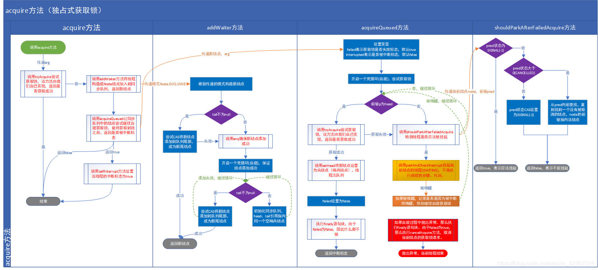

&emsp;**release 流程：**  
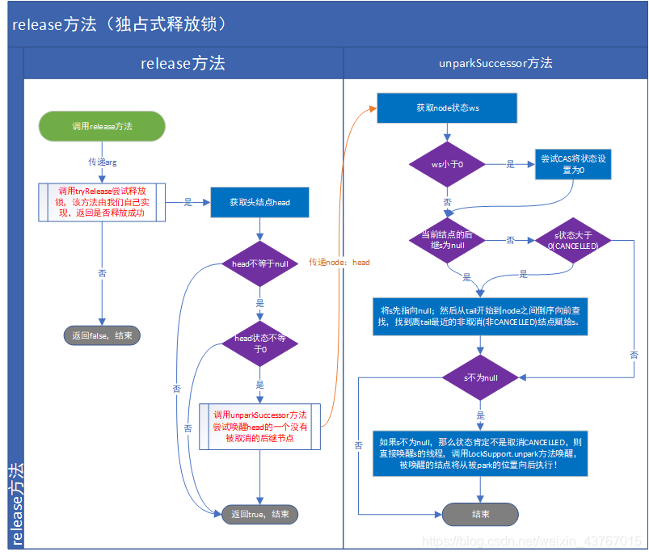

### 5.7.2 acquire 一般流程

&emsp;根据在上面的源码，我们尝试总结出 acquire 方法（独占式获取锁）构建同步队列的一般流程为。  
&emsp;**首先第一个线程 A 调用 lock 方法，此时还没有线程获取锁，那么线程 A 在 acquire 的 tryAcquire 方法中即获得了锁，此时同步队列还没有初始化，head 和 tail 都是 null。**  

  

&emsp;**此时第二个线程 B 进来了，由于 A 已经获取了锁，此时该线程将会被构造成结点添加到队列中，enq 方法中，第一次循环时，由于 tail 为 null，因此将会构造一个空结点作为同步队列的头结点和尾结点：**  

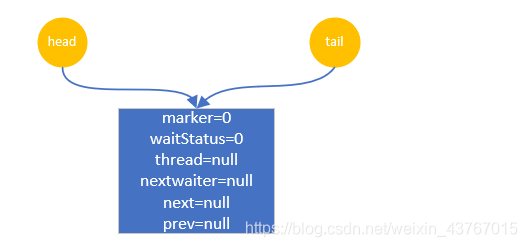

&emsp;第二次循环时，该结点将会添加到结点尾部，tail 指向该结点！  

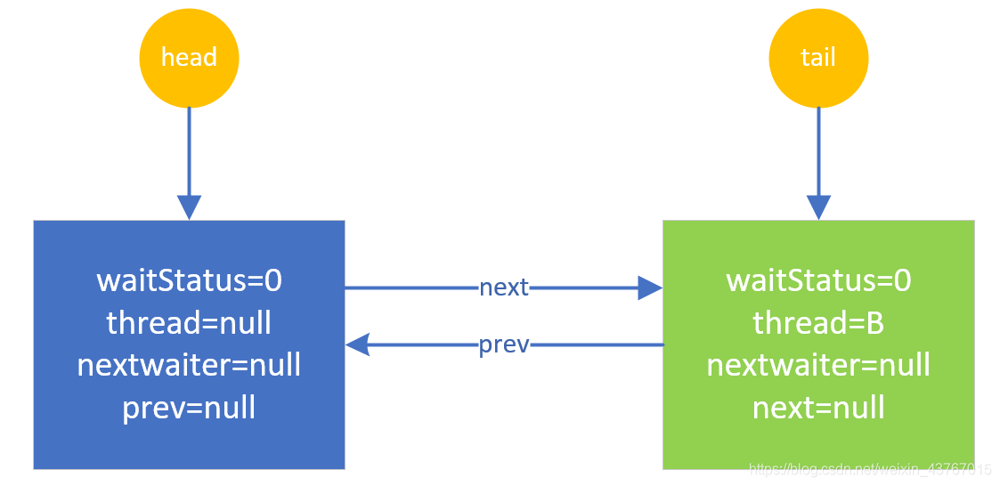  

&emsp;然后在 acquireQueued 方法中，假设结点自旋没有获得锁，那么在 shouldParkAfterFailedAcquire 方法中将会设置前驱结点的 waitStatus=-1，然后该结点的线程 B 将会被挂起：  

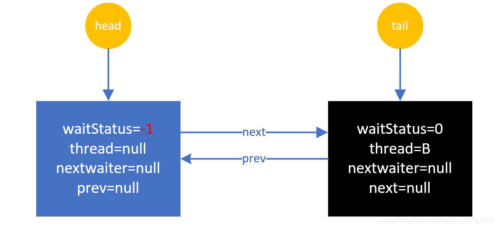  

&emsp;接下来，如果线程 C 也尝试获取锁，假设没有获取到，那么此时 C 也将会被挂起：  

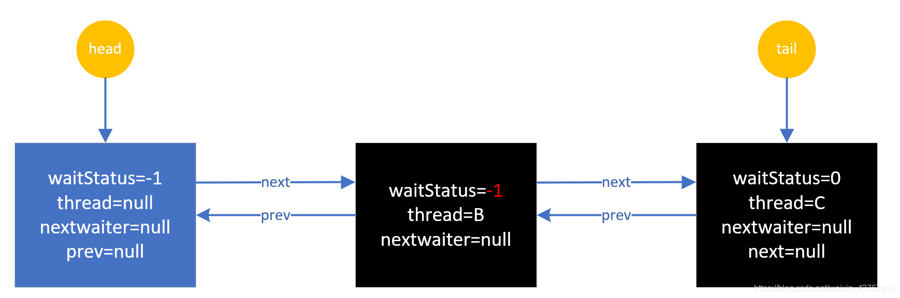  

&emsp;从这里能够看出来，一个结点的 SIGNAL 状态（-1）是它的后继子结点给它设置的，那多条线程情况下，最有可能的情况为：  

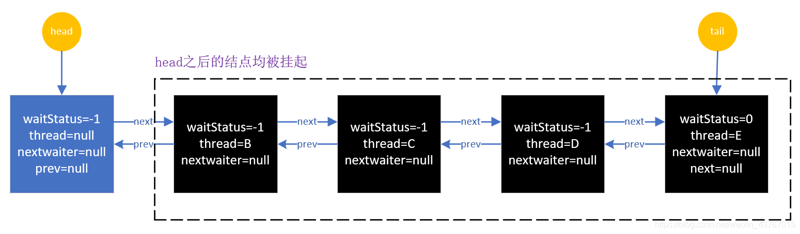

&emsp;**到此 acquire 一般流程分析完毕！**

### 5.7.3 release 一般流程

&emsp;根据在上面的源码以上面的图为基础，我们尝试总结出 release 方法（独占式锁释放）的一般流程为：  
&emsp;假如线程 A 共享资源使用完毕，调用 unlock 方法，内部调用了 release 方法，此时先调用 tryRelease 释放锁，释放成功之后调用 unparkSuccessor 方法，设置 head 结点状态为 0，并唤醒 head 结点的没有取消的后继结点（waitStatus 不大于 0），这里明显是 B 线程结点。resize 方法到这里其实已经结束了，下面就是被唤醒结点的操作。  

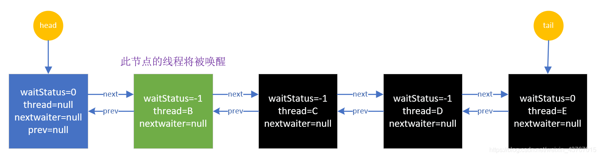  

&emsp;调用 unpark 唤醒线程 B 之后，线程 B 在 parkAndCheckInterrupt 方法中继续执行，首先判断中断状态，记录是因为什么原因被唤醒的，这里不是因为中断而被唤醒，因此返回 false，那么 acquireQueued 的 interrupted 字段为 false。  
&emsp;然后线程 B 在 acquireQueued 方法中继续自旋，假设此时 B 获取到了锁，那么调用 setHead 方法清除线程记录，并将 B 结点设置为头结点。这里清除了结点内部的线程记录也没关系，因为在我们实现 tryAcquire 方法中一般会记录是哪个线程获取了锁。  

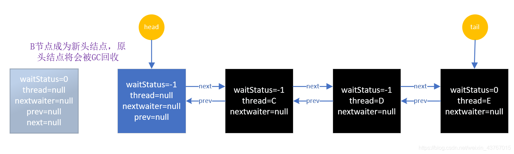

&emsp;当最后一个阻塞结点被唤醒，并且线程 E 获取锁之后，同步队列的结构如下：  

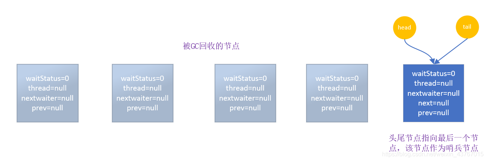

&emsp;当最后一个线程 E 共享资源使用完毕调用 unlock 时，在 release 中释放锁之后，再尝试利用 head 唤醒后继结点时，判断此时 head 结点的 waitStatus 还是等于 0，因此不会再调用 unparkSuccessor 方法。  
&emsp;到此 release 一般流程分析完毕！

5.8 acquireShared 共享式获取锁
------------------------

&emsp;共享式获取与独占式获取的区别就是同一时刻是否可以多个线程同时获取到锁。  

&emsp;**在独占锁的实现中会使用一个 exclusiveOwnerThread 属性，用来记录当前持有锁的线程**。当独占锁已经被某个线程持有时，其他线程只能等待它被释放后，才能去争锁，并且同一时刻只有一个线程能争锁成功。  

&emsp;对于共享锁来说，如果一个线程成功获取了共享锁，那么其他等待在这个共享锁上的线程就也可以尝试去获取锁，并且极有可能获取成功。基于共享式实现的组件有 CountDownLatch、Semaphore 等。  

&emsp;通过调用 AQS 的 acquireShared 模版方法方法可以共享式地获取锁，同样该方法不响应中断。实际上如果看懂了独占式获取锁的源码，那么看共享式获取锁的源码就非常简单了。大概步骤如下：

1.  首先使用 tryAcquireShared 尝试获取锁，获取成功（返回值大于等于 0）则直接返回；
2.  否则，调用 doAcquireShared 将当前线程封装为 Node.SHARED 模式的 Node 结点后加入到 AQS 同步队列的尾部，然后 "自旋" 尝试获取锁，如果还是获取不到，那么最终使用 park 方法挂起自己等待被唤醒。

```java
/**
 * 共享式获取锁的模版方法，不响应中断
 *
 * @param arg 参数
 */
public final void acquireShared(int arg) {
    //尝试调用tryAcquireShared方法获取锁
    //获取成功（返回值大于等于0）则直接返回；
    if (tryAcquireShared(arg) < 0)
        //失败则调用doAcquireShared方法将当前线程封装为Node.SHARED类型的Node 结点后加入到AQS 同步队列的尾部，
        //然后"自旋"尝试获取同步状态，如果还是获取不到，那么最终使用park方法挂起自己。
        doAcquireShared(arg);
}
```

### 5.8.1 tryAcquireShared 尝试获取共享锁

&emsp;**熟悉的 tryAcquireShared 方法，这个方法我们在最开头讲 “AQS 的设计” 时就提到过，该方法是 AQS 的子类即我们自己实现的，用于尝试获取共享锁，一般来说就是对 state 的改变、或者重入锁的检查等等，不同的锁有自己相应的逻辑判断，这里不多讲，后面讲具体锁的实现的时候（比如 CountDownLatch）会讲到。**  

&emsp;**返回 int 类型的值（比如返回剩余的 state 状态值 - 资源数量），一般的理解为：**

1.  如果返回值小于 0，表示当前线程共享锁失败；
2.  如果返回值大于 0，表示当前线程共享锁成功，并且接下来其他线程尝试获取共享锁的行为很可能成功；
3.  如果返回值等于 0，表示当前线程共享锁成功，但是接下来其他线程尝试获取共享锁的行为会失败。  
    
&emsp;实际上在 AQS 的实际实现中，即使某时刻返回值等于 0，接下来其他线程尝试获取共享锁的行为也可能会成功。即某线程获取锁并且返回值等于 0 之后，马上又有线程释放了锁，导致实际上可获取锁数量大于 0，此时后继还是可以尝试获取锁的。

&emsp;**在 AQS 的中 tryAcquireShared 的实现为抛出异常，因此需要子类重写：**

```java
protected int tryAcquireShared(int arg) {
    throw new UnsupportedOperationException();
}
```

### 5.8.2 doAcquireShared 自旋获取共享锁

&emsp;**首次调用 tryAcquireShared 方法获取锁失败之后，会调用 doAcquireShared 方法。类似于独占式获取锁 acquire 方法中的 addWaiter 和 acquireQueued 方法的组合版本！大概步骤如下：**

1.  调用 addWaiter 方法，将当前线程封装为 Node.SHARED 模式的 Node 结点后加入到 AQS 同步队列的尾部，即表示共享模式。
2.  后面就是类似于 acquireQueued 方法的逻辑，结点自旋尝试获取共享锁。如果还是获取不到，那么最终使用 park 方法挂起自己等待被唤醒。

&emsp;**每个结点可以尝试获取锁的要求是前驱结点是头结点，那么它本身就是整个队列中的第二个结点，每个获得锁的结点都一定是成为过头结点。那么如果某第二个结点因为不满足条件没有获取到共享锁而被挂起，那么即使后续结点满足条件也一定不能获取到共享锁。**

```java
/**
 * 自旋尝试共享式获取锁，一段时间后可能会挂起
 * 和独占式获取的区别：
 * 1 以共享模式Node.SHARED添加结点
 * 2 获取到锁之后，修改当前的头结点，并将信息传播到后续的结点队列中
 *
 * @param arg 参数
 */
private void doAcquireShared(int arg) {
    /*1 addWaiter方法逻辑，和独占式获取的区别1 ：以共享模式Node.SHARED添加结点*/
    final Node node = addWaiter(Node.SHARED);
    /*2 下面就是类似于acquireQueued方法的逻辑
     * 区别在于获取到锁之后acquireQueued调用setHead方法，这里调用setHeadAndPropagate方法
     *  */
    //当前线程获取锁失败的标志
    boolean failed = true;
    try {
        //当前线程的中断标志
        boolean interrupted = false;
        for (; ; ) {
            //获取前驱结点
            final Node p = node.predecessor();
            /*当前驱结点是头结点的时候就会以共享的方式去尝试获取锁*/
            if (p == head) {
                int r = tryAcquireShared(arg);
                /*返回值如果大于等于0,则表示获取到了锁*/
                if (r >= 0) {
                    /*和独占式获取的区别2 ：修改当前的头结点，根据传播状态判断是否要唤醒后继结点。*/
                    setHeadAndPropagate(node, r);
                    // 释放掉已经获取到锁的前驱结点
                    p.next = null;
                    /*检查设置中断标志*/
                    if (interrupted)
                        selfInterrupt();
                    failed = false;
                    return;
                }
            }
            /*判断是否应该挂起，以及挂起的方法，和acquireQueued方法的逻辑完全一致，不会响应中断*/
            if (shouldParkAfterFailedAcquire(p, node) &&
                    parkAndCheckInterrupt())
                interrupted = true;
        }
    } finally {
        if (failed)
            cancelAcquire(node);
    }
}
```

**从源码可以看出，和独占式获取的主要区别为：**

1.  addWaiter 以共享模式 Node.SHARED 添加结点。
2.  获取到锁之后，调用 setHeadAndPropagate 设置行 head 结点，然后根据传播状态判断是否要唤醒后继结点。。

#### 5.8.2.1 setHeadAndPropagat 设置结点并传播信息

&emsp;**在结点线程获取共享锁成功之后会调用 setHeadAndPropagat 方法，相比于 setHead 方法，在设置 head 之后多执行了一步 propagate 操作：**

1.  和 setHead 方法一样设置新 head 结点信息
2.  根据传播状态判断是否要唤醒后继结点。

##### 5.8.2.1.1 doReleaseShared 唤醒后继结点

&emsp;**doReleaseShared 用于在共享模式下唤醒后继结点。关于 Node.PROPAGATE 的分析，将在下面总结部分列出！**

```java
/**
 * 共享式获取锁的核心方法，尝试唤醒一个后继线程，被唤醒的线程会尝试获取共享锁，如果成功之后，则又会有可能调用setHeadAndPropagate，将唤醒传播下去。
 * 独占锁只有在一个线程释放所之后才会唤醒下一个线程，而共享锁在一个线程在获取到锁和释放掉锁锁之后，都可能会调用这个方法唤醒下一个线程
 * 因为在共享锁模式下，锁可以被多个线程所共同持有，既然当前线程已经拿到共享锁了，那么就可以直接通知后继结点来获取锁，而不必等待锁被释放的时候再通知。
 */
private void doReleaseShared() {
    /*一个死循环，跳出循环的条件就是最下面的break*/
    for (; ; ) {
        //获取当前的head，每次循环读取最新的head
        Node h = head;
        //如果h不为null且h不为tail，表示队列至少有两个结点，那么尝试唤醒head后继结点线程
        if (h != null && h != tail) {
            int ws = h.waitStatus;
            //如果头结点的状态为SIGNAL，那么表示后继结点需要被唤醒
            if (ws == Node.SIGNAL) {
                //尝试CAS设置h的状态从Node.SIGNAL变成0
                //可能存在多线程操作，但是只会有一条成功
                if (!compareAndSetWaitStatus(h, Node.SIGNAL, 0))
                    //失败的线程结束本次循环，继续下一次循环
                    continue;            // loop to recheck cases
                //成功的那一条线程会调用unparkSuccessor方法唤醒head的一个没有取消的后继结点
                //对于一个head，只需要一条线程去唤醒该head的后继就行了。上面的CAS就是保证unparkSuccessor方法对于一个head只执行一次
                unparkSuccessor(h);
            }
            /*
             * 如果h状态为0，那说明后继结点线程已经是唤醒状态了或者将会被唤醒，不需要该线程来唤醒
             * 那么尝试设置h状态从0变成PROPAGATE，如果失败则继续下一次循环，此时设置PROPAGATE状态能保证唤醒操作能够传播下去
             * 因为后继结点成为头结点时，在setHeadAndPropagate方法中能够读取到原head结点的PROPAGATE状态<0，从而让它可以尝试唤醒后继结点（如果存在）
             * */
            else if (ws == 0 &&
                    !compareAndSetWaitStatus(h, 0, Node.PROPAGATE))
                //失败的线程结束本次循环，继续下一次循环
                continue;                // loop on failed CAS
        }
        // 执行到这一步说明在上面的判断中队列可能只有一个结点，或者unparkSuccessor方法调用完毕，或h状态为PROPAGATE(不需要继续唤醒后继)
        // 再次检查h是否仍然是最新的head，如果不是的话需要再进行循环；如果是的话说明head没有变化，退出循环
        if (h == head)                   // loop if head changed
            break;
    }
}
```

5.9 realseShared 共享式释放锁
----------------------

&emsp;**共享锁的释放是通过调用 releaseShared 模版方法来实现的。大概步骤为：**

1.  调用 tryReleaseShared 尝试释放共享锁，这里必须实现为线程安全。
2.  如果释放了锁，那么调用 doReleaseShared 方法唤醒后继结点，实现唤醒的传播。

&emsp; **对于支持共享式的同步组件 (即多个线程同时访问)，它们和独占式的主要区别就是 tryReleaseShared 方法必须确保锁的释放是线程安全的 (因为既然是多个线程能够访问，那么释放的时候也会是多个线程的，就需要保证释放时候的线程安全)。由于 tryReleaseShared 方法也是我们自己实现的，因此需要我们自己实现线程安全，所以常常采用 CAS 的方式来释放同步状态。**

```java
/**
 * 共享模式下释放锁的模版方法。
 * ，如果成功释放则会调用
 */
public final boolean releaseShared(int arg) {
    //tryReleaseShared释放锁资源，该方法由子类自己实现
    if (tryReleaseShared(arg)) {
        //释放成功,必定调用doReleaseShared尝试唤醒后继结点
        doReleaseShared(); 
        return true;
    }
    return false;
}
```

5.10 acquireSharedInterruptibly 共享式可中断获取锁
-----------------------------------------

&emsp;**上面分析的独占式获取锁的方法 acquireShared 是不会响应中断的。但是 AQS 提供了另外一个 acquireSharedInterruptibly 模版方法，调用该方法的线程在等待获取锁时，如果当前线程被中断，会立刻返回，并抛出 InterruptedException。**

```java
/**
 * 共享式可中断获取锁模版方法
 *
 * @param arg 参数
 * @throws InterruptedException 线程处于中断状态,抛出此异常
 */
public final void acquireSharedInterruptibly(int arg)
        throws InterruptedException {
    //最开始就检查一次，如果当前线程是被中断状态，则清除已中断状态，并抛出异常
    if (Thread.interrupted())
        throw new InterruptedException();
    //尝试获取锁
    if (tryAcquireShared(arg) < 0)
        //获取不到就执行doAcquireSharedInterruptibly方法
        doAcquireSharedInterruptibly(arg);
}
```

### 5.10.1 doAcquireSharedInterruptibly 共享式可中断获取锁

&emsp;**该方法内部操作和 doAcquireShared 差不多，都是自旋获取共享锁，有些许区别，就是在后续挂起的线程因为线程被中断而返回时的处理方式不一样。**  

&emsp;**共享式不可中断获取锁仅仅是记录该状态，interrupted = true，紧接着又继续循环获取锁；共享式可中断获取锁则直接抛出异常，因此会直接跳出循环去执行 finally 代码块。**

```java
/**
 * 以共享可中断模式获取。
 *
 * @param arg 参数
 */
private void doAcquireSharedInterruptibly(int arg)
        throws InterruptedException {
    /*内部操作和doAcquireShared差不多，都是自旋获取共享锁，有些许区别*/
    final Node node = addWaiter(Node.SHARED);
    boolean failed = true;
    try {
        for (; ; ) {
            final Node p = node.predecessor();
            if (p == head) {
                int r = tryAcquireShared(arg);
                if (r >= 0) {
                    setHeadAndPropagate(node, r);
                    p.next = null; // help GC
                    failed = false;
                    return;
                }
            }
            if (shouldParkAfterFailedAcquire(p, node) &&
                    parkAndCheckInterrupt())
                /*
                 * 这里就是区别所在，共享不可中断式方法doAcquireShared中
                 * 如果线程被中断，此处仅仅会记录该状态，interrupted = true，紧接着又继续循环获取锁
                 *
                 * 但是在该共享可中断式的锁获取方法中
                 * 如果线程被中断，此处直接抛出异常，因此会直接跳出循环去执行finally代码块
                 * */
                throw new InterruptedException();
        }
    }
    /*获取到锁或者抛出异常都会执行finally代码块*/
    finally {
        /*如果获取锁失败。那么是发生异常的情况，可能就是线程被中断了，执行cancelAcquire方法取消该结点对锁的请求，该线程结束*/
        if (failed)
            cancelAcquire(node);
    }
}
```

5.11 tryAcquireSharedNanos 共享式超时获取锁
-----------------------------------

&emsp;**共享式超时获取锁 tryAcquireSharedNanos 模版方法可以被视作共享式响应中断获取锁 acquireSharedInterruptibly 方法的 “增强版”，支持中断，支持超时时间！**

```java
/**
 * 共享式超时获取锁，支持中断
 *
 * @param arg          参数
 * @param nanosTimeout 超时时间，纳秒
 * @return 是否获取锁成功
 * @throws InterruptedException 如果被中断，则抛出InterruptedException异常
 */
public final boolean tryAcquireSharedNanos(int arg, long nanosTimeout)
        throws InterruptedException {
    //最开始就检查一次，如果当前线程是被中断状态，则清除已中断状态，并抛出异常
    if (Thread.interrupted())
        throw new InterruptedException();
    //下面是一个||运算进行短路连接的代码
    //tryAcquireShared尝试获取锁，获取到了直接返回true
    //获取不到（左边表达式为false） 就执行doAcquireSharedNanos方法
    return tryAcquireShared(arg) >= 0 ||
            doAcquireSharedNanos(arg, nanosTimeout);
}
```

### 5.11.1 doAcquireSharedNanos 共享式超时获取锁

&emsp;**doAcquireSharedNanos (int arg,long nanosTimeout) 方法在支持响应中断的基础上， 增加了超时获取的特性。**  

&emsp;该方法在自旋过程中，当结点的前驱结点为头结点时尝试获取锁，如果获取成功则从该方法返回，这个过程和共享式式同步获取的过程类似，但是在锁获取失败的处理上有所不同。  

&emsp;如果当前线程获取锁失败，则判断是否超时（nanosTimeout 小于等于 0 表示已经超时），如果没有超时，重新计算超时间隔 nanosTimeout，然后使当前线程等待 nanosTimeout 纳秒（当已到设置的超时时间，该线程会从 LockSupport.parkNanos(Objectblocker,long nanos) 方法返回）。  

&emsp;如果 nanosTimeout 小于等于 spinForTimeoutThreshold（1000 纳秒）时，将不会使该线程进行超时等待，而是进入快速的自旋过程。原因在于，非常短的超时等待无法做到十分精确，如果这时再进行超时等待，相反会让 nanosTimeout 的超时从整体上表现得反而不精确。因此，在超时非常短的场景下，AQS 会进入无条件的快速自旋而不是挂起线程。

```java
static final long spinForTimeoutThreshold = 1000L;

/**
 * 以共享超时模式获取。
 *
 * @param arg          参数
 * @param nanosTimeout 剩余超时时间，纳秒
 * @return true 成功 ；false 失败
 * @throws InterruptedException 如果被中断，则抛出InterruptedException异常
 */
private boolean doAcquireSharedNanos(int arg, long nanosTimeout)
        throws InterruptedException {
    //剩余超时时间小于等于0的，直接返回
    if (nanosTimeout <= 0L)
        return false;
    //能够等待获取的最后纳秒时间
    final long deadline = System.nanoTime() + nanosTimeout;
    //同样调用addWaiter将当前线程构造成结点加入到同步队列尾部
    final Node node = addWaiter(Node.SHARED);
    boolean failed = true;
    try {
        /*和共享式式不可中断方法doAcquireShared一样，自旋获取锁*/
        for (; ; ) {
            final Node p = node.predecessor();
            if (p == head) {
                int r = tryAcquireShared(arg);
                if (r >= 0) {
                    setHeadAndPropagate(node, r);
                    p.next = null; // help GC
                    failed = false;
                    return true;
                }
            }
            /*这里就是区别所在*/
            //如果新的剩余超时时间小于0，则退出循环，返回false，表示没获取到锁
            nanosTimeout = deadline - System.nanoTime();
            if (nanosTimeout <= 0L)
                return false;
            //如果需要挂起 并且 剩余nanosTimeout大于spinForTimeoutThreshold，即大于1000纳秒
            if (shouldParkAfterFailedAcquire(p, node) &&
                    nanosTimeout > spinForTimeoutThreshold)
                //那么调用LockSupport.parkNanos方法将当前线程挂起nanosTimeout
                LockSupport.parkNanos(this, nanosTimeout);
            //如果线程被中断了，那么直接抛出异常
            if (Thread.interrupted())
                throw new InterruptedException();
        }
    }
    /*获取到锁、超时时间到了、抛出异常都会执行finally代码块*/
    finally {
        /*如果获取锁失败。可能就是线程被中断了，那么执行cancelAcquire方法取消该结点对锁的请求，该线程结束
         * 或者是超时时间到了，那么执行cancelAcquire方法取消该结点对锁的请求，将返回false
         * */
        if (failed)
            cancelAcquire(node);
    }
}
```

5.12 共享式获取 / 释放锁总结
------------------

&emsp;我们可以调用 acquireShared 模版方法来获取不可中断的共享锁，可以调用 acquireSharedInterruptibly 模版方法来可中断的获取共享锁，可以调用 tryAcquireSharedNanos 模版方法来可中断可超时的获取共享锁，在此之前需要重写 tryAcquireShared 方法；还可以调用 releaseShared 模版方法来释放共享锁，在此之前需要重写 tryReleaseShared 方法。  

&emsp;对于共享锁来说，由于锁是可以多个线程同时获取的。那么如果一个线程成功获取了共享锁，那么其他等待在这个共享锁上的线程就也可以尝试去获取锁，并且极有可能获取成功。因此在一个结点线程释放共享锁成功时，必定调用 doReleaseShared 尝试唤醒后继结点，而在一个结点线程获取共享锁成功时，也可能会调用 doReleaseShared 尝试唤醒后继结点。  

&emsp;基于共享式实现的组件有 CountDownLatch、Semaphore、ReentrantReadWriteLock 等。

### 5.12.1. Node.PROPAGATE 简析

#### 5.12.1.1 出现时机

&emsp;doReleaseShared 方法在线程获取共享锁成功之后可能执行，在线程释放共享锁成功之后必定执行。  

&emsp;在 doReleaseShared 方法中，可能会存在将线程状态设置为 Node.PROPAGATE 的情况，然而，整个 AQS 类中也只有这一处直接涉及到 Node.PROPAGATE 状态，并且仅仅是设置，在其他地方却再也没见到对该状态的直接使用。由于该状态值为 - 3，因此可能是在其他方法中对 waitStatus 大小范围的判断的时候将这种情况包括进去了（猜测）！  

&emsp;关于 Node.PROPAGATE 的直接代码如下：

```java
else if (ws == 0 &&!compareAndSetWaitStatus(h, 0, Node.PROPAGATE))
    continue;                // loop on failed CAS
```

&emsp;首先是需要进入到 else if 分支，然后需要此时 ws(源码中最开始获取的 head 结点的引用的状态—不一定是最新的) 状态为 0，然后尝试 CAS 设置该结点的状态为 Node.PROPAGATE，并且可能失败，失败之后直接 continue 继续下一次循环。  

&emsp;对于这个 Node.PROPAGATE 状态的作用，众说纷纭，笔者看了很多文章，很多看起来都有道理，但是仔细想想又有些差错，在此，笔者不做过多个人分析，首先来看看进入 else if 分支并且 ws 为 0 的情况有哪些！

1.  **初始情况**  

&emsp;假设某个共享锁的实现允许最多三个线程持有锁，此时有线程 A、B、C 均获取到了锁，同步队列中还有一个被挂起的结点线程 D 在等待锁的释放，此时队列结构如下：  

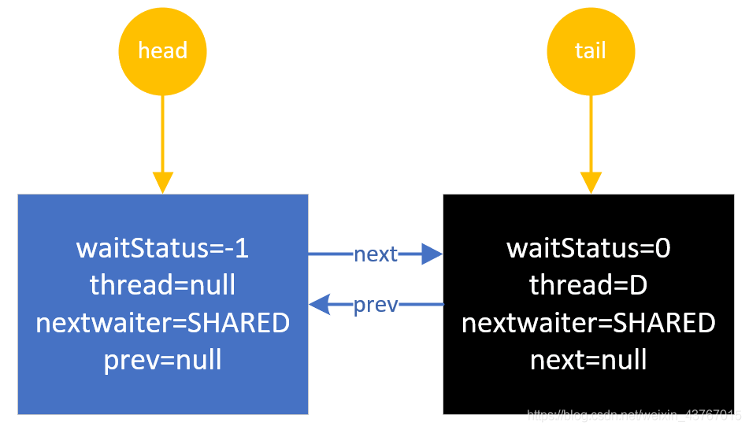  

&emsp;如果此时线程 A 释放了锁，那么 A 将会调用 doReleaseShared 方法，但是明显 A 将会进入 if 代码块中，将 head 的状态改为 0，同时调用 unparkSuccessor 唤醒一个后继线程，这里明显是 D。此时同步队列结构为：  
 
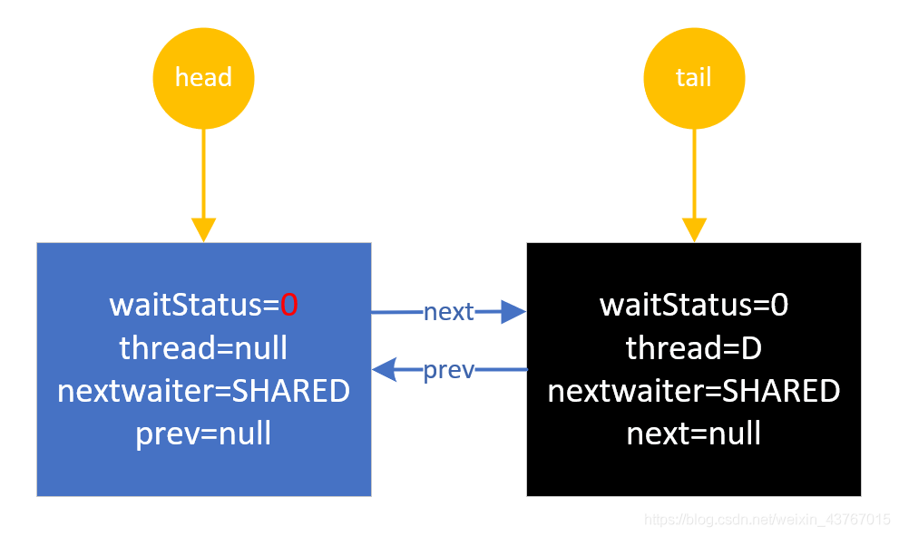

2.  **情形 1**  

&emsp;如果此时线程 B、C 都释放了锁，那么 B、C 都将会调用 doReleaseShared 方法，假设它们执行速度差不多，那么它们都将会进入到 else if 中，因为此时 head 的状态变成了 0，然后它们都会调用 CAS 将 0 改成 Node.PROPAGATE，此时只会有一条线程成功，另一条会失败。  

&emsp;**这就是释放锁时，进入到 else if 的一种情况。即多个释放锁的结点操作同一个 head，那么最终只有一个结点能够在 if 中成功调用 unparkSuccessor 唤醒后继，另外的结点都将失败并最终都会走到 else if 中去。同理，获取锁时也可能由于上面的原因而进入到 else if。**

3.  **情形 2**  
 
 &emsp;如果此时又来了一个新结点 E，由于同样没有获取到锁那么会调用 addWaiter 添加到 D 结点后面成为新 tail 结点。  
 
 &emsp;然后结点 E 会在 shouldParkAfterFailedAcquire 方法中尝试将没取消的前驱 D 的 waitStatus 修改为 Node.SIGNAL，然后挂起。  
 
 &emsp;**那么在新结点 E 执行 addWaiter 之后，执行 shouldParkAfterFailedAcquire 之前，此时同步队列结构为：**  

 

&emsp;由于 A 释放了锁，那么线程 D 会被唤醒，并调用 tryAcquireShared 获取了锁，那么将会返回 0（常见的共享锁获取锁的实现是使用 state 减去需要获取的资源数量，这里 A 释放了一把锁，D 又获取一把锁，此时剩余资源—锁数量剩余 0）。  

&emsp;**此时，如果 B 再释放锁，这就出现了 “即使某时刻返回值等于 0，接下来其他线程尝试获取共享锁的行为也可能会成功” 的情况。即 某线程获取共享锁并且返回值等于 0 之后，马上又有其他持有锁的线程释放了锁，导致实际上可获取锁数量大于 0，此时后继还是可以尝试获取锁的。**  

&emsp;上面的是题外话，我们回到正文。**如果此时 B 释放了锁，那么肯定还是会走 doReleaseShared 方法，由于在初始情形中，head 的状态已经被 A 修改为 0，此时 B 还是会走 else if ，将状态改为 Node.PROPAGATE。**  

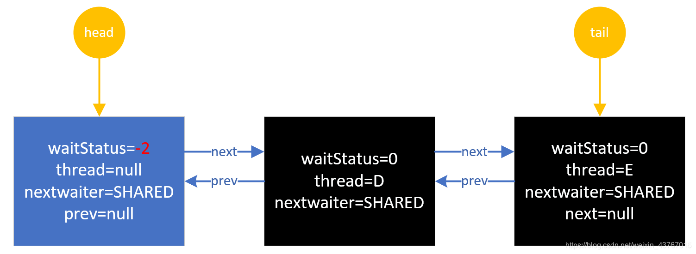  

&emsp;我们回到线程 D，此时线程 D 获取锁之后会走到 setHeadAndPropagate 方法中，在进行 sheHead 方法调用之后，此时结构如下（假设线程 E 由于资源分配的原因，在此期间效率低下，还没有将前驱 D 的状态改为 - 1，或者由于单核 CPU 线程切换导致线程 E 一直没有分配到时间片）：  

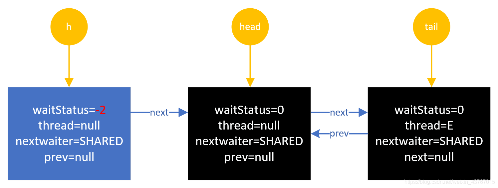  
 
&emsp;sheHead 之后，就会判断是否需要调用 doReleaseShared 方法唤醒后继线程，这里的判断条件是：

```java
propagate > 0 || h == null || h.waitStatus < 0 ||(h = head) == null || 
h.waitStatus < 0
```

&emsp;**根据结构，只有第三个条件 h.waitStatus<0 满足，此时线程 D 就可以调用 doReleaseShared 唤醒后继结点，在这个过程中，关键的就是线程 B 将老 head 的状态设置为 Node.PROPAGATE，即 - 2，小于 0，此时可以将唤醒传播下去，否则被唤醒的线程 A 将因为不满足条件而不会调用 doReleaseShared 方法！**  

&emsp;或许这就是所谓的 Node.PROPAGATE 可能将唤醒传播下去的考虑到的情况之一？  

&emsp;而在此时获取锁的线程 D 调用 doReleaseShared 方法时，由于此时 head 状态本来就是 0，因此直接进入 else if 将状态改为 Node.PROPAGATE，表示此时后继结点不需要唤醒，但是需要将唤醒操作继续传播下去。  

&emsp;**这也是在获取锁时，在 doReleaseShared 方法中第一次出现某结点作为 head 就直接进入到 else if 的一种情况。**  

3) **情形 3**  

&emsp;由于 A 释放了锁，那么如果 D 的获取了锁，并且方法执行完毕，那么此时同步队列结构如下：  

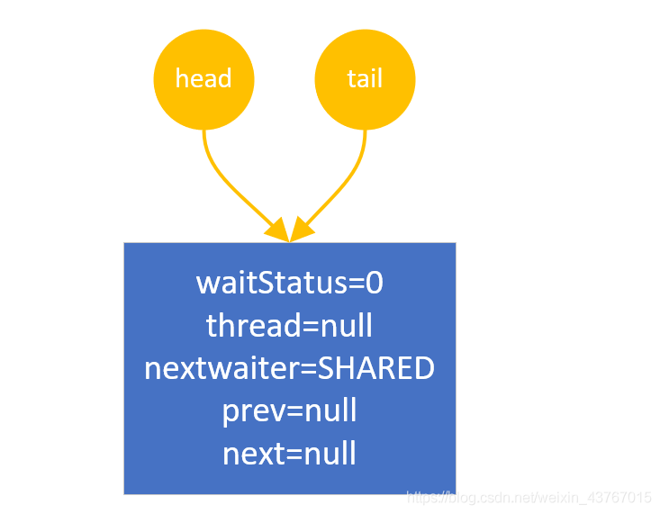  

&emsp;此时又来了一个新结点 E，由于同样没有获取到锁那么会调用 addWaiter 添加到 head  结点后面成为新 tail 结点。  

&emsp;然后结点 E 会在 shouldParkAfterFailedAcquire 方法中尝试将没取消的前驱 head 的 waitStatus 修改为 Node.SIGNAL，然后挂起。  

&emsp;那么在新结点 E 执行 addWaiter 之后，执行 shouldParkAfterFailedAcquire 之前，此时同步队列结构为：  

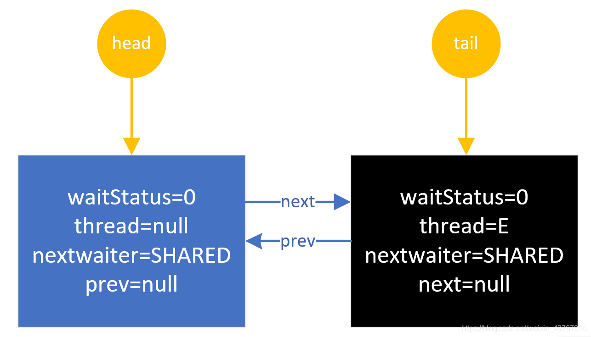  

&emsp;**此时线程 A 尝试释放锁，释放锁成功后一定会都调用 doReleaseShared 方法时，由于此时 head 状态本来就是 0，因此直接进入 else if 将状态改为 Node.PROPAGATE，表示此时后继结点不需要唤醒，但是需要将唤醒操作继续传播下去。**  

&emsp; **这也是在释放锁的时候，在 doReleaseShared 方法中第一次出现某结点作为 head 就直接进入到 else if 的一种情况。**

#### 5.12.1.2 总结

&emsp;**下面总结了会走到 else if 的几种情况，可能还有更多情形这里分有分析出来：**

1.  多线程并发的在 doReleaseShared 方法中操作同一个 head，并且这段时间 head 没发生改变。那么先进来的一条线程能够将 if 执行成功，即将状态置为 0，然后调用 unparkSuccessor 唤醒后，后续进来的线程由于状态为 0，那么只能执行 else if。这种情况对于获取锁或者释放锁的 doReleaseShared 方法都可能存在！这种情况发生时，在 doReleaseShared 方法中第一次出现某结点作为 head 时，不会进入 else if，一定是后续其他线程以同样的结点作为头结点时，才会进入 else if！
2.  对于获取锁的 doReleaseShared 方法，有一种在 doReleaseShared 方法中第一次出现某结点作为 head 就直接进入到 else if 的一种情况。设结点 D 作为原队列的尾结点，状态值为 0，然后又来了新结点 E，在新结点 E 的线程调用 addWaiter 之后（加入队列成为新 tail），shouldParkAfterFailedAcquire 之前（没来得及修改前驱 D 的状态为 - 1）的这段特殊时间范围之内，此时结点 D 的线程获取到了锁成为新头结点，并且原头结点状态值小于 0，那么就会出现 在获取锁时调用 doReleaseShared 并直接进入 else if 的情况，这种情况的要求极为苛刻。或许本就不存在，只是本人哪里的分析出问题了？
3.  对于释放锁的 doReleaseShared 方法，有一种在 doReleaseShared 方法中第一次出现结点某作为 head 就直接进入到 else if 的一种情况。设结点 D 作为原队列的尾结点，此时状态值为 0，并且已经获取到了锁；然后又来了新结点 E，在新结点 E 的线程调用 addWaiter 之后（加入队列成为新 tail），shouldParkAfterFailedAcquire 之前（没来得及修改前驱 D 的状态为 - 1）的这段特殊时间范围之内，此时结点 D 的线程释放了锁，那么就会出现 在释放锁时调用 doReleaseShared 并直接进入 else if 的情况，这种情况的要求极为苛刻。或许本就不存在，只是本人哪里的分析出问题了？

&emsp;**那么根据上面的情况来看，就算没有 else if 这个判断或者如果没有 Node.PROPAGATE 这个状态的设置，最终对于后续结点的唤醒并没有什么大的问题，也并不会导致队列失活。**  

&emsp;**加上 Node.PROPAGATE 这个状态的设置，导致的直接结果是可能会增加 doReleaseShared 方法调用的次数，但是也会增加无效、无意义唤醒的次数。** 在 setHeadAndPropagate 方法中，判断是否需要唤醒后继的源码注释中我们能找到这样的描述：

> The conservatism in both of these checks may cause unnecessary wake-ups, but only when there are multiple racing acquires/releases, so most need signals now or soon anyway.

&emsp;意思就是，这些判断可能会造成无意义的唤醒，但如果 doReleaseShared 方法调用的次数比较多的话，相当于多线程争抢着去唤醒后继线程，或许可以提升锁的获取速度？或者这里的代码只是一种更加通用的保证正确的做法？实际上 AQS 中还有许多这样可能会造成无意义调用的代码！

6 锁的简单实现
========

6.1 可重入独占锁的实现
-------------

&emsp;在最开始我们实现了简单的不可重入独占锁，现在我们尝试实现可重入的独占锁，实际上也比较简单！  

&emsp;AQS 的 state 状态值表示线程获取该锁的重入次数， 在默认情况下，state 的值为 0 表示当前锁没有被任何线程持有。当一个线程第一次获取该锁时会尝试使用 CAS 设置 state 的值为 l ，如果 CAS 成功则当前线程获取了该锁，然后记录该锁的持有者为当前线程。在该线程没有释放锁的情况下第二次获取该锁后，状态值被设置为 2，这就是重入次数为 2。在该线程释放该锁时，会尝试使用 CAS 让状态值减 1，如果减 l 后状态值为 0，则当前线程释放该锁。  

&emsp;**对于可重入独占锁，获取了几次锁就需要释放几次锁，否则由于锁释放不完全而阻塞其他线程！**

```java
/**
 * @author lx
 */
public class ReentrantExclusiveLock implements Lock {
    /**
     * 将AQS的实现组合到锁的实现内部
     */
    private static class Sync extends AbstractQueuedSynchronizer {
        /**
         * 重写isHeldExclusively方法
         *
         * @return 是否处于锁占用状态
         */
        @Override
        protected boolean isHeldExclusively() {
            //state是否等于1
            return getState() == 1;
        }

        /**
         * 重写tryAcquire方法，可重入的尝试获取锁
         *
         * @param acquires 参数，这里我们没用到
         * @return 获取成功返回true，失败返回false
         */
        @Override
        public boolean tryAcquire(int acquires) {
            /*尝试获取锁*/
            if (compareAndSetState(0, 1)) {
                setExclusiveOwnerThread(Thread.currentThread());
                return true;
            }
            /*获取失败，判断当前获取锁的线程是不是本线程*/
            else if (getExclusiveOwnerThread() == Thread.currentThread()) {
                //如果是，那么state+1，表示锁重入了
                setState(getState() + 1);
                return true;
            }
            return false;
        }

        /**
         * 重写tryRelease方法，可重入的尝试释放锁
         *
         * @param releases 参数，这里我们没用到
         * @return 释放成功返回true，失败返回false
         */
        @Override
        protected boolean tryRelease(int releases) {
            //如果尝试解锁的线程不是加锁的线程，那么抛出异常
            if (Thread.currentThread() != getExclusiveOwnerThread()) {
                throw new IllegalMonitorStateException();
            }
            boolean flag = false;
            int oldState = getState();
            int newState = oldState - 1;
            //如果state变成0，设置当前拥有独占访问权限的线程为null，返回true
            if (newState == 0) {
                setExclusiveOwnerThread(null);
                flag = true;
            }
            //重入锁的释放，释放一次state减去1
            setState(newState);
            return flag;
        }

        /**
         * 返回一个Condition，每个condition都包含了一个condition队列
         * 用于实现线程在指定条件队列上的主动等待和唤醒
         *
         * @return 每次调用返回一个新的ConditionObject
         */
        Condition newCondition() {
            return new ConditionObject();
        }
    }

    /**
     * 仅需要将操作代理到Sync实例上即可
     */
    private final Sync sync = new Sync();

    /**
     * lock接口的lock方法
     */
    @Override
    public void lock() {
        sync.acquire(1);
    }

    /**
     * lock接口的tryLock方法
     */
    @Override
    public boolean tryLock() {
        return sync.tryAcquire(1);
    }

    @Override
    public boolean tryLock(long timeout, TimeUnit unit) throws InterruptedException {
        return sync.tryAcquireNanos(1, unit.toNanos(timeout));
    }

    @Override
    public void lockInterruptibly() throws InterruptedException {
        sync.acquireInterruptibly(1);
    }

    /**
     * lock接口的unlock方法
     */
    @Override
    public void unlock() {
        sync.release(1);
    }

    /**
     * lock接口的newCondition方法
     */
    @Override
    public Condition newCondition() {
        return sync.newCondition();
    }

    public boolean isLocked() {
        return sync.isHeldExclusively();
    }

    public boolean hasQueuedThreads() {
        return sync.hasQueuedThreads();
    }
}
```

### 6.1.1 测试

```java
/**
 * @author lx
 */
public class ReentrantExclusiveLockTest {
    /**
     * 创建锁
     */
    static ReentrantExclusiveLock reentrantExclusiveLock = new ReentrantExclusiveLock();
    /**
     * 自增变量
     */
    static int i;

    public static void main(String\[\] args) throws InterruptedException {
        //三条线程
        ThreadPoolExecutor threadPoolExecutor = new ThreadPoolExecutor(3, 3, 1L, TimeUnit.MINUTES,
                new LinkedBlockingQueue<>(), Executors.defaultThreadFactory(), new ThreadPoolExecutor.DiscardPolicy());
        Runa runa = new Runa();
        for (int i1 = 0; i1 < 3; i1++) {
            threadPoolExecutor.execute(runa);
        }
        threadPoolExecutor.shutdown();
        while (!threadPoolExecutor.isTerminated()) {
        }
        //三条线程执行完毕，输出最终结果
        System.out.println(i);

    }


    /**
     * 线程任务，循环50000次，每次i自增1
     */
    public static class Runa implements Runnable {
        @Override
        public void run() {
            // lock与unlock注释时，可能会得到错误的结果
            // 开启时每次都会得到正确的结果150000
            //支持多次获取锁(重入)
            reentrantExclusiveLock.lock();
            reentrantExclusiveLock.lock();
            for (int i1 = 0; i1 < 50000; i1++) {
                i++;
            }
            //获取了多少次必须释放多少次
            reentrantExclusiveLock.unlock();
            reentrantExclusiveLock.unlock();
        }
    }
}
```

6.2 可重入共享锁的实现
-------------

&emsp;自定义一个共享锁，共享锁的数量可以自己指定。默认构造情况下，在同一时刻，最多允许三条线程同时获取锁，超过三个线程的访问将被阻塞。  

&emsp;我们必须重写 tryAcquireShared(int args) 方法和 tryReleaseShared(int args) 方法。由于是共享式的获取，那么在对同步状态 state 更新时，两个方法中都需要使用 CAS 方法 compareAndSet(int expect,int update) 做原子性保障。  

&emsp;假设一条线程一次只需要获取一个资源即表示获取到锁。由于同一时刻允许至多三个线程的同时访问，表明同步资源数为 3，这样可以设置初始状态 state 为 3 来代表同步资源，当一个线程进行获取，status 减 1，该线程释放，则 status 加 1，状态的合法范围为 0、1 和 2，其中 0 表示当前已经有两个线程获取了同步资源，此时再有其他线程对同步状态进行获取，该线程可能会被阻塞。  

&emsp;最后，将自定义的 AQS 实现通过内部类的方法聚合到自定义锁中，自定义锁还需要实现 Lock 接口，外部方法的内部实现直接调用对应的模版方法即可。  

&emsp;这里一条线程可以获取多次共享锁，但是同时必须释放多次共享锁，否则可能由于锁资源的减少，导致效率低下甚至死锁（可以使用 tryLock 避免）！

```java
public class ShareLock implements Lock {
    /**
     * 默认构造器，默认共享资源3个
     */
    public ShareLock() {
        sync = new Sync(3);
    }

    /**
     * 指定资源数量的构造器
     */
    public ShareLock(int num) {
        sync = new Sync(num);
    }

    private static class Sync extends AbstractQueuedSynchronizer {
        Sync(int num) {
            if (num <= 0) {
                throw new RuntimeException("锁资源数量需要大于0");
            }
            setState(num);
        }

        /**
         * 重写tryAcquireShared获取共享锁
         */
        @Override
        protected int tryAcquireShared(int arg) {
            /*一般的思想*/
            /*//获取此时state
            int currentState = getState();
            //获取剩余state
            int newState = currentState - arg;
            //如果剩余state小于0则直接返回负数
            //否则尝试更新state，更新成功就说明获取成功，返回大于等于0的数
            return newState < 0 ? newState : compareAndSetState(currentState, newState) ? newState : -1;*/

            /*更好的思想
             * 在上面的实现中，如果剩余state值大于0，那么只尝试CAS一次，如果失败就算没有获取到锁，此时该线程会进入同步队列
             * 在下面的实现中，如果剩余state值大于0，那么如果尝试CAS更新不成功，会在for循环中重试，直到剩余state值小于0或者更新成功
             *
             * 两种方法的不同之处在于，对CAS操作是否进行重试，这里建议第二种
             * 因为可能会有多个线程同时获取多把锁，但是由于CAS只能保证一次只有一个线程成功，因此其他线程必定失败
             * 但此时，实际上还是存在剩余的锁没有被获取完毕的，因此让其他线程重试，相比于直接加入到同步队列中，对于锁的利用率更高！
             * */
            for (; ; ) {
                int currentState = getState();
                int newState = currentState - arg;
                if (newState < 0 || compareAndSetState(currentState, newState)) {
                    return newState;
                }
            }

        }

        /**
         * 重写tryReleaseShared释放共享锁
         *
         * @param arg 参数
         * @return 成功返回true 失败返回false
         */
        @Override
        protected boolean tryReleaseShared(int arg) {
            //只能成功
            for (; ; ) {
                int currentState = getState();
                int newState = currentState + arg;
                if (compareAndSetState(currentState, newState)) {
                    return true;
                }
            }
        }
    }

    /**
     * 内部初始化一个sync对象，此后仅需要将操作代理到这个Sync对象上即可
     */
    private final Sync sync;

    /*下面都是调用模版方法*/
    
    @Override
    public void lock() {
        sync.acquireShared(1);
    }

    @Override
    public void lockInterruptibly() throws InterruptedException {
        sync.acquireSharedInterruptibly(1);
    }

    @Override
    public boolean tryLock() {
        return sync.tryAcquireShared(1) >= 0;
    }

    @Override
    public boolean tryLock(long time, TimeUnit unit) throws InterruptedException {
        return sync.tryAcquireSharedNanos(1, unit.toNanos(time));
    }

    @Override
    public void unlock() {
        sync.releaseShared(1);
    }


    /**
     * @return 没有实现自定义Condition，单纯依靠原始Condition实现是不支持共享锁的
     */
    @Override
    public Condition newCondition() {
        throw new UnsupportedOperationException();
    }
}
```

### 6.2.1 测试

```java
public class ShareLockTest {

    static final ShareLock lock = new ShareLock();

    public static void main(String\[\] args) {
        /*启动10个线程*/
        for (int i = 0; i < 10; i++) {
            Worker w = new Worker();
            w.setDaemon(true);
            w.start();
        }
        ShareLockTest.sleep(20);
    }

    /**
     * 睡眠
     *
     * @param seconds 时间，秒
     */
    public static void sleep(long seconds) {
        try {
            TimeUnit.SECONDS.sleep(seconds);
        } catch (InterruptedException e) {
            e.printStackTrace();
        }
    }

    static class Worker extends Thread {
        @Override
        public void run() {
            /*不停的获取锁，释放锁
             * 最开始获取了几个锁，那么最后必须释放几个锁
             * 否则可能由于锁资源的减少，导致效率低下甚至死锁（可以使用tryLock避免）！
             * */
            while (true) {
                /*tryLock测试*/
                if (lock.tryLock()) {
                    System.out.println(Thread.currentThread().getName());
                    /*获得锁之后都会休眠2秒
                    那么可以想象，控制台将很有可能会出现连续三个一起输出，然后等待2秒，再连续三个一起输出，然后2秒……*/
                    ShareLockTest.sleep(2);
                    lock.unlock();
                }

                /*lock测试，或许总会出现固定线程获取锁，因为AQS默认是实现是非公平锁*/
                /*lock.lock();
                System.out.println(Thread.currentThread().getName());
                ShareLockTest.sleep(2);
                lock.unlock();*/
            }
        }
    }
}
```

7 条件队列
======

&emsp;**上面讲解了 AQS 对于各种独占锁、共享锁的实现原理，以及获取锁释放锁的方法。但是似乎还少了点什么，那就是 Condition 条件队列。**  
&emsp;**如果我们只有同步队列，确实可以实现线程同步，但是由于 Java 的线程实际上还是底层操作系统实现的，它具体分配多长的时间片、具体哪些线程需要等待、什么时候进入等待、哪些线程能够获得锁，都不是我们我们能够控制的，这样很难支持复杂的多线程需求。**  
&emsp;**而 Condition 则可用于实现主动的线程的等待、通知机制，是实现可控制的多线程编程中非常重要的一部分！**

7.1 Condition 概述
----------------

### 7.1.1 Object 监视器与 Condition

&emsp;任意一个 Java 对象，都拥有一与之关联的唯一的监视器对象 monitor（该对象是在 HotSpot 源码中使用 C++ 实现的），为此 Java 为每个对象提供了一组监视器方法（定义在 java.lang.Object 上），主要包括 wait()、wait(long timeout)、notify() 以及 notifyAll() 方法，这些方法与 synchronized 同步关键字配合，可以实现等待 / 通知模式。具体可以看 Synchronized 的原理：[Java 中的 synchronized 的底层实现原理以及锁升级优化详解](https://blog.csdn.net/weixin_43767015/article/details/105544786)。  

&emsp;Condition(又称条件变量) 接口也提供了类似 Object 的监视器方法，与 Lock 配合可以实现等待 / 通知模式，但是这两者在使用方式以及功能特性上还是有差别的。Object 的监视器方法与 Condition 接口的对比如下（来自网络）：  

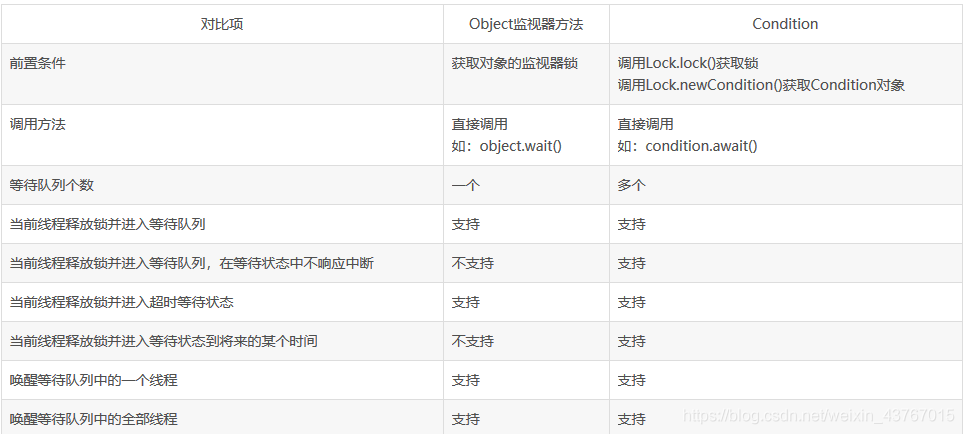  

&emsp;Condition 可以和任意的锁对象结合，监视器方法不会再绑定到某个锁对象上。使用 Lock 锁之后，相当于 Lock 替代了 synchronized 方法和语句的使用，Condition 替代了 Object 监视器方法的使用。  

&emsp;在 Condition 中，Condition 对象当中封装了监视器方法，并用 await() 替换 wait()，用 signal() 替换 notify()，用 signalAll() 替换 notifyAll()，传统线程的通信方式，Condition 都可以实现，这里注意，Condition 是被绑定到 Lock 上的，要创建一个 Lock 的 Condition 必须用 newCondition() 方法。如果在没有获取到锁前调用了条件变量的 await 方法则会抛出 java.lang.IllegalMonitorStateException 异常。  

&emsp;synchronized 同时只能与一个共享变量的 notify 或 wait 方法实现同步，而 AQS 的一个锁可以对应多个条件变量。  

&emsp;Condition 的强大之处还在于它可以为多个线程间建立不同的 Condition，使用 synchronized/wait() 只有一个条件队列，notifyAll 会唤起条件队列下的所有线程，而使用 lock-condition，可以实现多个条件队列，signalAll 只会唤起某个条件队列下的等待线程。  

&emsp;**另外 AQS 只提供了 ConditionObject 的实现，并没有提供获取 Condition 的 newCondition 方法对应的模版方法，需要由 AQS 的子类来提供具体实现，通常是直接调用 ConditionObject 的构造器 new 一个对象返回。一个锁对象可以多次调用 newCondition 方法，因此一个锁对象可以对应多个 Condition 对象！**

### 7.1.2 常用 API 方和使用示例

<table><tbody><tr><td>方法名称</td><td>描述</td></tr><tr><td>void await() throws InterruptedException</td><td>当前线程进入等待状态直到被通知或中断。该方法返回时，该线程肯定又一次获取了锁。</td></tr><tr><td>void awaitUninterruptibly()</td><td>当前线程进入等待状态直到被通知，等待过程中不响应中断。该方法返回时，该线程肯定又一次获取了锁。</td></tr><tr><td>long awaitNanos(long nanosTimeout) throws InterruptedException</td><td>当前线程进入等待状态直到被通知，中断，或者超时。返回（超时时间 - 实际返回所用时间）。如果返回值是 0 或者负数，那么可以认定已经超时了。该方法返回时，该线程肯定又一次获取了锁。</td></tr><tr><td>boolean await(long time, TimeUnit unit) throws InterruptedException</td><td>当前线程进入等待状态直到被通知，中断，或者超时。如果在从此方法返回前检测到等待时间超时，则返回 false，否则返回 true。该方法返回时，该线程肯定又一次获取了锁。</td></tr><tr><td>boolean awaitUntil(Date deadline) throws InterruptedException</td><td>当前线程进入等待状态直到被通知，中断或者超过指定时间点。如果没有到指定时间就被通知，则返回 true，否则返回 false。</td></tr><tr><td>void signal()</td><td>唤醒一个在 Condition 上等待最久的线程，该线程从等待方法返回前必须获得与 Condition 相关联的锁</td></tr><tr><td>void signalAll()</td><td>唤醒所有等待在 Condition 上的线程，能够从等待方法返回的线程必须获得与 Condition 相关联的锁</td></tr></tbody></table>

&emsp;Condition 定义了等待 / 通知两种类型的方法，当前线程调用这些方法时，需要提前获取到 Condition 对象关联的锁。Condition 对象是由 Lock 对象（调用 Lock 对象的 newCondition() 方法）创建出来的，换句话说，Condition 是依赖 Lock 对象的。  
&emsp;**下面示例 Condition 实现有界同步队列（生产消费）：**

```java
/**
 * 使用Condition实现有界队列
 */
public class BoundedQueue<T> {
    //数组队列
    private Object\[\] items;
    //添加下标
    private int addIndex;
    //删除下标
    private int removeIndex;
    //当前队列数据数量
    private int count;
    //互斥锁
    private Lock lock = new ReentrantLock();
    //队列不为空的条件
    private Condition notEmpty = lock.newCondition();
    //队列没有满的条件
    private Condition notFull = lock.newCondition();

    public BoundedQueue(int size) {
        items = new Object\[size\];
    }

    //添加一个元素，如果数组满了，添加线程进入等待状态，直到有“空位”
    public void add(T t) {
        lock.lock();
        try {
            while (count == items.length) {
                notFull.await();
            }
            items\[addIndex\] = t;
            if (++addIndex == items.length) {
                addIndex = 0;
            }
            ++count;
            //唤醒一个等待删除的线程
            notEmpty.signal();
        } catch (Exception e) {
            e.printStackTrace();
        } finally {
            lock.unlock();
        }
    }

    //由头部删除一个元素，如果数组空，则删除线程进入等待状态，知道有新元素加入
    public T remove() throws InterruptedException {
        lock.lock();
        try {
            while (count == 0) {
                notEmpty.await();
            }
            Object res = items\[removeIndex\];
            if (++removeIndex == items.length)
                removeIndex = 0;
            --count;
            //唤醒一个等待插入的线程
            notFull.signal();
            return (T) res;
        } finally {
            lock.unlock();
        }
    }

    @Override
    public String toString() {
        return "BoundedQueue{" +
                "items=" + Arrays.toString(items) +
                ", addIndex=" + addIndex +
                ", removeIndex=" + removeIndex +
                ", count=" + count +
                ", lock=" + lock +
                ", notEmpty=" + notEmpty +
                ", notFull=" + notFull +
                '}';
    }

    public static void main(String\[\] args) throws InterruptedException {
        BoundedQueue<Object> objectBoundedQueue = new BoundedQueue<>(10);
        for (int i = 0; i < 20; i++) {
            objectBoundedQueue.add(i);
            System.out.println(objectBoundedQueue);
            if (i/2==0) {
                objectBoundedQueue.remove();
            }
        }
    }
}
```

&emsp;首先需要获得锁，目的是确保数组修改的可见性和排他性。当数组数量等于数组长度时，表示数组已满，则调用 notFull.await()，当前线程随之释放锁并进入等待状态。如果数组数量不等于数组长度，表示数组未满，则添加元素到数组中，同时通知等待在 notEmpty 上的线程，数组中已经有新元素可以获取。  

&emsp;在添加和删除方法中使用 while 循环而非 if 判断，目的是防止过早或意外的通知，只有条件符合才能够退出循环。

7.2 条件队列的结构
-----------

&emsp;每一个 AQS 对象中包含一个同步队列，类似的，**每个 Condition 对象中都包含着一个队列（以下称为等待 / 条件队列），用来存放调用该 Condition 对象的 await() 方法时被阻塞的线程。该队列是 Condition 实现等待 / 通知机制的底层关键数据结构。**  

&emsp;**条件队列同样是一个 FIFO 的队列，结点的类型直接复用的同步队列的结点类型—AQS 的静态内部类 AbstractQueuedSynchronizer.Node。一个 Condition 对象的队列中每个结点包含的线程就是在该 Condition 对象上等待的线程，那么如果一个锁对象获取了多个 Condition 对象，就可能会有不同的线程在不同的 Condition 对象上等待！**  

&emsp;**如果一个获取到锁的线程调用了 Condition.await() 方法，那么该线程将会被构造成等待类型为 Node.CONDITION 的 Node 结点加入等待队列尾部并释放锁，加入对应 Condition 对象的条件队列尾部并挂起（WAITING）。**  

&emsp;**如果某个线程中调用某个 Condition 的 signal/signalAll 方法，对应 Condition 对象的条件队列的结点会转移到锁内部的 AQS 对象的同步队列中，并且在获取到锁之后，对应的线程才可以继续恢复执行后续代码。**  

&emsp;**ConditionObject 中持有条件队列的头结点引用 firstWaiter 和尾结点引用 lastWaiter。**

```java
public abstract class AbstractQueuedSynchronizer
            extends AbstractOwnableSynchronizer
            implements java.io.Serializable {
    /**
     * 同步队列头节点
     */
    private transient volatile Node head;

    /**
     * 同步队列尾节点
     */
    private transient volatile Node tail;

    /**
     * 同步状态
     */
    private volatile int state;
    
    /**
     * Node节点的实现
     */
    static final class Node {
        //……
    }
    
    /**
     * 位于AQS内部的ConditionObject类，就是Condition的实现
     */
    public class ConditionObject implements Condition, java.io.Serializable {
        private static final long serialVersionUID = 1173984872572414699L;
        /**
         * 条件队列头结点引用
         */
        private transient Node firstWaiter;
        /**
         * 条件队列尾结点引用
         */
        private transient Node lastWaiter;
        
        //……
    }
}
```

&emsp;Condition 的实现是 AQS 的内部类 ConditionObject，因此每个 Condition 实例都能够访问 AQS 提供的方法，相当于每个 Condition 都拥有所属 AQS 的引用。  

&emsp;和 AQS 中的同步队列不同的是，条件队列是一个单链表，结点之间使用 nextWaiter 引用维持后继的关系，并不会用到 prev, next 属性，它们的值都为 null，并且没有哨兵结点，大概结构如下：  

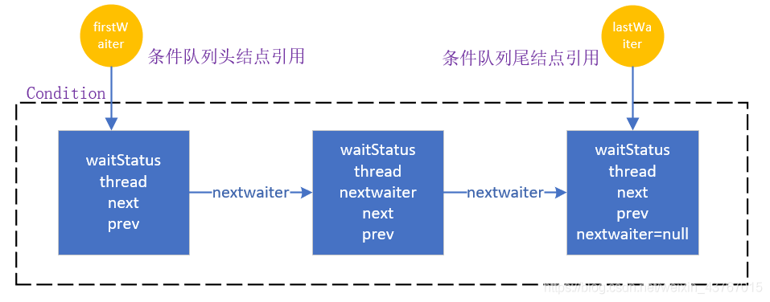  

&emsp;如图所示，Condition 拥有首尾结点的引用，而新增结点只需要将原有的尾结点 nextWaiter 指向它，并且更新尾结点即可。上述结点引用更新的过程并没有使用 CAS 保证，原因在于调用 await() 方法的线程必定是获取了锁的线程，也就是说该过程是由锁来保证线程安全的。  

&emsp;在 Object 的监视器模型上，一个监视器对象只能拥有一个同步队列和等待队列，而 JUC 中的一个同步组件实例可以拥有一个同步队列和多个条件队列，其对应关系如下图：  

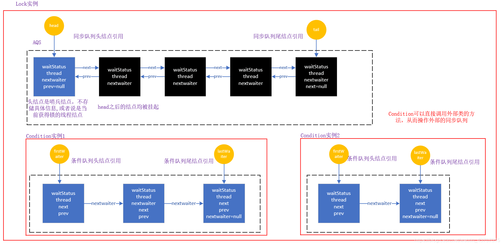

7.3 等待机制原理
----------

&emsp;调用 Condition 的 await()、await(long time, TimeUnit unit)、awaitNanos(long nanosTimeout)、awaitUninterruptibly()、awaitUntil(Date deadline) 方法时，会使当前线程构造成一个等待类型为 Node.CONDITION 的 Node 结点加入等待队列尾部并释放锁，同时线程状态变为等待状态（WAITING）。而当从 await() 方法返回时，当前线程一定获取了 Condition 相关联的锁。  

&emsp;对于同步队列和条件队列这两个两个队列来说，当调用 await() 方法时，相当于同步队列的头结点（获取了锁的结点）移动到 Condition 的等待队列成为尾结点（只是一个比喻，实际上并没有移动）。  

&emsp;**AQS 的 Node 的 waitStatus 使用 Node.CONDITION（-2）来表示结点处于等待状态，如果条件队列中的结点不是 Node.CONDITION 状态，那么就认为该结点就不再等待了，需要出队列。**

### 7.3.1 await() 响应中断等待

&emsp;调用该方法的线程也一定是成功获取了锁的线程，也就是同步队列中的首结点，如果一个没有获得锁的线程调用此方法，那么可能会抛出异常！  

&emsp;await 方法用于将当前线程构造成结点并加入等待队列中，并释放锁，然后当前线程会进入等待状态，等待唤醒。  

&emsp;当等待队列中的结点线程因为 signal、signalAll 或者被中断而唤醒，则会被移动到同步队列中，然后在 await 中尝试获取锁。如果是在其他线程调用 signal、signalAll 方法之前就因为中断而被唤醒了，则会抛出 InterruptedException，并清除当前线程的中断状态。  

&emsp;该方法响应中断。最终，如果该方法能够返回，那么该线程一定是又一次重新获取到锁了。  

&emsp;**大概步骤为：**

1.  最开始就检查一次，如果当前线程是被中断状态，则清除已中断状态，并抛出异常
2.  调用 addConditionWaiter 方法，将当前线程封装成 Node.CONDITION 类型的 Node 结点链接到条件队列尾部，返回新加的结点，该过程中将移除取消等待的结点。
3.  调用 fullyRelease 方法，一次性释放当前线程所占用的所有的锁（重入锁），并返回取消时的同步状态 state 值。
4.  循环，调用 isOnSyncQueue 方法判断结点是否被转移到了同步队列中：  
    - 如果不在同步队列中，那么 park 挂起当前线程，不在执行后续代码。  
    - 如果被唤醒，那么调用 checkInterruptWhileWaiting 检查线程被唤醒的原因，并且使用 interruptMode 字段记录中断模式。  
    - 如果此时线程时中断状态，那么 break 跳出循环，否则，进行下一次循环判断。
5.  到这一步，结点一定是加入同步队列中了。那么使用 acquireQueued 自旋获取独占锁，将锁重入次数原封不动的写回去。
6.  获取到锁之后，判断如果在获取锁的等待过程中被中断，并且之前的中断模式不为 THROW\_IE（可能是 0），那么设置中断模式为 REINTERRUPT。
7.  如果结点后继不为 null，说明是 “在调用 signal 或者 signalAll 方法之前就因为中断而被唤醒” 的情况，发生这种情况时结点是没有从条件队列中移除的，此时需要移除。这里直接调用调用 unlinkCancelledWaiters 对条件队列再次进行整体清理。
8.  如果中断模式不为 0，那么调用 reportInterruptAfterWait 方法对不同的中断模式做出处理。

```java
/**
 * 位于ConditionObject中的方法
 * 当前线程进入等待状态，直到被通知或中断
 *
 * @throws InterruptedException 如果线程被中断，那么返回并抛出异常
 */
public final void await() throws InterruptedException {
    /*最开始就检查一次，如果当前线程是被中断状态，则清除已中断状态，并抛出异常*/
    if (Thread.interrupted())
        throw new InterruptedException();
    /*当前线程封装成Node.CONDITION类型的Node结点链接到条件队列尾部，返回新加的结点*/
    Node node = addConditionWaiter();
    /*尝试释放当前线程所占用的所有的锁，并保存当前的锁状态*/
    int savedState = fullyRelease(node);
    //中断模式,默认为0 表示没有中断，后面会介绍
    int interruptMode = 0;
/*循环检测，如果当前队列不在同步队列中，那么将当前线程继续挂起，停止执行后续代码，直到被通知/中断；
否则，表示已在同步队列中，直接跳出循环*/
    while (!isOnSyncQueue(node)) {
        //此处线程阻塞
        LockSupport.park(this);
        // 走到这一步说明可能是被其他线程通知唤醒了或者是因为线程中断而被唤醒
        // checkInterruptWhileWaiting检查线程被唤醒的原因，并且使用interruptMode字段记录中断模式
        if ((interruptMode = checkInterruptWhileWaiting(node)) != 0)
            //如果是中断状态，则跳出循环，这说明中断状态也会离开条件队列加入同步队列
            break;
        /*如果没有中断，那就是因为signal或者signalAll方法的调用而被唤醒的，并且已经被加入到了同步队列中
         * 在下一次循环时，将不满足循环条件，而自动退出循环*/
    }
    /*
     * 到这一步，结点一定是加入同步队列中了
     * 那么使用acquireQueued自旋获取独占锁，第二个参数就是最开始释放锁时的同步状态，这里要将锁重入次数原封不动的写回去
     * 如果在获取锁的等待过程中被中断，并且之前的中断模式不为THROW\_IE（可能是0），那么设置中断模式为REINTERRUPT，
     * 即表示在调用signal或者signalAll方法之后设置的中断状态
     * */
    if (acquireQueued(node, savedState) && interruptMode != THROW\_IE)
        interruptMode = REINTERRUPT;
    /*此时已经获取到了锁，那么实际上这个对应的结点就是head结点了
     *但是如果线程是 在调用signal或者signalAll方法之前就因为中断而被唤醒 的情况时，将结点添加到同步队列的的时候，并没有清除在条件队列中的结点引用
     *因此，判断nextWaiter是否不为null，如果是则还需要从条件队列中移除彻底移除这个结点。
     * */
    if (node.nextWaiter != null)
        //这里直接调用unlinkCancelledWaiters方法移除所有waitStatus不为CONDITION的结点
        unlinkCancelledWaiters();
    //如果中断模式不为0，那么调用reportInterruptAfterWait方法对不同的中断模式做出处理
    if (interruptMode != 0)
        reportInterruptAfterWait(interruptMode);
}
```

#### 7.3.1.1 addConditionWaiter 添加结点到条件队列

&emsp;**同步队列的首结点并不会直接加入等待队列，而是通过 addConditionWaite 方法把当前线程构造成一个新的结点并将其加入等待队列中。**  

&emsp;**addConditionWaiter 方法用于将当前线程封装成 Node.CONDITION 类型的结点链接到条件队列尾部。大概有两步：**

1.  首先获取条件队列尾结点，如果尾结点不是等待状态，那么调用 unlinkCancelledWaiters 对整个链表做一个清理，清除不是等待状态的结点；
2.  将当前线程包装成 Node.CONDITION 类型的 Node 加入条件队列尾部，这里不需要 CAS，因为此时线程已经获得了锁，不存在并发的情况。

```java
/**
 * 位于ConditionObject中的方法
 * 当前线程封装成Node.CONDITION类型的Node结点链接到条件队列尾部
 *
 * @return 新添加的结点
 */
private Node addConditionWaiter() {
    //获取条件队列尾结点t
    Node t = lastWaiter;
    /*1 如果t的状态不为Node.CONDITION，即不是等待状态了遍历整个条件队列链表，清除所有不在等待状态的结点*/
    if (t != null && t.waitStatus != Node.CONDITION) {
        /*遍历整个条件队列链表，清除所有不在等待状态的结点*/
        unlinkCancelledWaiters();
        //获取最新的尾结点
        t = lastWaiter;
    }
    /*2 将当前线程包装成Node.CONDITION类型的Node加入条件队列尾部
     * 这里不需要CAS，因为此时线程已经获得了锁，不存在并发的情况
     * 从这里也能看出来，条件队列仅仅是一条通过nextWaiter维持后继关系的单链表，同时不存在类似于同步队列的哨兵结点
     * */
    Node node = new Node(Thread.currentThread(), Node.CONDITION);
    if (t == null)
        firstWaiter = node;
    else
        t.nextWaiter = node;
    lastWaiter = node;
    //返回新加结点
    return node;
}
```

#### 7.3.1.2 unlinkCancelledWaiters 清除取消等待的结点

&emsp;**unlinkCancelledWaiters 方法会从头开始遍历整个单链表，清除所有取消等待的结点，比较简单！**

```java
/**
 * 位于ConditionObject中的方法
 * 从头开始遍历整个条件队列链表，清除所有不在等待状态的结点
 */
private void unlinkCancelledWaiters() {
    //t用来记录当前结点的引用，从头结点开始
    Node t = firstWaiter;
    //trail用来记录上一个非取消(Node.CONDITION)结点的引用
    Node trail = null;
    /*头结点不为null，则遍历链表*/
    while (t != null) {
        //获取后继
        Node next = t.nextWaiter;
        /*如果当前结点状态不是等待状态(Node.CONDITION)，即取消等待了*/
        if (t.waitStatus != Node.CONDITION) {
            //当前结点的后继引用置空
            t.nextWaiter = null;
            //trail为null，出现这种情况，只能是第一次循环时，就发现头结点取消等待了
            // 则头结点指向next
            if (trail == null)
                firstWaiter = next;
            //否则trail的后继指向next
            else
                trail.nextWaiter = next;
            //如果next为null，说明到了尾部，则lastWaiter指向上一个非取消(Node.CONDITION)结点的引用，该结点就是尾结点
            if (next == null)
                lastWaiter = trail;
        }
        /*否则，trail指向t*/
        else
            trail = t;
        //t指向next，相当于遍历链表了
        t = next;
    }
}
```

#### 7.3.1.3 fullyRelease 释放所有重入锁

&emsp;**await 中锁的释放都是独占式的。由于可能是可重入锁，因此 fullyRelease 方法会将当前获取锁的线程的全部重入锁都一次性释放掉。例如某个线程的锁重入了一次，此时 state 变成 2，在 await 中会一次性将 2 变成 0。**  

&emsp;**我们常说说 await 方法必须要在获取锁之后调用，因为在 fullyRelease 中会调用 release 独占式的释放锁，而 release 中调用了 tryRelease 方法，对于独占锁的释放，我们的实现会检查是否是当前获取锁的线程，如果不是，那么会抛出 IllegalMonitorStateException 异常。**  

&emsp;**fullyRelease 大概步骤如下：**

1.  获取当前的同步状态 state 的值 savedState，调用 release 释放全部锁包括重入的；
2.  释放成功那么返回 savedState，如果不是当前获取锁的线程那么会抛出异常。
3.  释放失败同样也会抛出 IllegalMonitorStateException 异常。
4.  finally 中，释放成功什么也不做；释放失败则将新添加进条件队列的结点状态设置为 Node.CANCELLED，即算一种非等待状态。

```java
/**
 * 位于AQS中的方法，在结点被添加到条件队列中之后调用
 * 尝试释放当前线程所占用的所有的锁，并返回当前的锁的同步状态state
 *
 * @param node 刚添加的结点
 * @return 当前的同步状态
 */
final int fullyRelease(Node node) {
    boolean failed = true;
    try {
        //获取此时state值，
        int savedState = getState();
        //因为state可能表锁重入次数
        //这里调用release释放锁，参数为此时state的值，表示释放全部锁，就算是重入锁也一次性释放完毕
        //我们常说说await方法必须要在获取锁之后调用，就是这个方法的逻辑实现的:
        //这个方法中调用了tryRelease方法，对于独占锁我们的实现会检查是否是当前获取锁的线程，如果不是，那么会抛出IllegalMonitorStateException异常
        //release释放之后还会唤醒同步队列的一个非取消的结点
        if (release(savedState)) {
            //释放完成之后
            failed = false;
            //返回释放之前的state同步状态
            return savedState;
        } 
        /*如果释放失败，那么也直接抛出异常*/
        else {
            throw new IllegalMonitorStateException();
        }
    } finally {
        //如果释放失败，可能是抛出异常，那么新加入结点的状态改成Node.CANCELLED，即算一种非等待状态
        if (failed)
            node.waitStatus = Node.CANCELLED;
    }
}
```

#### 7.3.1.4 isOnSyncQueue 结点是否在同步队列中

&emsp;**isOnSyncQueue 用于检测结点是否在同步队列中，如果 await 等待的线程被唤醒 / 中断，那么对应的结点会被转移到同步队列之中！**

```java
/**
 * 位于AQS中的方法，在fullyRelease之后调用
 * 判断结点是否在同步队列之中
 *
 * @param node 新添加的结点
 * @return 如果在返回true，否则返回false
 */
final boolean isOnSyncQueue(Node node) {
    //如果状态为Node.CONDITION那一定是不在同步队列中
    //或者如果前驱为null，表示肯定不在同步队列中，因为加入队列的第一步就是设置前驱
    if (node.waitStatus == Node.CONDITION || node.prev == null)
        return false;
    //如果next不为null，说明肯定在同步队列中了，而且还不是在尾部
    if (node.next != null)
        return true;
    /*
    有可能状态不为Node.CONDITION并且node.prev的值不为null，此时还没彻底添加到队列中，但是不知道后续会不会添加成功，因为enq入队时CAS变更的tail可能失败。
    此时需要调用findNodeFromTail从后向前遍历整个同步队列，查找是否有该结点
     */
    return findNodeFromTail(node);
}

/**
 * 从尾部开始向前遍历同步队列，查找是否存在指定结点
 *
 * @param node 指定结点
 * @return 如果存在，返回true
 */
private boolean findNodeFromTail(Node node) {
    //遍历同步队列，查找是否存在该结点
    Node t = tail;
    for (; ; ) {
        if (t == node)
            return true;
        if (t == null)
            return false;
        t = t.prev;
    }
}
```

#### 7.3.1.5 checkInterruptWhileWaiting 检测中断以及被唤醒原因

&emsp;**await 将线程中断的状态根据在不同情况下的中断分成三种模式，除了下面的两种之外，还使用 0 表示没有中断。在 await 方法的最后，会根据不同的中断模式做出不同的处理。**

```java
/**
 * 中断模式
 * 退出await方法之前，需要设置中断状态，由于此时已经获得了锁，即相当于设置一个标志位。
 * 如果是在调用signal或者signalAll方法之后被中断，会是这个模式
 */
private static final int REINTERRUPT = 1;
/**
 * 中断模式
 * 退出await方法之前，需要抛出InterruptedException异常
 *如果是在等待调用signal或者signalAll之前就被中断了，会是这个模式
 */
private static final int THROW\_IE = -1;
```

&emsp;**checkInterruptWhileWaiting 方法在挂起的线程被唤醒之后调用，用于检测被唤醒的原因，并返回中断模式。大概步骤为：**

1.  判断此时线程的中断状态，并清除中断状态。如果是中断状态，那么调用 transferAfterCancelledWait 方法判断那是在什么时候中断的；否则，返回 0，说明是调用 signal 或者 signalAll 方法之后被唤醒的，并且没有中断。
2.  transferAfterCancelledWait 方法中，如果是因为在调用 signal 或者 signalAll 之前就被中断了，那么会将该结点状态设置为 0，并调用 enq 方法加入到同步队列中，返回 THROW\_IE 模式，表示在 await 方法的最后会抛出异常；否则那就是在调用 signal 或者 signalAll 方法之后被中断的，那么在等待结点成功加入同步队列之后，返回 REINTERRUPT 模式，表示在 await 方法最后会重新设置中断状态。

```java
/**
 * Condition中的方法
 * 检查被唤醒线程的中断状态，返回中断模式
 */
private int checkInterruptWhileWaiting(Node node) {
    //检查中断状态，并清除中断状态
    return Thread.interrupted() ?
            //如果是中断状态，那么调用transferAfterCancelledWait方法判断是在什么时候被中断的
            //如果在调用signal或者signalAll之前被中断，那么返回THROW\_IE，表示在await方法最后会抛出异常
            // 否则返回REINTERRUPT，表示在await方法最后会重新设置中断状态
            (transferAfterCancelledWait(node) ? THROW\_IE : REINTERRUPT) :
            //如果是未中断状态，那么返回0
            0;
}

/**
 * AQS中的方法
 * 判断是在什么时候被中断的
 *
 * @param node 指定结点
 * @return 如果在signal或者signalAll之前被中断，将返回true；否则返回false
 */
final boolean transferAfterCancelledWait(Node node) {
    //我们需要知道：signal或者signalAll方法中会将结点状态从Node.CONDITION设置为0
    //这里再试一次，如果在这里将指定node从Node.CONDITIONCAS设置为0成功，那么表示该结点肯定是在signal或者signalAll方法被调用之前 被中断而唤醒的
    if (compareAndSetWaitStatus(node, Node.CONDITION, 0)) {
        /*即使是因为这样被唤醒，此时也需要手动将结点加入同步队列尾部
        注意此时并没有将结点移除条件队列，因此在await方法的最后，会有这样的判断：
         if (node.nextWaiter != null) // clean up if cancelled
         unlinkCancelledWaiters();
         实际上就是再判断这种情况!
        */
        enq(node);
        //入队成功，返回true
        return true;
    }
    /*否则，表示是在signal或者signalAll被调用之后，又被设置了中断状态的
     * signal或者signalAll的方法中会将结点添加到同步队列中，这里循环判断到底在不在队列中，
     * 因为或者signal或者signalAll方法可能还没有执行完毕，这里等它执行完毕，然后返回false
     * 如果不等他执行完毕，在回到外面的await方法中时，可能会影响后续的重新获取锁acquireQueued方法的执行
     * */
    while (!isOnSyncQueue(node))
        Thread.yield();
    //确定被加入到了同步队列，则返回false
    return false;
}
```

#### 7.3.1.6 reportInterruptAfterWait 对中断模式进行处理

&emsp;**在 await 方法的最后，如果中断模式不为 0，那么会对之前设置的中断模式进行统一处理：**

1.  如果是 THROW\_IE 模式，即在调用 signal 或者 signalAll 之前就被中断了，那么抛出 InterruptedException 异常。
2.  如果是 REINTERRUPT 模式，即在调用 signal 或者 signalAll 方法之后被中断，那么简单的设置一个中断状态为 true。

```java
/**
 * 中断模式的处理：
 * 如果是THROW\_IE模式，那么抛出InterruptedException异常
 * 如果是REINTERRUPT模式，那么简单的设置一个中断状态结尾true
 */
private void reportInterruptAfterWait(int interruptMode)
        throws InterruptedException {
    if (interruptMode == THROW\_IE)
        throw new InterruptedException();
    else if (interruptMode == REINTERRUPT)
        selfInterrupt();
}
```

### 7.3.2 await(time, TimeUnit) 超时等待一段时间

&emsp;**当前线程进入等待状态直到被通知、中断，或者超时。**  
&emsp;如果在超时时间范围之内被唤醒了，则返回 true；否则返回 false。  
&emsp;该方法响应中断。最终，如果该方法能够返回，那么该线程一定是又一次重新获取到锁了。

```java
/**
 * 超时等待
 *
 * @param time 时长
 * @param unit 时长单位
 * @return 如果在超时时间范围之内被唤醒了，则返回true；否则返回false
 * @throws InterruptedException 如果一开始就是中断状态或者如果在signal()或signalALL()方法调用之前就因为中断而被唤醒，那么抛出异常
 */
public final boolean await(long time, TimeUnit unit)
        throws InterruptedException {
    /*内部结构和await方法差不多*/
    //将超时时间转换为纳秒
    long nanosTimeout = unit.toNanos(time);
    if (Thread.interrupted())
        throw new InterruptedException();
    Node node = addConditionWaiter();
    int savedState = fullyRelease(node);
    //获取最大超时时间对应的时钟纳秒值
    final long deadline = System.nanoTime() + nanosTimeout;
    //超时标志位timedout
    boolean timedout = false;
    int interruptMode = 0;
    while (!isOnSyncQueue(node)) {
        //超时时间如果小于等于0，表示已经超时了，还没有返回，此时主动将结点加入同步队列。
        if (nanosTimeout <= 0L) {
            //直接调用transferAfterCancelledWait，这里的transferAfterCancelledWait方法被用来将没有加入队列的结点直接加入队列，或者等待结点完成入队
            //该方法中，如果检测到该结点此时（已超时）还没被加入同步队列，则手动添加并返回true；否则，等待入队完成并返回false
            timedout = transferAfterCancelledWait(node);
            //结束循环
            break;
        }
        //如果超时时间大于1000，则parkNanos等待指定时间，一段之间之后将会自动被唤醒
        if (nanosTimeout >= spinForTimeoutThreshold)
            LockSupport.parkNanos(this, nanosTimeout);
        //检查并设置中断模式
        if ((interruptMode = checkInterruptWhileWaiting(node)) != 0)
            break;
        //更新剩余超时时间
        nanosTimeout = deadline - System.nanoTime();
    }
    if (acquireQueued(node, savedState) && interruptMode != THROW\_IE)
        interruptMode = REINTERRUPT;
    if (node.nextWaiter != null)
        unlinkCancelledWaiters();
    if (interruptMode != 0)
        reportInterruptAfterWait(interruptMode);
    //注意:最终返回的是!timedout
    // 即如果在parkNanos时间范围之内被唤醒了，则返回true，否则如果是自然唤醒的，则返回false
    return !timedout;
}
```

### 7.3.3 awaitUntil(deadline) 超时等待时间点

&emsp;**与 await(time, TimeUnit) 的行为一致，不同之处在于该方法的参数不是一段时间，而是一个时间点。**  
&emsp;如果在超时时间点之前被唤醒了，则返回 true；否则返回 false。  
&emsp;该方法响应中断。最终，如果该方法能够返回，那么该线程一定是又一次重新获取到锁了。

```java
/**
 * 超时等待指定时间点
 *
 * @param deadline 超时时间点
 * @return 如果在超时时间点之前被唤醒了，则返回true；否则返回false
 * @throws InterruptedException 如果一开始就是中断状态或者如果在signal()或signalALL()方法调用之前就因为中断而被唤醒，那么抛出异常
 */
public final boolean awaitUntil(Date deadline)
        throws InterruptedException {
    //获取指定时间点的毫秒
    long abstime = deadline.getTime();
    if (Thread.interrupted())
        throw new InterruptedException();
    Node node = addConditionWaiter();
    int savedState = fullyRelease(node);
    //超时标志位timedout
    boolean timedout = false;
    int interruptMode = 0;
    while (!isOnSyncQueue(node)) {
        //如果当前时间毫秒 大于 指定时间点的毫秒，表明已经超时了，还没有返回，此时主动将结点加入同步队列。
        if (System.currentTimeMillis() > abstime) {
            //直接调用transferAfterCancelledWait，这里的transferAfterCancelledWait方法被用来将没有加入队列的结点直接加入队列，或者等待结点完成入队
            //该方法中，如果检测到该结点此时（已超时）还没被加入同步队列，则手动添加并返回true；否则，等待入队完成并返回false
            timedout = transferAfterCancelledWait(node);
            break;
        }
        //parkUntil方法使线程睡眠到指定时间点
        LockSupport.parkUntil(this, abstime);
        //检查并设置中断模式
        if ((interruptMode = checkInterruptWhileWaiting(node)) != 0)
            break;
    }
    if (acquireQueued(node, savedState) && interruptMode != THROW\_IE)
        interruptMode = REINTERRUPT;
    if (node.nextWaiter != null)
        unlinkCancelledWaiters();
    if (interruptMode != 0)
        reportInterruptAfterWait(interruptMode);
    //注意:最终返回的是!timedout
    // 即如果在指定时间点之前被唤醒了，则返回true，否则返回false
    return !timedout;
}
```

### 7.3.4 awaitNanos(nanosTimeout) 超时等待纳秒

&emsp;**当前线程进入等待状态直到被通知，中断，或者超时。**  
&emsp;返回（超时时间 - 实际返回所用时间）。如果返回值是 0 或者负数，那么可以认定已经超时了。  
&emsp;该方法响应中断。最终，如果该方法能够返回，那么该线程一定是又一次重新获取到锁了。

```java
/**
 * 超时等待指定纳秒，若指定时间内返回，则返回 nanosTimeout-已经等待的时间；
 *
 * @param nanosTimeout 超时时间，纳秒
 * @return 返回 超时时间 - 实际返回所用时间
 * @throws InterruptedException 如果一开始就是中断状态或者如果在signal()或signalALL()方法调用之前就因为中断而被唤醒，那么抛出异常
 */
public final long awaitNanos(long nanosTimeout)
        throws InterruptedException {
    /*内部结构和await方法差不多*/
    if (Thread.interrupted())
        throw new InterruptedException();
    Node node = addConditionWaiter();
    int savedState = fullyRelease(node);
    //获取最大超时时间对应的时钟纳秒值
    final long deadline = System.nanoTime() + nanosTimeout;
    int interruptMode = 0;
    while (!isOnSyncQueue(node)) {
        //超时时间如果小于等于0，表示已经超时了，还没有返回，此时主动将结点加入同步队列。
        if (nanosTimeout <= 0L) {
            //直接调用transferAfterCancelledWait，这里的transferAfterCancelledWait方法被用来将没有加入队列的结点直接加入队列，或者等待结点完成入队
            //这里不需要返回值
            transferAfterCancelledWait(node);
            break;
        }
        //如果超时时间大于1000，则parkNanos等待指定时间，一段之间之后将会自动被唤醒
        if (nanosTimeout >= spinForTimeoutThreshold)
            LockSupport.parkNanos(this, nanosTimeout);
        //检查并设置中断模式
        if ((interruptMode = checkInterruptWhileWaiting(node)) != 0)
            break;
        //更新剩余超时时间
        nanosTimeout = deadline - System.nanoTime();
    }
    if (acquireQueued(node, savedState) && interruptMode != THROW\_IE)
        interruptMode = REINTERRUPT;
    if (node.nextWaiter != null)
        unlinkCancelledWaiters();
    if (interruptMode != 0)
        reportInterruptAfterWait(interruptMode);
    //返回 最大超时时间对应的时钟纳秒值 减去 当前时间的纳秒值
    //可以想象，如果在指定时间之内返回，那么将是正数，否则是0或负数
    return deadline - System.nanoTime();
}
```

### 7.3.5 awaitUninterruptibly() 不响应中断等待

&emsp;**当前线程进入等待状态直到被通知，不响应中断。**  
&emsp;其它线程调用该条件对象的 signal() 或 signalALL() 方法唤醒等待的线程之后，该线程才可能从 awaitUninterruptibly 方法中返回。等待过程中如果当前线程被中断，该方法仍然会继续等待，同时保留该线程的中断状态。  
&emsp;最终，如果该方法能够返回，那么该线程一定是又一次重新获取到锁了。

```java
/**
 * 当前线程进入等待状态直到被通知(signal或者signalAll)而唤醒，不响应中断。
 */
public final void awaitUninterruptibly() {
    /*内部结构和await方法差不多，比await更加简单，因为不需要响应中断*/
    Node node = addConditionWaiter();
    int savedState = fullyRelease(node);
    boolean interrupted = false;
    /*循环，只有其他线程调用对应Condition的signal或者signalAll方法，将该结点加入到同步队列中时，才会停止循环*/
    while (!isOnSyncQueue(node)) {
        //直接等待
        LockSupport.park(this);
        //被唤醒之后，会判断如果被中断了，那么清除当前线程的中断状态。记录中断标志位，然后继续循环
        //在下一次的循环条件中会判断是否被加入了同步队列
        if (Thread.interrupted())
            interrupted = true;
    }
    //如果获取锁的等待途中被中断过，或者前面的中断标志位为true
    if (acquireQueued(node, savedState) || interrupted)
        //安全中断，实际上就是将当前线程的中断标志位改为true，记录一下而已
        selfInterrupt();
}
```

7.4 通知机制原理
----------

&emsp;上面讲了等待机制，并且提起了 signal 和 signalAll 方法将会唤醒等待的线程，这就是 Condition 的通知机制，相比于等待机制，通知机制还是比较简单的！

### 7.4.1 signal 通知单个线程

&emsp;signal 方法首先进行了 isHeldExclusively 检查，也就是当前线程必须是获取了锁的线程，否则抛出异常。接着将会尝试唤醒在条件队列中等待时间最长的结点，将其移动到同步队列并使用 LockSupport 唤醒结点中的线程。**大概步骤如下：**

1.  检查调用 signal 方法的线程是否是持有锁的线程，如果不是则直接抛出 IllegalMonitorStateException 异常。
2.  调用 doSignal 方法将等待时间最长的一个结点从条件队列转移至同步队列尾部，然后根据条件可能会尝试唤醒该结点对应的线程。

```java
/**
 * Conditon中的方法
 * 将等待时间最长的结点移动到同步队列，然后unpark唤醒
 *
 * @throws IllegalMonitorStateException 如果当前调用线程不是获取锁的线程，则抛出异常
 */
public final void signal() {
    /*1 首先调用isHeldExclusively检查当前调用线程是否是持有锁的线程
     * isHeldExclusively方法需要我们重写
     * */
    if (!isHeldExclusively())
        throw new IllegalMonitorStateException();
    //获取头结点
    Node first = firstWaiter;
    /*2 如果不为null，调用doSignal方法将等待时间最长的一个结点从条件队列转移至同步队列尾部，然后根据条件可能会尝试唤醒该结点对应的线程。*/
    if (first != null)
        doSignal(first);
}


/**
 * AQS中的方法
 * 检测当前线程是否是持有独占锁的线程，该方法AQS没有提供实现（抛出UnsupportedOperationException异常）
 * 通常需要我们自己重写，一般重写如下！
 *
 * @return true 是；false 否
 */
protected final boolean isHeldExclusively() {
    //比较获取锁的线程和当前线程
    return getExclusiveOwnerThread() == Thread.currentThread();
}
```

#### 7.4.1.1 doSignal 移除 - 转移等待时间最长的结点

&emsp;**doSignal 方法将在 do while 中从头结点开始向后遍历整个条件队列，从条件队列中移除等待时间最长的结点，并将其加入到同步队列，在此期间会清理一些遍历时遇到的已经取消等待的结点。**

```java
/**
 * Conditon中的方法
 * 从头结点开始向后遍历，从条件队列中移除等待时间最长的结点，并将其加入到同步队列
 * 在此期间会清理一些遍历时遇到的已经取消等待的结点。
 *
 * @param first 条件队列头结点
 */
private void doSignal(Node first) {
    /*从头结点开始向后遍历，唤醒等待时间最长的结点，并清理一些已经取消等待的结点*/
    do {
        //firstWaiter指向first的后继结点，并且如果为null，则lastWaiter也置为null，表示条件队列没有了结点
        if ((firstWaiter = first.nextWaiter) == null)
            lastWaiter = null;
        //first的后继引用置空，这样就将first出队列了
        first.nextWaiter = null;
        /*循环条件
         * 1 调用transferForSignal转移结点，如果转移失败（结点已经取消等待了）；
         * 2 则将first赋值为它的后继，并且如果不为null；
         * 满足上面两个条件，则继续循环
         * */
    } while (!transferForSignal(first) &&
            (first = firstWaiter) != null);
}
```

##### 7.4.1.1.1 transferForSignal 转移结点

&emsp;**transferForSignal 会尝试将遍历到的结点转移至同步队列中，调用该方法之前并没有显示的判断结点是不是处于等待状态，而是在该方法中通过 CAS 的结果来判断。**  
&emsp;**大概步骤为：**

1.  尝试 CAS 将结点等待状态从 Node.CONDITION 更新为 0。这里不存在并发的情况，因为调用线程此时已经获取了独占锁，因此如果更改等待状态失败，那说明该结点原本就不是 Node.CONDITION 状态，表示结点早已经取消等待了，则直接返回 false，表示转移失败。
2.  CAS 成功，则表示该结点是处于等待状态，那么调用 enq 将结点添加到同步队列尾部，返回添加结点在同步队列中的前驱结点。
3.  获取前驱结点的状态 ws。如果 ws 大于 0，则表示前驱已经被取消了或者将 ws 改为 Node.SIGNAL 失败，表示前驱可能在此期间被取消了，那么调用 unpark 方法唤醒被转移结点中的线程，好让它从 await 中的等待中醒来；否则，那就由它的前驱结点在获取锁之后释放锁时再唤醒。返回 true。

```java
/**
 * 将结点从条件队列转移到同步队列，并尝试唤醒
 *
 * @param node 被转移的结点
 * @return 如果成功转移，返回true；失败则返回false
 */
final boolean transferForSignal(Node node) {
    /*1 尝试将结点的等待状态变成0，表示取消等待
    如果更改等待状态失败，那说明一定是原本就不是Node.CONDITION状态，表示结点早已经取消等待了，则返回false。
    这里不存在并发的情况，因为调用线程此时已经获取了独占锁*/
    if (!compareAndSetWaitStatus(node, Node.CONDITION, 0))
        return false;

    /*2 将结点添加到同步队列尾部，返回添加结点的前驱结点*/
    Node p = enq(node);
    //获取前驱结点的状态ws
    int ws = p.waitStatus;
    /*3 如果ws大于0 表示前驱已经被取消了 或者 将ws改为Node.SIGNAL失败，表示前驱可能在此期间被取消了
    则调用unpark方法唤醒被转移结点中的线程，好让它从await中的等待唤醒（后续尝试获取锁）
    否则，那就由它的前驱结点获取锁之后释放锁时再唤醒。
    */
    if (ws > 0 || !compareAndSetWaitStatus(p, ws, Node.SIGNAL))
        LockSupport.unpark(node.thread);
    //返回true
    return true;
}
```

&emsp;被唤醒后的线程（无论是在 signal 中被唤醒的、还是由于同步队列前驱释放锁被唤醒的、还是由于在等待时因为中断而被唤醒的），都将从 await() 方法中的 while 循环中退出，下一步将调用同步器的 acquireQueued() 方法加入到获取锁的竞争中。

### 7.4.2 signalAll 通知全部线程

&emsp;**signalAll 方法，相当于对等待队列中的每个结点均执行一次 signal 方法，效果就是将等待队列中所有结点全部移动到同步队列中，并尝试唤醒每个结点的线程，让他们竞争锁。大概步骤为：**

1.  检查调用 signalAll 方法的线程是否是持有锁的线程，如果不是则直接抛出 IllegalMonitorStateException 异常。
2.  调用 doSignalAll 方法将条件队列中的所有等待状态的结点转移至同步队列尾部，然后根据条件可能会尝试唤醒该结点对应的线程，相当于清空了条件队列。

```java
/**
 * Conditon中的方法
 * 将次Condition中的所有等待状态的结点 从条件队列移动到同步队列中。
 *
 * @throws IllegalMonitorStateException 如果当前调用线程不是获取锁的线程，则抛出异常
 */
public final void signalAll() {
    /*1 首先调用isHeldExclusively检查当前调用线程是否是持有锁的线程
     * isHeldExclusively方法需要我们重写
     * */
    if (!isHeldExclusively())
        throw new IllegalMonitorStateException();
    //获取头结点
    Node first = firstWaiter;
    /*2 如果不为null，调用doSignalAll方法将条件队列中的所有等待状态的结点转移至同步队列尾部，
    然后根据条件可能会尝试唤醒该结点对应的线程，相当于清空了条件队列。*/
    if (first != null)
        doSignalAll(first);
}
```

#### 7.4.2.1 doSignalAll 移除 - 转移全部结点

&emsp;**移除并尝试转移条件队列的所有结点，实际上会将条件队列清空。对每个结点调用 transferForSignal 方法。**

```java
/**
 * Conditon中的方法
 * 移除并尝试转移条件队列的所有结点，实际上会将条件队列清空
 *
 * @param first 条件队列头结点
 */
private void doSignalAll(Node first) {
    //头结点尾结点都指向null
    lastWaiter = firstWaiter = null;
    /*do while 循环转移结点*/
    do {
        //next保存当前结点的后继
        Node next = first.nextWaiter;
        //当前结点的后继引用置空
        first.nextWaiter = null;
        //调用transferForSignal尝试转移结点，就算失败也没关系，因为transferForSignal一定会对所有的结点都尝试转移
        //可以看出来，这里的转移是一个一个的转移的
        transferForSignal(first);
        //first指向后继
        first = next;
    } while (first != null);
}
```

7.5 Condition 的应用
-----------------

&emsp;**有了 Condition，，在配合 Lock 就能实现可控制的多线程案例，让多线程按照我们业务需求去执行，比如下面的常见案例!**

### 7.5.1 生产消费案例

&emsp;使用 Lock 和 Condition 实现简单的生产消费案例，生产一个产品就需要消费一个产品，一次最多只能生产、消费一个产品  
&emsp;常见实现是：如果存在商品，那么生产者等待，并唤醒消费者；如果没有商品，那么消费者等待，并唤醒生产者！

```java
public class ProducerAndConsumer {
    public static void main(String\[\] args) {
        Resource resource = new Resource();
        Producer producer = new Producer(resource);
        Consumer consumer = new Consumer(resource);
        //使用线程池管理线程
        ThreadPoolExecutor threadPoolExecutor = new ThreadPoolExecutor(4, 4, 0, TimeUnit.SECONDS, new LinkedBlockingQueue<>(), Executors.defaultThreadFactory(), new ThreadPoolExecutor.AbortPolicy());
        //两个生产者两个消费者
        threadPoolExecutor.execute(producer);
        threadPoolExecutor.execute(consumer);
        threadPoolExecutor.execute(producer);
        threadPoolExecutor.execute(consumer);
        threadPoolExecutor.shutdown();
    }

    /**
     * 产品资源
     */
    static class Resource {
        private String name;
        private int count;
        //标志位
        boolean flag;
        //获取lock锁，lock锁的获取和释放需要代码手动操作
        ReentrantLock lock = new ReentrantLock();
        //从lock锁获取一个condition，用于生产者线程在此等待和唤醒
        Condition producer = lock.newCondition();
        //从lock锁获取一个condition，用于消费者线程在此等待和唤醒
        Condition consumer = lock.newCondition();

        void set(String name) {
            //获得锁
            lock.lock();
            try {
                while (flag) {
                    try {
                        System.out.println("有产品了--" + Thread.currentThread().getName() + "生产等待");
                        //该生产者线程,在producer上等待
                        producer.await();
                    } catch (InterruptedException e) {
                        e.printStackTrace();
                    }
                }
                ++count;
                this.name = name;
                System.out.println(Thread.currentThread().getName() + "生产了" + this.name + +count);
                flag = !flag;
                //唤醒在consumer上等待的消费者线程,这样不会唤醒等待的生产者
                consumer.signalAll();
            } finally {
                //释放锁
                lock.unlock();
            }
        }

        void get() {
            lock.lock();
            try {
                while (!flag) {
                    try {
                        System.out.println("没产品了--" + Thread.currentThread().getName() + "消费等待");
                        //该消费者线程,在consumer上等待
                        consumer.await();
                    } catch (InterruptedException e) {
                        e.printStackTrace();
                    }
                }
                System.out.println(Thread.currentThread().getName() + "消费了" + this.name + count);
                flag = !flag;
                //唤醒在producer监视器上等待的生产者线程,这样不会唤醒等待的消费者
                producer.signalAll();
            } finally {
                lock.unlock();
            }
        }
    }

    /**
     * 消费者行为
     */
    static class Consumer implements Runnable {
        private Resource resource;

        public Consumer(Resource resource) {
            this.resource = resource;
        }

        @Override
        public void run() {
            while (true) {
                try {
                    Thread.sleep(500);
                } catch (InterruptedException e) {
                    e.printStackTrace();
                }
                //调用消费方法
                resource.get();
            }
        }
    }

    /**
     * 生产者行为
     */
    static class Producer implements Runnable {
        private Resource resource;

        public Producer(Resource resource) {
            this.resource = resource;
        }

        @Override
        public void run() {
            while (true) {
                try {
                    Thread.sleep(500);
                } catch (InterruptedException e) {
                    e.printStackTrace();
                }
                //调用生产方法
                resource.set("面包");
            }
        }
    }
}
```

### 7.5.2 实现商品仓库

&emsp;使用 Lock 和 Condition 实现较复杂的的生产消费案例，实现一个中间仓库，产品被存储在仓库之中，可以连续生产、消费多个产品。  
&emsp;这个实现，可以说就是简易版的消息队列！

```java
/**
 * @author lx
 */
public class BoundedBuffer {

    public static void main(String\[\] args) {
        Resource resource = new Resource();
        Producer producer = new Producer(resource);
        Consumer consumer = new Consumer(resource);
        //使用线程池管理线程
        ThreadPoolExecutor threadPoolExecutor = new ThreadPoolExecutor(4, 4, 0, TimeUnit.SECONDS, new LinkedBlockingQueue<>(), Executors.defaultThreadFactory(), new ThreadPoolExecutor.AbortPolicy());
        //两个生产者两个消费者
        threadPoolExecutor.execute(producer);
        threadPoolExecutor.execute(consumer);
        threadPoolExecutor.execute(producer);
        threadPoolExecutor.execute(consumer);
        threadPoolExecutor.shutdown();
    }

    /**
     * 产品资源
     */
    static class Resource {

        // 获得锁对象
        final Lock lock = new ReentrantLock();
        // 获得生产监视器
        final Condition notFull = lock.newCondition();
        // 获得消费监视器
        final Condition notEmpty = lock.newCondition();
        // 定义一个数组，当作仓库，用来存放商品
        final Object\[\] items = new Object\[100\];
        /*
         * putpur：生产者使用的下标索引；
         * takeptr：消费者下标索引；
         * count：用计数器，记录商品个数
         */
        int putptr, takeptr, count;

        /**
         *  生产方法
         * @param x
         * @throws InterruptedException
         */
        public void put(Object x) throws InterruptedException {
            // 获得锁
            lock.lock();
            try {
                // 如果商品个数等于数组的长度，商品满了将生产将等待消费者消费
                while (count == items.length) {
                    notFull.await();
                }
                // 生产索引对应的商品，放在仓库中
                Thread.sleep(50);
                items\[putptr\] = x;
                // 如果下标索引加一等于数组长度，将索引重置为0，重新开始
                if (++putptr == items.length) {
                    putptr = 0;
                }
                // 商品数加1
                ++count;
                System.out.println(Thread.currentThread().getName() + "生产了" + x + "共有" + count + "个");
                // 唤醒消费线程
                notEmpty.signal();
            } finally {
                // 释放锁
                lock.unlock();
            }
        }

        /**
         * 消费方法
         * @return
         * @throws InterruptedException
         */
        public Object take() throws InterruptedException {
            //获得锁
            lock.lock();
            try {
                //如果商品个数为0.消费等待
                while (count == 0) {
                    notEmpty.await();
                }
                //获得对应索引的商品，表示消费了
                Thread.sleep(50);
                Object x = items\[takeptr\];
                //如果索引加一等于数组长度，表示取走了最后一个商品，消费完毕
                if (++takeptr == items.length)
                //消费索引归零，重新开始消费
                {
                    takeptr = 0;
                }
                //商品数减一
                --count;
                System.out.println(Thread.currentThread().getName() + "消费了" + x + "还剩" + count + "个");
                //唤醒生产线程
                notFull.signal();
                //返回消费的商品
                return x;
            } finally {
                //释放锁
                lock.unlock();
            }
        }
    }

    /**
     * 生产者行为
     */
    static class Producer implements Runnable {
        private Resource resource;

        public Producer(Resource resource) {
            this.resource = resource;
        }

        @Override
        public void run() {
            while (true) {
                try {
                    resource.put("面包");
                } catch (InterruptedException e) {
                    e.printStackTrace();
                }
            }
        }
    }
    /**
     * 消费者行为
     */
    static class Consumer implements Runnable {
        private Resource resource;

        public Consumer(Resource resource) {
            this.resource = resource;
        }

        @Override
        public void run() {
            while (true) {
                try {
                    resource.take();
                } catch (InterruptedException e) {
                    e.printStackTrace();
                }

            }
        }
    }
}
```

### 7.5.3 输出 ABCABC……

&emsp;编写一个程序，开启 3 个线程，这三个线程的 name 分别为 A、B、C，每个线程将自己的名字 在屏幕上打印 10 遍，要求输出的结果必须按名称顺序显示，例如：ABCABCABC…  
&emsp;这个案例中，我们需要手动控制相关线程在指定线程之前执行。

```java
/**
 * @author lx
 */
public class PrintABC {
    ReentrantLock lock = new ReentrantLock();
    Condition A = lock.newCondition();
    Condition B = lock.newCondition();
    Condition C = lock.newCondition();
    /**
     * flag标志，用于辅助控制顺序，默认为1
     */
    private int flag = 1;

    public void printA(int i) {
        lock.lock();
        try {
            while (flag != 1) {
                try {
                    A.await();
                } catch (InterruptedException e) {
                    e.printStackTrace();
                }
            }
            System.out.println(Thread.currentThread().getName() + " " + i);
            flag = 2;
            B.signal();
        } finally {
            lock.unlock();
        }
    }

    public void printB(int i) {
        lock.lock();
        try {
            while (flag != 2) {
                try {
                    B.await();
                } catch (InterruptedException e) {
                    e.printStackTrace();
                }
            }
            System.out.println(Thread.currentThread().getName() + " " + i);
            flag = 3;
            C.signal();
        } finally {
            lock.unlock();
        }
    }

    public void printC(int i) {
        lock.lock();
        try {
            while (flag != 3) {
                try {
                    C.await();
                } catch (InterruptedException e) {
                    e.printStackTrace();
                }
            }
            System.out.println(Thread.currentThread().getName() + " " + i);
            System.out.println("---------------------");
            flag = 1;
            A.signal();
        } finally {
            lock.unlock();
        }
    }

    public static void main(String\[\] args) {
        PrintABC testABC = new PrintABC();
        Thread A = new Thread(new A(testABC), "A");
        Thread B = new Thread(new B(testABC), "B");
        Thread C = new Thread(new C(testABC), "C");
        A.start();
        B.start();
        C.start();
    }

    static class A implements Runnable {
        private PrintABC testABC;

        public A(PrintABC testABC) {
            this.testABC = testABC;
        }

        @Override
        public void run() {
            for (int i = 0; i < 10; i++) {
                testABC.printA(i + 1);
            }
        }
    }

    static class B implements Runnable {
        private PrintABC testABC;

        public B(PrintABC testABC) {
            this.testABC = testABC;
        }

        @Override
        public void run() {
            for (int i = 0; i < 10; i++) {
                testABC.printB(i + 1);
            }
        }
    }

    static class C implements Runnable {
        private PrintABC testABC;

        public C(PrintABC testABC) {
            this.testABC = testABC;
        }

        @Override
        public void run() {
            for (int i = 0; i < 10; i++) {
                testABC.printC(i + 1);
            }
        }
    }
}
```

8 总结
====

&emsp;AQS 是 JUC 中实现同步组件的基础框架，有了 AQS 我们自己也能比较轻松的实现自定义的同步组件。  

&emsp;AQS 中提供了同步队列的实现，用于实现锁的获取和释放，没有获取到锁的线程将进入同步队列排队等待，是实现线程同步的基础。  

&emsp;AQS 内部还提供了条件队列的实现，条件队列用于实现线程之间的主动等待、唤醒机制，是实现线程 有序可控 同步的不可缺少的部分。  

&emsp;一个锁对应一个同步队列，对应多个条件变量，每个条件变量有自己的一个条件队列，这样就可以实现按照业务需求让不同的线程在不同的条件队列上等待，相对于 Synchronized 的只有一个条件队列，功能更加强大！  

&emsp;**最后，当我们深入源码时，发现对于最基础的同步支持，比如可见性、原子性、线程等待、唤醒等操作，AQS 也是调用的其他工具、或者利用了其他特性：**

1.  同步状态 state 被设置为 **volatile** 类型，这样在获取、更新时保证了可见性，还可以禁止重排序！
2.  使用 **CAS** 来更新变量，来保证单个变量的复合操作（读 - 写）具有原子性！而 CAS 方法内部又调用了 unsafe 的方法。这个 Unsafe 类，实际上是比 AQS 更加底层的底层框架，或者可以认为是 AQS 框架的基石。
3.  CAS 操作在 Java 中的最底层的实现就是 Unsafe 类提供的，它是作为 Java 语言与 Hospot 源码（C++）以及底层操作系统沟通的桥梁，可以去了解 Unsafe 的一些操作。
4.  对于线程等待、唤醒，是调用了 **LockSupport** 的 park、unpark 方法，如果去看 LockSupport 的源码，那么实际上最终还是调用 Unsafe 类中的方法！

&emsp;**AQS 框架是 JUC 中的同步组件的基石，如果再去尝试寻找构建 AQS 的基石的话，通过 AQS 的 Java 源码我们可以发现就是：volatile 修饰符、CAS（UNSAFE）操作、LockSupport（park、unpark）操作。**  

&emsp;**学习了 AQS，对于我们后续将会进行的 Lock 锁等 JUC 同步组件的实现分析将会大有帮助！**

**相关文章：**  
&emsp;LockSupport：[JUC—LockSupport 以及 park、unpark 方法底层源码深度解析](https://blog.csdn.net/weixin_43767015/article/details/107207643)  
&emsp;volatile：[Java 中的 volatile 实现原理深度解析以及应用](https://blog.csdn.net/weixin_43767015/article/details/105518264)。  
&emsp;CAS：[Java 中的 CAS 实现原理解析与应用](https://blog.csdn.net/weixin_43767015/article/details/106342879)。  
&emsp;UNSAFE：[JUC—Unsafe 类的原理详解与使用案例](https://blog.csdn.net/weixin_43767015/article/details/104643890)。

